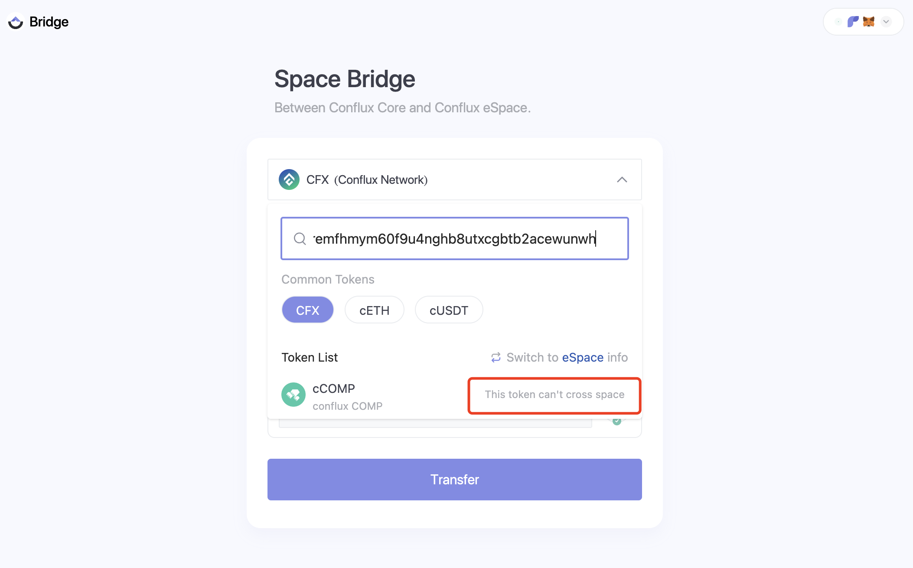
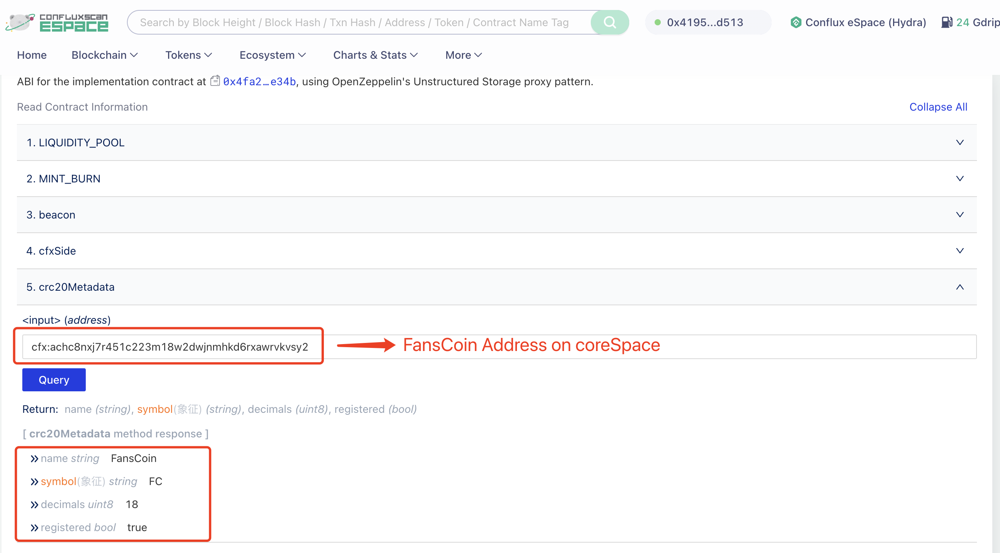
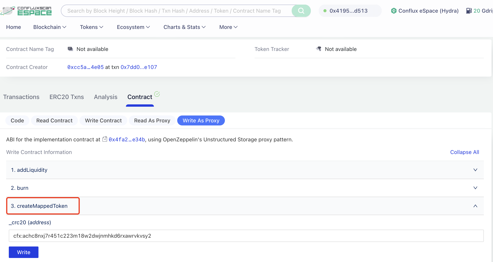
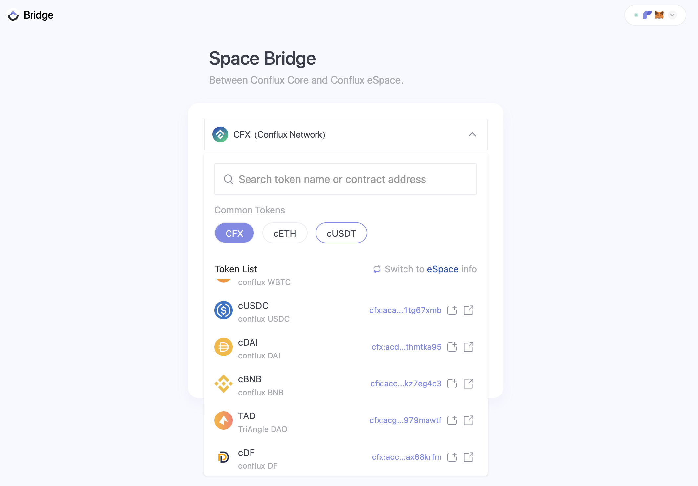

This tutorial guides developers on transferring any CRC20 token from Core Space to eSpace, using [FansCoin (FC)](https://confluxscan.io/token/cfx:achc8nxj7r451c223m18w2dwjnmhkd6rxawrvkvsy2) as an example. The goal is to transfer a CRC20 token (A) issued on coreSpace to become an ERC20 token (eA) in eSpace. Currently, if there is no corresponding token in eSpace, it's not possible to use the official [cross-space bridge](https://confluxhub.io/espace-bridge/cross-space) directly.

<!-- [image1](image1) -->

[](../image/cannot-cross-space.png)

Before initiating cross-space operations, let's review several key contracts associated with the cross-space bridge:

**On CoreSpace:**

- BeaconProxy Proxy Contract: `cfx:acfcrckktgx99scxwr6jtjx81yhm4ggsfatprwzb3x`
- BeaconProxy Logic Contract - ConfluxSide: `cfx:acc7gpd3380pv6v112s5c2y3g3g6jvm32egm5mhnk7`

**On eSpace:**

- BeaconProxy Proxy Contract: `0x4f9e3186513224cf152016ccd86019e7b9a3c809`
- BeaconProxy Logic Contract - EvmSide: `0x4fa28072bd5b551dde70213aa02cb05bd022e34b`

## Cross-Space Methods

### Step 1: Registering a Core Space ERC20 Token to eSpace

First, call the `registerMetadata` method (Write as Proxy) in the BeaconProxy proxy contract on coreSpace, passing the token address `Address_A`. This function invokes the crossSpaceCall contract for cross-space operations, registering the A contract in the EVM space. The code is as follows:

```solidity
// Register token metadata to EVM space
function registerMetadata(IERC20 _token) public override {
    require(
        sourceTokens[address(_token)] == address(0),
        "ConfluxSide: token is mapped from EVM space"
    );
    // Cross-space call to EVM contract EvmSide, which is the BeaconProxy proxy contract in eSpace
    crossSpaceCall.callEVM(
        bytes20(evmSide),
        abi.encodeWithSelector(
            // Calls eSpace's BeaconProxy contract's registerCRC20 to register the current token address in eSpace contract
            IEvmSide.registerCRC20.selector,
            address(_token),
            _token.name(),
            _token.symbol(),
            _token.decimals()
        )
    );
}
```

[](../image/call-beacon-proxy-core.jpg)

After registration, the `crc20Metadata` function in eSpace's BeaconProxy contract can retrieve the CRC20 token's metadata in eSpace as `name (string), symbol (string), decimals (uint8), registered (bool)`.

[](../image/fanscoin-metadata.png)

### Step 2: Creating Token Mapping

In eSpace's BeaconProxy contract, call the `createMappedToken` method, passing the CRC20 token address.

[](../image/create-map-token.png)

The internal implementation is as follows:

```solidity
function createMappedToken(address _crc20) public override {
    require(crc20Metadata[_crc20].registered, "EvmSide: not registered");
    TokenMetadata memory d = crc20Metadata[_crc20];
    _deploy(_crc20, d.name, d.symbol, d.decimals);
}
...

function _deploy(
        address _token,
        string memory _name,
        string memory _symbol,
        uint8 _decimals
    ) internal returns (address mappedToken) {
        if (mappedTokens[_token] == address(0)) {
            mappedToken = address(
                new BeaconProxy{salt: keccak256(abi.encodePacked(_token))}(
                    beacon,
                    ""
                )
            );
            UpgradeableERC20(mappedToken).initialize(
                _name,
                _symbol,
                _decimals,
                owner()
            );
            mappedTokens[_token] = mappedToken;
            sourceTokens[mappedToken] = _token;
            mappedTokenList.push(_token);
        } else {
            mappedToken = mappedTokens[_token];
        }
    }
```

This operation creates a new `BeaconProxy` contract and deploys an `UpgradeableERC20` contract, setting the new `BeaconProxy` contract address as the corresponding `mappedToken` for the CRC20 token.

At this point, the CRC20 and ERC20 tokens on both Core Space and eSpace are fully paired.

### Step 3: Using the Official Cross-Space Bridge

Now you can perform cross-space operations through the official [cross-space bridge](https://confluxhub.io/espace-bridge/cross-space), which involves calling the
`crossToEVM` function in coreSpace's BeaconProxy contract (after first approving the CRC20 token to the BeaconProxy contract).

[](../image/use-cross-space.png)

### Step 4: Updating Logo and Token Tag Information

The remaining issue is that after crossing to eSpace, the token lacks logo and tag information. This might require official action through the Announcement contract.

[](../image/add-logo.jpg)

### Step 5: Displaying on Cross-Space Bridge

To be displayed on the official cross-chain bridge, modify the `native_token_list_mainnet.json` file and submit a pull request to the [conflux-evm-bridge](https://github.com/Conflux-Chain/conflux-evm-bridge) repository, requesting to add your token to the default display.

[](../image/default-display.png)

You can also visit the community-deployed version at [community cross-space bridge](https://bridge.fanscoin.org), or submit a PR at this [repository](https://github.com/ConfluxDAO/conflux-evm-bridge/) to directly display your token on the community cross-space bridge.

[](../image/fanscoin-bridge.png)
