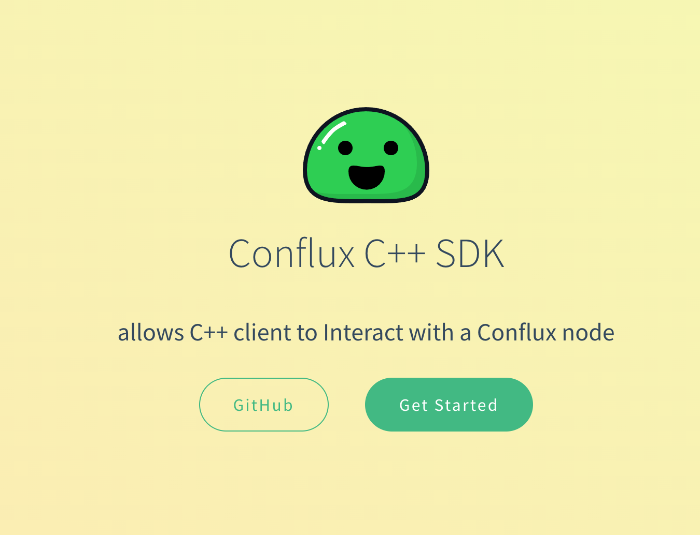

Conflux has SDKs for mainstream programming languages, including `JavaScript`, `Golang`, `Java` and `Python`. This is just a short introduction to the SDKs, for detailed usage info, check their respective documentation.

## Official SDKs

### [js-conflux-sdk](https://confluxnetwork.gitbook.io/js-conflux-sdk/)

If you are familiar with JavaScript or Node.js, or if you want to build a web site to interact with your contract, `js-conflux-sdk` is right for you. It has a lot of useful features.

```js
const { Conflux } = require("js-conflux-sdk");

async function main() {
  let conflux = new Conflux({
    url: "https://test.confluxrpc.com",
    networkId: 1,
  });

  let balance = await conflux.cfx.getBalance(
    "cfxtest:aakkfzezns4h8ymx1cgmcnd4x3aev6e2he38nnu8sv"
  );
  console.log("balance: ", balance);
}

main().catch(console.log);
```

### [go-conflux-sdk](https://github.com/conflux-chain/go-conflux-sdk)

Golang is a great language: fast, easy to use, and stable. In blockchain world a lot projects are developing with Go. If you want to develop a backend service which needs to communicate with Conflux network, `go-conflux-sdk` suits for you.

```go
package main

import (
	"fmt"

	conflux "github.com/Conflux-Chain/go-conflux-sdk"
)

func main() {
	client, err := conflux.NewClient("https://test.confluxrpc.com")
	if err != nil {
		fmt.Println("failed to create client:", err)
		return
	}
	defer client.Close()

	epoch, err := client.GetEpochNumber()
	if err != nil {
		fmt.Println("failed to get epoch number:", err)
		return
	}

	fmt.Println("Current epoch number:", epoch)
}

```

### [java-conflux-sdk](https://github.com/conflux-chain/java-conflux-sdk)

Java is really a long live programming language. `java-conflux-sdk` can be used to talk to a Conflux node. It is evolved from the [web3j](https://docs.web3j.io/) library. Some of web3j's utility functions also work on the Conflux network.

```java
package conflux.sdk.examples;
import java.math.BigInteger;
import conflux.web3j.Cfx;

public class App {
  public static void main(String[] args) throws Exception {
    int retry = 3;
    int intervalMills = 1000;  // interval(milliseconds) between retry
    Cfx cfx = Cfx.create("https://test.confluxrpc.com", retry, intervalMills);
    BigInteger epoch = cfx.getEpochNumber().sendAndGet();
    System.out.println("Current epoch: " + epoch);
  }
}
```

### [python-conflux-sdk](https://github.com/conflux-chain/python-conflux-sdk)

`python-conflux-sdk` (also known as `conflux_web3`) is the official Python SDK for Conflux Core Space. It is built upon [web3.py](https://github.com/ethereum/web3.py) v6, and most of its API is consistent with `web3.py`, offering convenience for developers who wish to migrate their Python code from Ethereum. For example:

```python
# modified from https://web3py.readthedocs.io/en/stable/middleware.html#signing
from conflux_web3 import Web3
w3 = Web3("https://test.confluxrpc.com")
from conflux_web3.middleware import construct_sign_and_send_raw_middleware
from cfx_account import Account
acct = Account.create('KEYSMASH FJAFJKLDSKF7JKFDJ 1530')
w3.middleware_onion.add(construct_sign_and_send_raw_middleware(acct))
w3.cfx.default_account = acct.address

transaction = {
    'to': w3.address.zero_address(),
    'value': 22,
}
w3.cfx.send_transaction(transaction)
```

Online runnable examples (courtesy of [Binder](https://mybinder.org/)) are provided in the [SDK documentation](https://python-conflux-sdk.readthedocs.io/en/latest/README.html), available in both English and Chinese.

## Solidity SDKs

### [thirdweb Solidity SDK](https://portal.thirdweb.com/solidity)

This SDK provides the tools needed to build custom smart contracts efficiently by offering a set of prebuilt base contracts and a set of reusable components, or extensions, that can be integrated into your own smart contracts.

### [Conflux-contracts](https://github.com/conflux-fans/conflux-contracts)

This is a Solidity package including common useful contracts in Conflux DAPP developments. Which is kindly like OpenZeppelin. Currenlty most used is `Conflux InternalContracts`.

### [OpenZeppelin](https://docs.openzeppelin.com/contracts/4.x/)

This is the famous library for secure smart contract development. Build on a solid foundation of community-vetted code.

- Implementations of standards like ERC20 and ERC721.
- Flexible role-based permissioning scheme.
- Reusable Solidity components to build custom contracts and complex decentralized systems.

## Community developed SDKs

### [Cive](https://cive.zyx.ee/)

Cive is a **Typescript** interface for the Conflux Core Space. It is built on [`viem`](https://viem.sh/). It inherits all the advantages of Viem, such as being `lightweight`, `modular`, `high-performance`, and `type-safe`, making it suitable for developing applications and various tools.

### [thirdweb SDK](https://portal.thirdweb.com/sdk)

The SDK covers all aspects of the web3 development stack, including connecting to user’s wallets, interacting with the blockchain and smart contracts, decentralized storage, authentication, and more; enabling you to build scalable and performant web3 applications on any EVM-compatible blockchain.

### [cpp-conflux-sdk](https://csyangbinbin.github.io/cpp-conflux-sdk/)

The Conflux C++ API allows any C++ client to interact with a local or remote Conflux node based on JSON-RPC 2.0 protocol. With Conflux C++ API, user can easily manage accounts, send transactions, deploy smart contracts and query blockchain information.



### [.NET SDK](https://github.com/Nconflux/Conflux.net.SDK)

Nconflux is the .Net integration library for Conflux, simplifying the access and smart contract interaction with Conflux nodes.

Nconflux is developed targeting netcore 3.1 and .net 5, hence it is compatible with all the operating systems (Windows, Linux, MacOS, Android and OSX) and has been tested on cloud, mobile, desktop, Xbox, hololens and windows IoT.

### [Swift SDK](https://github.com/Conflux-Chain/swift-conflux-wallet-sdk)
