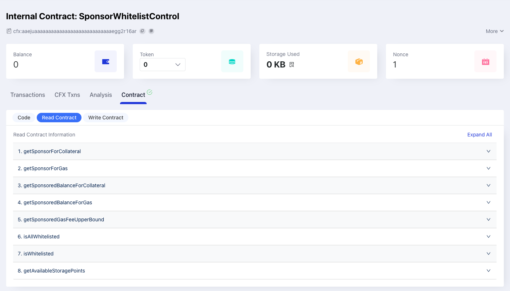

A "smart contract" is simply a program that runs on the Conflux Core blockchain. It's a collection of code (its functions) and data (its state) that resides at a specific address on the Conflux Core blockchain. To learn more about smart contracts, see our [Introduction to Smart Contracts](/docs/general/conflux-basics/contracts).

## Smart contract in Conflux Core

Conflux Core has a built-in virtual machine (VM) that can execute smart contracts. The VM is almost entirely compatible with the Ethereum Virtual Machine (EVM), meaning that the majority of Ethereum smart contracts can be deployed and run directly on Conflux Core. Conflux Core smart contracts are also written in the **Solidity language**, and mainstream Solidity libraries can be used directly for developing Conflux Core smart contracts.

To learn more about Solidity language see our [Intro to Solidity](/docs/general/build/smart-contracts/solidity-basics) and it's [official documentation](https://docs.soliditylang.org/en/).

## Compare to Ethereum Smart Contract

Conflux's VM is almost entirely compatible with EVM, meaning that the majority of Ethereum smart contracts can be deployed and run directly on Conflux Core. Conflux Core smart contracts are also written in the Solidity language, and mainstream Solidity libraries can be used directly for developing Conflux Core smart contracts.

However, there are two points to note for Ethereum smart contract developers:

1. The calculation rules for Conflux Core contract addresses are different from Ethereum. If there are any instances of address calculations in Solidity code or interaction logic, it is important to check whether modifications are needed.
2. The 1820 contract address in Conflux Core is different from Ethereum. The Ethereum 1820 contract address is `0x1820a4B7618BdE71Dce8cdc73aAB6C95905faD24`, while the Conflux Core 1820 contract address is `0x88887eD889e776bCBe2f0f9932EcFaBcDfCd1820`.

Check [Differences between Conflux VM and EVM](../core-space-basics/vm-difference.md) for more details.

We also provide a Solidity library called [conflux-contracts](https://github.com/conflux-fans/conflux-contracts) which include source code of Conflux's Internal Contracts and address utilities.

## Core Space contract dev tools {#smart-contract-development-tools}

It's recommended to use the following tools for smart contract development:

- Hardhat + [Conflux Network plugin](https://github.com/conflux-chain/hardhat-conflux) - A popular Ethereum development environment for smart contracts
- [ChainIDE](https://chainide.com/) - A Remix like web-based IDE for smart contract development

### Scan contract read write tool

Conflux Scan provides a tool to read and write smart contracts. You can use it to interact with smart contracts on the Conflux network.

Any contract on the Conflux network that has been verified on Conflux Scan can be interacted with using this tool. You can read the contract's state, call its methods, and send transactions to it.