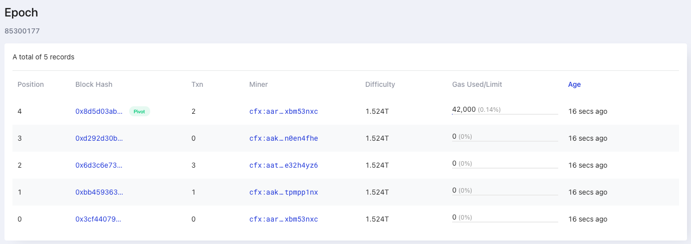
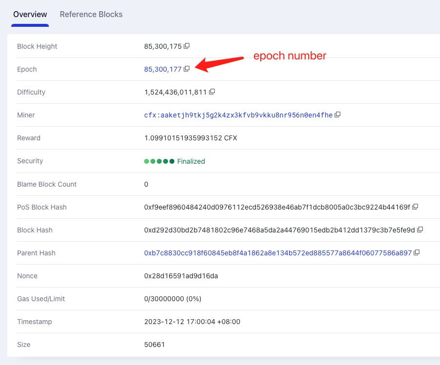
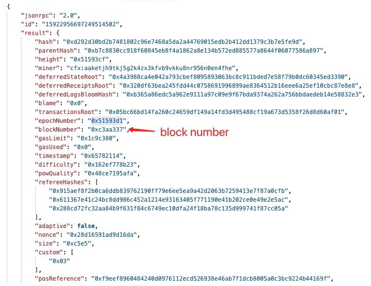

## What is Epoch Number?

Conflux Core Space uses the [Tree-Graph](/docs/general/conflux-basics/consensus-mechanisms/proof-of-work/tree-graph) as its ledger structure. Each block, apart from having a single parent edge, also contains a list of reference edges to previous blocks. This structure is essentially a directed tree (parent edges only) embedded inside a DAG (all edges), hence the name Tree-Graph.

When processing transactions, Conflux first selects a pivot chain in the Tree-Graph using [GHAST](https://confluxnetwork.medium.com/conflux-research-group-ghast-mechanism-adaptive-weight-ghast-explained-part-1-ffe8224a7282). Then, using the pivot chain and the reference edges, it orders the ledger into a linear sequence of blocks.


All the blue blocks in above figures are in the pivot chain. Pivot chain can be understood as the main axis or trunk of the Tree-Graph. Each block in the pivot chain define an **epoch** and has a **unique epoch number**. The epoch number of the genesis block is 0. The epoch number of the next block is 1, and so on.

Each epoch in Tree-Graph may have **one or more blocks**. And the block in the pivot chain called **pivot block** is the **last block of the epoch**. All the blocks in **one epoch** have the **same epoch number**.



## How to get latest epoch number?

You can see the latest epoch number in [confluxscan](https://confluxscan.io), or get by calling [`cfx_epochNumber`](/docs/core/build/json-rpc/cfx-namespace#cfx_epochnumber) RPC method.

```bash
# Request
curl -X POST --data '{"jsonrpc":"2.0","method":"cfx_epochNumber","params":["latest_mined"],"id":1}' -H "Content-Type: application/json" https://main.confluxrpc.com

# Result
{
    "jsonrpc" : "2.0",
    "result" : "0x5159665",
    "id" : 1
}
```

The **result** is a hex string. You can convert it to decimal number to get the epoch number. Check [cfx_epochNumber](/docs/core/build/json-rpc/cfx-namespace#cfx_epochnumber)'s documentation for more details.

## What's the difference between block's epoch number and block number?

In confluxscan's block detail page, you can see the block's epoch number and block number. It's the number of the epoch the block belongs to.



Block height is the **height of a block within its branch chain**. If a block is a pivot block, its block height is equal to the epoch number.

If you retrieve block information through block-related RPC methods (such as cfx_getBlockByHash), you can also see the epoch number of the block. In addition to that, you can observe the block's **blockNumber**. The blockNumber represents the height of the block in the entire full-ordered Tree-Graph . In other words, blockNumber is the height of the block in the entire Tree-Graph, not the height within its branch chain.



## FAQs

### Why there are multiple blocks have same epochNumber?

This is normal. It means that these blocks are in the same epoch. So they have the same epoch number.

### Is there a limit on the number of blocks in an epoch?

No, but we have observed that the number of blocks in an epoch is usually less than 100.

### Is Ethereum's Epoch Number the same as Conflux's Epoch Number?

No, they are different.

### Does Conflux eSpace have Epoch Number?

No, eSpace doesn't have Epoch Number.

### What's the epoch time of Conflux Core?

It's about 1 seconds. But it's not fixed. It depends on the network's hash rate.
