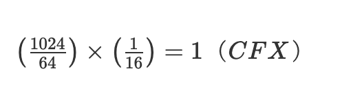

Conflux Core introduced the Collateral for Storage (CFS) mechanism as a **pricing method for using storage**. Compared to Ethereum's one-time storage fee, the CFS mechanism is more fair and reasonable. In principle, this mechanism requires locking a certain amount of funds as collateral to occupy storage space. This collateral remains locked until the corresponding storage space is either released or taken over by others. The interest generated by the locked collateral is directly allocated to miners for maintaining the storage space. Thus, the storage cost in Conflux also depends on the duration for which the storage space is occupied. Conflux has detailed this mechanism in chapter 7 of its [Conflux Protocol Specification](https://confluxnetwork.org/files/Conflux_Protocol_Specification.pdf).

## Storage Cost Calculation

In the Conflux network, **each storage entry occupies 64B (B is Bytes, byte)**, which is the size of the key/value pair in the world state. It is important to note that the key in the blockchain is generally 256 bits long, and the value is also 256 bits long (each is 32B long, totaling 64B). The deposit required for storage is proportional to the smallest multiple of 64B that can encompass all stored items. In the world state, throughout the entire lifecycle of a storage item, the item's owner must lock a fixed amount of CFX as a storage deposit. Specifically, for each storage entry of 64B, the owner will have 1/16 CFX locked. For **occupying `1KB` of space, you will pay `1CFX`** as a deposit. The corresponding formula is as follows:

## Storage Ownership

For each storage entry, the **last account** that writes to the entry is considered the owner of the storage entry. The storage owner is required to pay the storage collateral for the storage entry.

> If a storage entry is written in the execution of a contract C with sponsorship for collateral, then C is regarded as the account writing to that entry and hence becomes the owner accordingly (see Section 8.1 in [Conflux Protocol Specification](https://www.confluxnetwork.org/files/Conflux_Protocol_Specification.pdf) for more details).

When account α becomes the owner of a storage entry (whether through creation or modification), α must immediately lock 1/16 CFX for the entry. If α has sufficient balance, the required deposit will be automatically locked. However, if α does not have enough balance, the operation will fail, and α cannot create or modify the entry.

If a contract is sponsored, the sponsor will pay the storage collateral for the storage entry, and the sponsor will then become the owner of the storage entry. If the contract's sponsor changes, the new sponsor will pay the storage collateral for the storage entry, becoming the new owner.

## Collateral Refund

When a storage item is **deleted from the world state**, the corresponding 1/16 CFX deposit will be unlocked and **returned to the item owner's balance**.

If the ownership of a storage item changes, the 1/16 CFX deposit of the previous owner is unlocked, and the new owner must simultaneously lock 1/16 CFX as their deposit.

It should be noted that the deposit **refund is "quietly" added to the balance**; there is no transfer transaction available for inquiry.

## Specify Storage Collateral in Transactions

When users **send a Conflux Core transaction**, they must fill in a `storageLimit` field (**in bytes**). The storage limit functions similarly to the gas limit, but for storage. It sets an upper limit, stipulating that the increase in the deposit payer's deposit before and after executing the transaction should not exceed the `storage upper limit` multiplied by 1/1024 CFX. If this value is set too low, the deposit may exceed the upper limit after execution, leading to transaction failure. Therefore, this field generally needs to be set higher than the actual usage, and **any excess will not generate a storage mortgage**. However, setting it excessively high is not recommended, as it might result in an insufficient balance to cover the deposit, causing the transaction to fail. The Fullnode provides the RPC method `cfx_estimateGasAndCollateral` to estimate the storage size a transaction will use.

After executing the transaction, the `Receipt` includes several fields related to storage changes:

* `storageCollateralized`: This shows the amount of data that is stored and collateralized.
* `storageCoveredBySponsor`: Indicates whether the storage mortgage for this transaction is sponsored.
* `storageReleased`: The amount of storage released by this transaction.

The `cfx_getCollateralForStorage` method can be used to query the storage size currently mortgaged by an address; the unit is bytes. The mortgaged amount of CFX can be calculated by dividing this value by 1024. Additionally, this information can be obtained through the `cfx_getAccount` method. The returned information includes the `collateralForStorage` field.

## Sponsorship Mechanism and CIP-107

Conflux implements a [sponsorship mechanism](./internal-contracts/sponsor-whitelist-control.md) to subsidize the usage of smart contracts. This mechanism allows the sponsor of a contract to pay the collateral for storage occupied by transactions, instead of the transaction sender.

Following the [`v2.3.0` hardfork](../../general/hardforks/v2.3.md), [CIP-107](https://github.com/Conflux-Chain/CIPs/blob/master/CIPs/cip-107.md) was activated. This introduced storage points as a new type of collateral for storage, where 1 KB of storage space costs 1,024 storage points.

Collateral storage points are also refunded when the storage space they cover is freed or when its ownership changes. However, it is important to note that these storage points are non-transferrable and do not generate storage interest.

For more detailed information on the sponsorship mechanism and CIP-107, please refer to [Sponsorship Mechanism](./internal-contracts/sponsor-whitelist-control.md) and [CIP-107 DAO-Adjustable Burn of Storage Collateral](https://github.com/Conflux-Chain/CIPs/blob/master/CIPs/cip-107.md).

## FAQs

### Does eSpace Have Storage Collateral?

No. The storage collateral mechanism is applicable exclusively to the Conflux Core Space.
