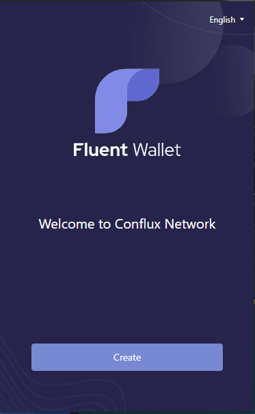
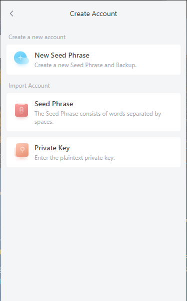
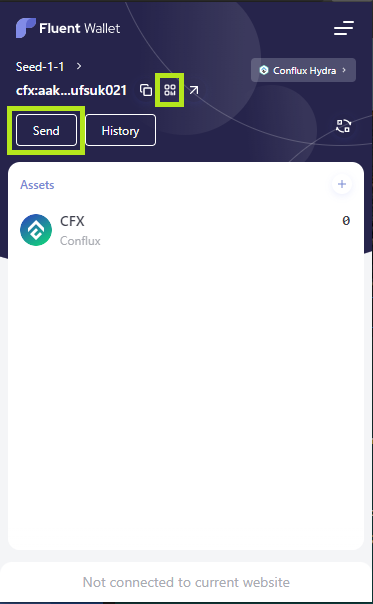

To interact with Conflux Core Space, you'll first need to create an account. Usually accounts in Conflux Core Space are created and managed through the Fluent wallet. 

### Installing [Fluent Wallet](https://fluentwallet.com/)

Fluent is a browser plug-in wallet, similar to Ethereum's MetaMask wallet. It currently supports by Chrome, Firefox and Edge. Users can directly search for `Fluent Wallet` in the browser plug-in market, select and install it. Or find it in [Fluent official website](https://fluentwallet.com/)

After the Fluent wallet is installed, the first step is to set the password:

The next step is to create or import an account seed phrase. The account seed phrase can be used to generate or restore an account, so it is very important and needs to be kept properly.

After the seed phrase is created, Fluent will automatically create an account through it and you can see the name, address, balance and other information of the account. You can also see the CFX `Send` and `Deposit` buttons, click to send or receive CFX.

