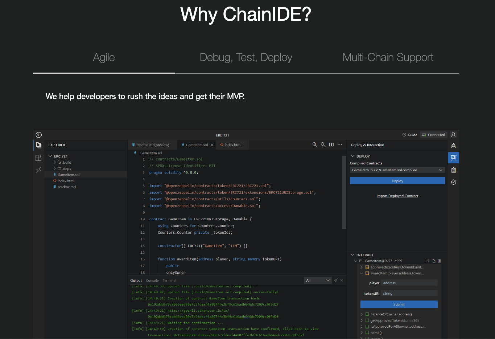
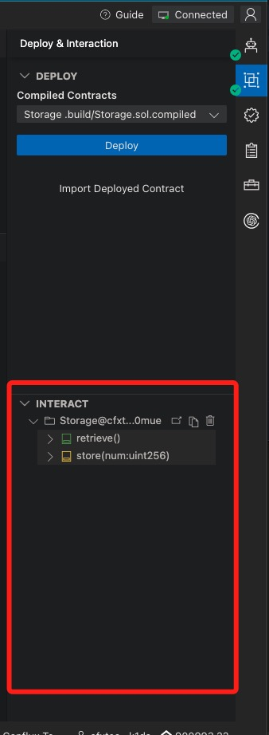
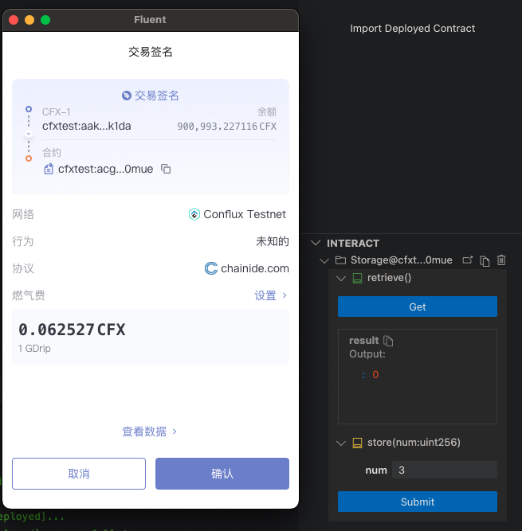

[ChainIDE](https://chainide.com/) is a web-based IDE for blockchain smart contract development. It provides a one-stop solution for smart contract development, testing, debugging, and deployment.
It is kind like Remix for Ethereum, but it is more powerful. It supports multiple blockchains, including Conflux Core Space.



This tutorial will show you how to use ChainIDE to develop and deploy a smart contract on Core Space.

## Create Project

First, you need to create a project on ChainIDE. First select `Conflux` in left Chain list, and then choose a template from right cards. In this tutorial will choose **Storage** template.


## Workspace Overview

After creating a project, you will see the workspace of ChainIDE. It is similar to VSCode. The left side is the file explorer, the right side is the editor, and the bottom is the terminal.


The example solidity code is: 

```js
// SPDX-License-Identifier: MIT
pragma solidity ^0.8.0;

/**
 * @title Storage
 * @dev Store & retrieve value in a variable
 */
contract Storage {

    uint256 number;

    /**
     * @dev Store value in variable
     * @param num value to store
     */
    function store(uint256 num) public {
        number = num;
    }

    /**
     * @dev Return value 
     * @return value of 'number'
     */
    function retrieve() public view returns (uint256){
        return number;
    }
}

```

## Compile Contract

In the right toolbox the first one is **Solidity Compiler**, you can choose the compiler version, and then click **Compile** button to compile the contract.

After the compilation is completed, you will get the `ABI` and `BYTECODE`.


## Connect Fluent Wallet

Before we deploy this contract to Core Space Testnet, we need to connect the Fluent Wallet. Click the **Connect Wallet** button in the window top right.

And then click **Injected Web3 Provider** button in the popup window.


After that, we can choose the Fluent Wallet, because we want to deploy contract to Core Space.


Finally click **approve** in wallet popup window. Then we can see that the status(top right) of wallet connection is **Connected**, and the connected account address and balance in bottom right.

Remember to switch the network to **Conflux Testnet** in Fluent.

## Deploy Contract

Click the **Deploy & Interaction** in right toolbox, then choose a contract to deploy, click the **Deploy** button. Then a deploy confirmation popup window will show, click **Confirm** button to deploy the contract. A transaction will send to Core Space Testnet, and the contract will be deployed after the transaction is executed.


You can see the deploy progress in the **Output** area, include the transaction hash.

After the contract is deployed, a new contract will appear in **Interact** area.



## Interact with Contract

The Interact tool will list all the public functions of the contract. If a function is read only, you can click the **Get** button to get result. If function has parameters, you can specify them with input box.

If the function is a state changing function, you need to click **Submit** button to send a transaction to Core Space Testnet. After the transaction is executed, the result will show in the **Output** area.



## Other tools

There are other tools in the right toolbox, include:

1. Contract Verifier: can be used to verify contract source code on ConfluxScan
2. Address Converter


## Summary

ChainIDE is a powerful IDE for smart contract development. It is very convenient to use, and it is very suitable for beginners. You can use it to develop and deploy smart contracts on Core Space Testnet.