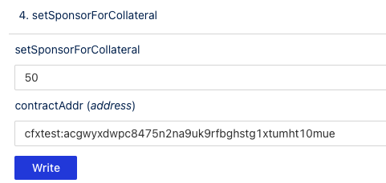
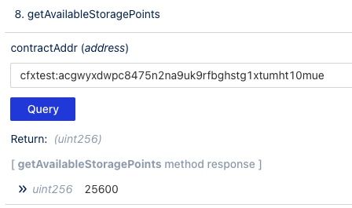
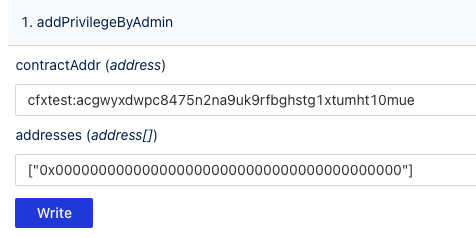

Conflux Core [Sponsorship](../core-space-basics/sponsor-mechanism.md) is a user-friendly feature for blockchain new users. In this tutorial, we will show you how to use [ConfluxScan Read&Write Tool](https://testnet.confluxscan.io/address/cfxtest:aaejuaaaaaaaaaaaaaaaaaaaaaaaaaaaaeprn7v0eh?tab=contract-viewer) to sponsor a contract.

Read&Write Tool is a tool for users to interact with smart contracts. Any verified contract on ConfluxScan can use it read or write data.

## Preparation

1. Install [Fluent](https://fluentwallet.com/) wallet, switch network to Conflux Testnet.
2. Get some test tokens from [Conflux Testnet Faucet](https://faucet.confluxnetwork.org/).
3. A contract address, for example: `cfxtest:acgwyxdwpc8475n2na9uk9rfbghstg1xtumht10mue`

## Query Sponsor Info

In the **Read Contract** tab, all the contract's view method is listed. Open anyone of them, input parameter(If any), click **Query** button, you will get the result.

Take `getSponsorForGas` for example:

If **Zero Address** returned, it means the contract is not sponsored.

## Sponsor Storage

In the **Write Contract** tab, all the contract's write method is listed. Before use it, you need connect your wallet first.

If a write method has a **payable modifier**, the first input box can be used to set the amount of CFX to be transferred to the contract, when calling the method.

In this example we input 50, which means we will transfer 50 CFX to the contract.

Then click the **Write** button, a popup will show up, click **Confirm** to confirm the transaction.

After the transaction is executed, we can query the contract's sponsor info again. 

Half of the CFX will be converted to storage points.

## Sponsor Gas

We will set 10 CFX for gas sponsor balance, and upper bound is **1000000000000000** Drip.

After the transaction is executed, we can query the contract's sponsor info again.

## Whitelist

Finally, we need to add zero address to the whitelist, so we can use the contract without paying gas fee.

The second parameter is an array, we can pass ["0x0000000000000000000000000000000000000000"].

## Check Contract Storage usage info on ConfluxScan

You can also check contract's storage used and sponsor balance info on ConfluxScan's contract detail page.

## Check Transaction Sponsored on ConfluxScan

After setting up the sponsor, we can interact with the contract without paying gas fee. And the transaction will be marked as **Sponsored** on ConfluxScan in detail page.

## Other Sponsor Methods

Developers can use SDKs to call `SponsorWhitelistControl`'s methods to sponsor a contract. Check [example at here](../core-space-basics/internal-contracts/sponsor-whitelist-control.md#how-to-sponsor-a-contract).

## FAQs

### I sponsored a contract, but the transaction still failed. Why?

There are several reasons that may cause the transaction to fail:

1. Upperbound is too small.
2. The sponsor balance is not enough.
3. The whitelist is not set correctly.
