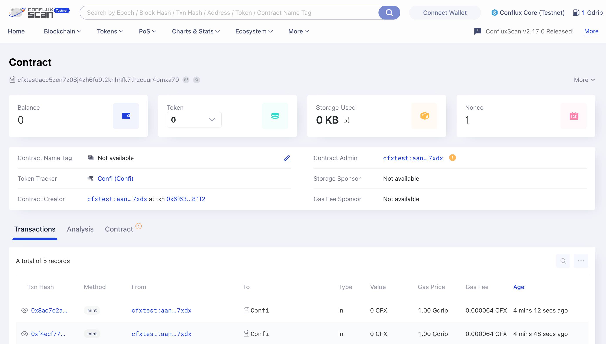

# Create and Deploy CRC721 NFT on Conflux with Hardhat

This tutorial will guide you through the steps to create, write, and deploy an CRC721 NFT smart contract on Conflux CoreSpace using Hardhat. Additionally, it will show you how to view your contract on ConfluxScan.

If you are not familiar with Hardhat, please refer to the [Hardhat documentation](https://hardhat.org/getting-started/).

## Prerequisites

Before you start, make sure you have the following:

- Node.js installed on your computer.
- A text editor, such as Visual Studio Code.
- A basic understanding of smart contract development and the Solidity programming language.

## Step 1: Setting Up Your Environment

First, you need to set up your development environment:

```bash
mkdir conflux-nft-crc721
cd conflux-nft-crc721
npm init -y
npm install --save-dev hardhat
```

Now, run the following command to create a Hardhat project:

```bash
npx hardhat
```

When prompted, choose the default project setup by pressing Enter for all questions. This will create a basic Hardhat project setup with all the necessary configurations. After setting up, your project directory should include the Hardhat configuration files.

[](../imgs/nft-tutorials/hardhat-create-project.png)

## Step 2: Installing Dependencies

Install OpenZeppelin contracts, which provide a secure, audited implementation of ERC721 tokens, And Install Hardhat-Conflux-Plugin, which is built on top of js-conflux-sdk, making its usage for deployment and interaction very similar to that of js-conflux-sdk:

```bash
npm install @openzeppelin/contracts hardhat-conflux js-conflux-sdk
```

For additional information on the Hardhat-Conflux-Plugin, please refer to the [Hardhat Conflux Plugin Tutorials](https://doc.confluxnetwork.org/docs/core/tutorials/hardhat-conflux-plugin).
To learn more about the JS-Conflux-SDK, please visit the [JS-Conflux-SDK Documentation](https://docs.confluxnetwork.org/js-conflux-sdk).

## Step 3: Writing the Smart Contract

Create a new file named `ConfluxCRC721NFT.sol` in the `contracts` folder and add the following Solidity code:

```solidity
// SPDX-License-Identifier: MIT
pragma solidity ^0.8.24;

import "@openzeppelin/contracts/token/ERC721/extensions/ERC721URIStorage.sol";
import "@openzeppelin/contracts/access/Ownable.sol";

contract ConfluxCRC721NFT is ERC721URIStorage, Ownable {
    uint256 public nextTokenId;

    constructor(
        string memory name_,
        string memory symbol_
    ) ERC721(name_, symbol_) Ownable(msg.sender) {}

    function mint(address to, string memory uri) public onlyOwner {
        _safeMint(to, nextTokenId);
        _setTokenURI(nextTokenId, uri);
        nextTokenId++;
    }
}

```

This contract uses OpenZeppelin's ERC721URIStorage and Ownable contracts to create an NFT that only the owner can mint.

## Step 4: Configuring Hardhat

Edit the `hardhat.config.js` to add the Conflux network configuration:

```javascript
require("@nomicfoundation/hardhat-toolbox");
require("hardhat-conflux");

const PRIVATE_KEY = "YOUR_PRIVATE_KEY_HERE";

/** @type import('hardhat/config').HardhatUserConfig */
module.exports = {
  solidity: "0.8.24",
  defaultNetwork: "cfxTestnet",
  networks: {
    cfx: {
      url: "https://main.confluxrpc.com",
      accounts: [PRIVATE_KEY],
      chainId: 1029,
    },
    cfxTestnet: {
      url: "https://test.confluxrpc.com",
      accounts: [PRIVATE_KEY],
      chainId: 1,
    },
  },
};
```

Replace `YOUR_PRIVATE_KEY_HERE` with your private key.

## Step 5: Deploying the Contract

Create a deployment script in the `scripts` folder, named `deploy.js`:

```javascript
const hre = require("hardhat");

async function main() {
  const signers = await hre.conflux.getSigners();
  const defaultAccount = signers[0];

  const ConfluxCRC721NFT = await hre.conflux.getContractFactory(
    "ConfluxCRC721NFT"
  );
  const receipt = await ConfluxCRC721NFT.constructor("Confi", "Confi")
    .sendTransaction({
      from: defaultAccount.address,
    })
    .executed();

  console.log(
    `Contract deployment ${
      receipt.outcomeStatus === 0 ? "succeeded" : "failed"
    }`
  );

  console.log("ConfluxCRC721NFT deployed to:", receipt.contractCreated);
}

main()
  .then(() => process.exit(0))
  .catch((error) => {
    console.error(error);
    process.exit(1);
  });
```

Deploy the contract by running:

```bash
npx hardhat run scripts/deploy.js --network cfxTestnet
```

## Step 6: Minting an NFT

To mint an NFT, you can use a script that interacts directly with the `mint` function in your smart contract. This script will mint an NFT to a specified address.

Create another script in the `scripts` folder and name it `mintNFT.js`:

This script sets the URI of a specific token, where `YOUR_CONTRACT_ADDRESS` is the address of your deployed NFT contract and `NFT_RECEIVER_ADDRESS` is the address of the NFT you want mint to.

```javascript
const hre = require("hardhat");

async function main() {
  const signers = await hre.conflux.getSigners();
  const defaultAccount = signers[0];

  const contractAddress = "YOUR_CONTRACT_ADDRESS";
  const recipientAddress = "NFT_RECEIVER_ADDRESS"; // Address to receive the NFT
  const tokenURI = "https://yourdomain.com/metadata/1.json"; // The metadata URI for the NFT

  const ConfluxCRC721NFT = await hre.conflux.getContractAt(
    "ConfluxCRC721NFT",
    contractAddress
  );

  const receipt = await ConfluxCRC721NFT.mint(recipientAddress, tokenURI)
    .sendTransaction({
      from: defaultAccount.address,
    })
    .executed();

  console.log(
    `Minted NFT to ${recipientAddress}: Transaction Hash: ${receipt.transactionHash}`
  );
}

main().catch((error) => {
  console.error(error);
  process.exit(1);
});
```

Replace `YOUR_CONTRACT_ADDRESS` with your contract's address and `RECIPIENT_WALLET_ADDRESS` with the address of the wallet that should receive the NFT.

These steps and scripts allow you to manage the lifecycle of your NFT, from minting to setting metadata, directly through Hardhat scripts. Adjust the `tokenURI` in both scripts to match your NFT's metadata location.

You will see the following message after successful deployment
[](../imgs/nft-tutorials/deploy-success.png)

## Step 7: Viewing Your Contract on ConfluxScan

After deploying your contract, go to [ConfluxScan](https://testnet.confluxscan.io/), enter your contract address in the search bar, and you can view your contract's details, transactions, and more.

[](../imgs/nft-tutorials/deploy-success.png)

## Conclusion

This guide provided a step-by-step process for creating, deploying, and managing an CRC721 NFT on Conflux CoreSpace using Hardhat. By following these steps, you can launch your own NFT project on Conflux coreSpace.
