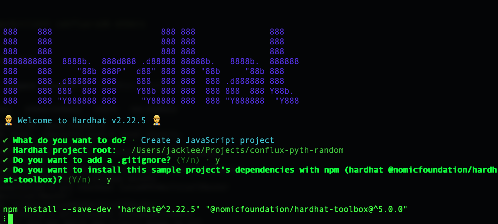

# Retrieve Random Numbers

This tutorial will guide you through building a project on Conflux eSpace using Hardhat and retrieving random numbers through the Pyth Oracle.

## Prerequisites

Before starting, ensure you have the following software installed:

1. Node.js and npm
2. Hardhat
3. ConfluxPortal wallet extension

## Step 1: Create a Hardhat Project

First, we need to create a new Hardhat project.

```bash
mkdir conflux-pyth-random
cd conflux-pyth-random
npm init -y
npx hardhat init
```

Follow the prompts and choose the default options to create a basic JavaScript project and install the required dependencies.



## Step 2: Install Necessary Dependencies

Install the Pyth client library and Conflux-related dependencies.

```bash
npm install @pythnetwork/pyth-sdk-solidity @pythnetwork/entropy-sdk-solidity dotenv
```

## Step 3: Configure Hardhat

Configure the Conflux eSpace network in `hardhat.config.js`.

```javascript
require("@nomicfoundation/hardhat-toolbox");
require("dotenv").config();

module.exports = {
  solidity: "0.8.4",
  networks: {
    conflux: {
      url: "https://evmtestnet.confluxrpc.com",
      accounts: [process.env.PRIVATE_KEY],
    },
  },
};
```

## Step 4: Write the Smart Contract

Create a file named `RandomNumber.sol` in the `contracts` directory and add the following code:

```solidity
// SPDX-License-Identifier: MIT
pragma solidity ^0.8.4;

import "@pythnetwork/entropy-sdk-solidity/IEntropyConsumer.sol";
import "@pythnetwork/entropy-sdk-solidity/IEntropy.sol";

contract RandomNumber is IEntropyConsumer {
    IEntropy private entropy;

    constructor(address _entropy) {
        entropy = IEntropy(_entropy);
    }

    // This method is required by the IEntropyConsumer interface.
    // It returns the address of the entropy contract which will call the callback.
    function getEntropy() internal view override returns (address) {
        return address(entropy);
    }

    // It is called by the entropy contract when a random number is generated.
    function entropyCallback(
        uint64 sequenceNumber,
        // If your app uses multiple providers, you can use this argument to
        // distinguish which one is calling the app back.
        address provider,
        bytes32 randomNumber
    ) internal override {
        // Implement your callback logic here.
        uint256 randomNum = uint256(randomNumber);

        // Use the random number
    }

    function getRandomNumber() public payable {
        address provider = entropy.getDefaultProvider();
        uint fee = entropy.getFee(provider);
        // This method returns a sequence number and emits a RequestedWithCallback event.
        uint64 sequenceNumber = entropy.requestWithCallback{value: fee}(
            provider,
            keccak256(abi.encodePacked(block.timestamp))
        );
        // You can store this sequence number to identify the request in next step.
    }
}

```

When the final random number is ready to use, the entropyCallback function will be called by the Entropy contract. This will happen in a separate transaction submitted by the requested provider. The entropyCallback function should be implemented in the same contract that is requesting the random number.

## Step 5: Deploy the Smart Contract

Create a file named `deploy.js` in the `scripts` directory and add the following code:

```javascript
async function main() {
  const [deployer] = await ethers.getSigners();

  console.log("Deploying contracts with the account:", deployer.address);

  // eSpace Testnet
  const entropyAddress = "0xdF21D137Aadc95588205586636710ca2890538d5"; // Replace with the actual Entropy contract address

  const RandomNumber = await ethers.getContractFactory("RandomNumber");
  const randomNumber = await RandomNumber.deploy(entropyAddress);

  await randomNumber.waitForDeployment(); // Ensure the contract is deployed

  console.log("RandomNumber contract deployed to:", randomNumber.target);
}

main()
  .then(() => process.exit(0))
  .catch((error) => {
    console.error(error);
    process.exit(1);
  });

```

You can consult the current [Entropy contract addresses](https://docs.pyth.network/entropy/contract-addresses) to find the address on Conflux eSpace, which is `0xdF21D137Aadc95588205586636710ca2890538d5`.

## Step 6: Run the Deployment Script

Deploy the contract using the following command:

```bash
npx hardhat run scripts/deploy.js --network conflux
```

## Step 7: Interact with the Contract

After deployment, you can interact with the contract using the Hardhat console or a script. For example, create a file named `interact.js` in the `scripts` directory:

```javascript
async function main() {
  const [deployer] = await ethers.getSigners();

  const RandomNumber = await ethers.getContractFactory("RandomNumber");
  const randomNumber = RandomNumber.attach(
    "0x9807945B3f004B7b9812FDd4E131693176749e12"
  ); // Replace with the actual contract address

  // Request a random number
  const tx = await randomNumber.getRandomNumber({
    value: ethers.parseEther("0.01"),
  }); // Adjust the value based on the required fee
  await tx.wait();
}

main()
  .then(() => process.exit(0))
  .catch((error) => {
    console.error(error);
    process.exit(1);
  });

```

Run the script using the following command:

```bash
npx hardhat run scripts/interact.js --network conflux
```

## Summary

Through this tutorial, you have learned how to build a project on Conflux eSpace using Hardhat and retrieve random numbers through the Pyth Oracle. For more information, refer to the [Pyth Oracle official documentation](https://docs.pyth.network/).
