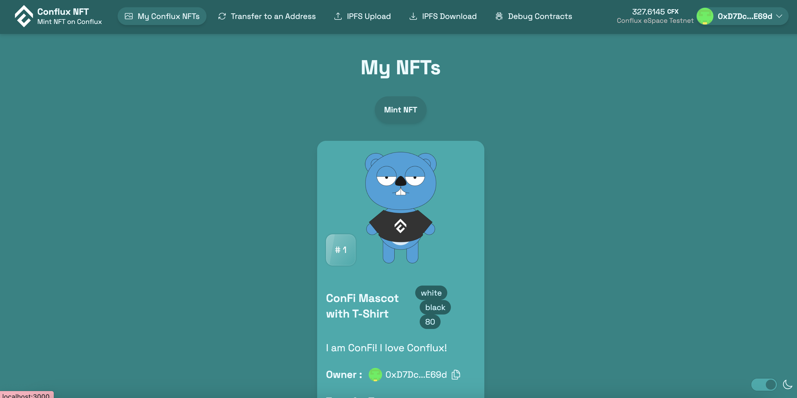

[Scaffold Conflux NFT Example](https://github.com/conflux-fans/conflux-scaffold-nft-example) is an adaptation of Scaffold-ETH-2 (https://scaffoldeth.io/) whereby we have adjusted the template to allow you to deploy a ERC721 contract on Conflux eSpace and leverage the components, integration of hardhat, and the quick deployment of Scaffold-ETH-2. 

In this tutorial, we go more in-depth of how the solidity contract is used and interact with the ERC721 contract to mint NFTs on Conflux eSpace that can be transfered to other wallets.

## Video Conflux

Watch this [video](https://youtu.be/sj2ph_ctQUg) for full tutorial on how to create an app from scratch and deploy it live on Conflux eSpace.

## Clone Scaffold Conflux

In your visual studio terminal, run the following to clone the repo and install the dependencies. 

```bash
git clone git@github.com:conflux-fans/conflux-scaffold-nft-example.git
yarn install
```

In the folder directory of `conflux-scaffold-nft-example` you will have a similar folder structure as the typical conflux scaffold repo. However, the hardhat folder includes a new contract called "ConfluxNFT.sol" which imports a bunch of openzepplin contracts.

The [openzepplin wizard](https://wizard.openzeppelin.com/#erc721) is a useful site to put together contract code for a NFT but it is best to review the libraries from node_modules within the hardhat folder and review the functions used in the solidity contract. Once you have have compiled and deployed the contract, review the debugger section in the frontend to see if the contract is constructed to your purposes.

```bash
yarn chain
```

Once the hardhat chain is set up, open up a new terminal. You can test your smart contract and then deploy it 

```bash
yarn deploy
```

There are several files that are relevant when deploying. 

- One is the deployment script in /conflux-scaffold-nft-example/packages/hardhat/deploy
- The other is the configuration of which networks you are deploying on. /conflux-scaffold-nft-example/packages/hardhat/hardhat.config.ts
- The default deployment network is hardhat but you can change it to Conflux eSpace or Conflux Testnet by doing the following

```bash
yarn deploy --network confluxESpace
```

```bash
yarn deploy --network confluxESpaceTestnet
```

To verify the contract on the Conflux testnet, simply run the following command with the Contract Address. If there were any constructors, you will need to pass them in as well after the contract address.

```sh
npx hardhat verify --network confluxESpaceTestnet [Contract Address] 
```     

The added instructions onto hardhat are in the packages/hardhat/hardhat.config.ts file where etherscan is adjusted to include the the block explorer url.

:::note
The deployer of the contract and thereby the owner of the contract can be changed by re-labelling the `./packages/hardhat/.env.example` to `./packages/hardhat/.env` and putting your private key in DEPLOYER_PRIVATE_KEY=. However, the default uses a default "public" private key for hardhat testing purposes.
:::

Once you have deployed the contract, you can start up your front-end to see how it interacts with the contracts. You should be able to see an interface like the following. The Contract Debug page is similar to other web deployment applications like Remix.


## Front-End

Once you have your front-end up and running, go ahead and try minting a NFT. You should be able to see the following being minted on the front-end.



The fun begins on navigating through your front-end and seeing how it all interacts with the contract.

- Navigate to conflux-scaffold-nft-example/packages/nextjs/app/myNFTs/page.tsx

You will see that the interaction with the contract is similar to Conflux Scaffold in the sense that functions that require gas and writing into the contract use writeContractAsync. The function to be used is specified "mintItem" and the arguments required in the contract are the address the NFT is to be minted to and the URI of the NFT (which is the IPFS url that contains the metadata of the NFT).


The actual metadata of the NFT to be uploaded to IPFS is contained in conflux-scaffold-nft-example/packages/nextjs/utils/simpleNFT/nftsMetadata.json

For each token that is minted, the token counter inside the smart contract is incremented by 1 and the tokenURI looks into this json file to find the metadata of the NFT that will add to IPFS and to the smart contract. The repo provides a default IPFS that one can use for testing purposes to post metadata that can be used for minting NFTs.

Other examples where Conflux Scaffold is used (and would need to be modified for any revised Contract Names) can be found in the following frontend pages.

- packages/nextjs/app/myNFTs/page.tsx
- packages/nextjs/app/myNFTs/_components/MyHoldings.tsx
- packages/nextjs/app/myNFTs/_components/NFTCard.tsx
- packages/nextjs/app/transfers/page.tsx

In each of these pages, the contract instance is set up to either read or write into the contract similar to the mint function, with the exception being the transfers page which uses events to create the logs of the transactions that take place.

## Deploy App on Vercel

And that's it! You are ready to deploy your app once you are happy with your smart contract and the front-end. Ensure in the front end that /packages/nextjs/scaffold.config.ts the chains.hardhat is removed if you no longer are using hardhat for testing purposes and would like to interact with contracts deployed on Conflux eSpace or Conflux Testnet.

```bash
yarn vercel
```

Follow the instructions for deployment on vercel. 

If you have any questions, please refer to the video for full tutorial [video](https://youtu.be/sj2ph_ctQUg).