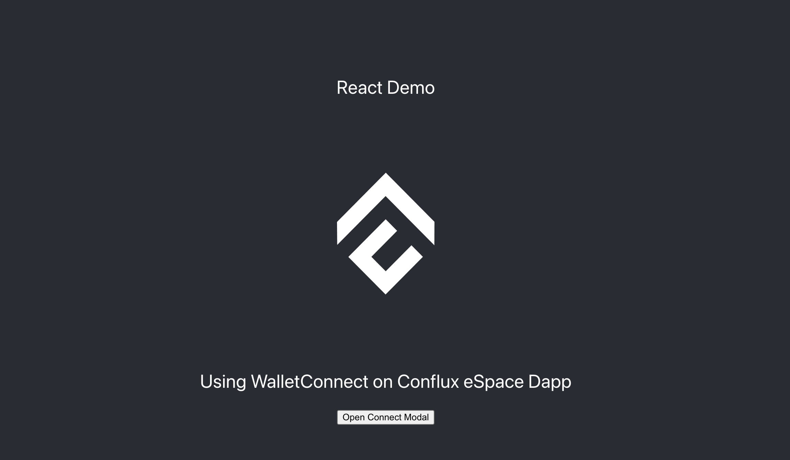

# Integrating WalletConnect with Your React App on Conflux Chain

This tutorial will guide you how to seamlessly integrate WalletConnect into your React application to enable user interactions with Conflux eSpace, thereby providing your users with a secure and intuitive way to connect their wallets to your dApp on Conflux eSpace.

[](../img/walletconnect-react.png)

## Prerequisites

- Node.js installed on your machine
- Basic understanding of React, JavaScript and Typescript
- A Conflux eSpace network-compatible wallet (e.g., MetaMask)

## Step 1: Setting Up Your React Project

If you haven't already created a React project, start by setting up one. You can skip this step if you have an existing project.

```bash
npx create-react-app web3modal-conflux-react
cd web3modal-conflux-react
```

## Step 2: Installing Necessary Libraries

Web3Modal SDK has support for Wagmi, which will help you interact with wallets and smart contracts.

```bash
npm install @web3modal/wagmi wagmi viem @tanstack/react-query
```

## Step 3: Setting Up WalletConnect

Create a new file in your project, `Web3ModalConfig.tsx`, and import the necessary modules to set up WalletConnect.

```typescript
import { createWeb3Modal } from "@web3modal/wagmi/react";

import { http, createConfig, WagmiProvider } from "wagmi";

// Import Conflux eSpace network config for wagmi
import { confluxESpace} from "wagmi/chains";
import { walletConnect, injected, coinbaseWallet } from "wagmi/connectors";

import { QueryClient, QueryClientProvider } from "@tanstack/react-query";
import { ReactNode } from "react";

// 0. Setup queryClient
const queryClient = new QueryClient();

// 1. Get projectId at https://cloud.walletconnect.com
const projectId = "YOUR_PROJECT_ID";

// 2. Create wagmiConfig
const metadata = {
  name: "Web3Modal",
  description: "Web3Modal Example",
  url: "https://web3modal.com", // origin must match your domain & subdomain
  icons: ["https://avatars.githubusercontent.com/u/37784886"],
};

const config =  (createConfig as any)({
  chains: [confluxESpace],
  transports: {
    [confluxESpace.id]: http(),
  },
  connectors: [
    walletConnect({ projectId, metadata, showQrModal: false }),
    injected({ shimDisconnect: true }),
    coinbaseWallet({
      appName: metadata.name,
      appLogoUrl: metadata.icons[0],
    }),
  ],
});

// 3. Create modal
createWeb3Modal({
  wagmiConfig: config,
  projectId,
  enableAnalytics: false, // Optional - defaults to your Cloud configuration
  enableOnramp: false, // Optional - false as default
});

export function Web3ModalProvider({ children }: { children: ReactNode }) {
  return (
    <WagmiProvider config={config}>
      <QueryClientProvider client={queryClient}>{children}</QueryClientProvider>
    </WagmiProvider>
  );
}

```

For details on how to obtain `ProjectId`, please refer to this [article](/docs/espace/tutorials/walletConnect/project-creation).

## Step 4:  Use the Web3ModalProvider in Your Application

At your application's entry point, typically in the index.tsx, use the `Web3ModalProvider` component to wrap your application.

```typescript
import React from "react";
import ReactDOM from "react-dom/client";
import "./index.css";
import App from "./App";
import reportWebVitals from "./reportWebVitals";
import { Web3ModalProvider } from "./Web3ModalConfig";

const root = ReactDOM.createRoot(
  document.getElementById("root") as HTMLElement
);
root.render(
  <React.StrictMode>
    <Web3ModalProvider>
      <App />
    </Web3ModalProvider>
  </React.StrictMode>
);

```

## Step 5: Connect Conflux eSpace Network

You can use React state hooks to manage the connected state and listen to WalletConnect provider events.

Create a new component, `ConnectWalletBtn.tsx`, in your project, to open ConnectWallet Modal 
```typescript
import { useWeb3Modal } from "@web3modal/wagmi/react";

export default function ConnectButton() {
  // Use modal hook
  const { open } = useWeb3Modal();

  return (
    <>
      <button onClick={() => open()}>Open Connect Modal</button>
    </>
  );
}

```

In `App.tsx` or any other component, use the `ConnectButton` component to connect to wallets on the Conflux eSpace
```typescript
import React from "react";
import logo from "./logo.png";
import "./App.css";
import { useWeb3Modal } from "@web3modal/wagmi/react";
import ConnectButton from "./ConnectWalletBtn";
function App() {
  return (
    <div className="App">
      <header className="App-header">
        
        <p>
          Using WalletConnect on Conflux eSpace Dapp
        </p>
        <ConnectButton/>
      </header>
    </div>
  );
}

export default App;

```

By following the steps above, you have integrated Web3Modal into your React application. This will enable users to connect their wallets via Web3Modal and interact with Conflux eSpace using Wagmi and React Query. You can now continue developing your application, adding more functionalities.