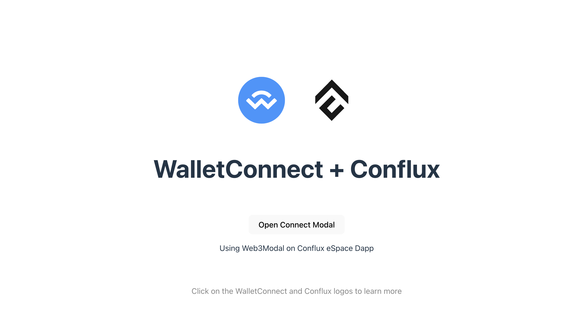

# Integrating Web3Modal with WalletConnect in a Vue.js Project

This tutorial guides you through the process of integrating WalletConnect with Web3Modal in a Vue.js project, specifically targeting the Conflux eSpace network.
For a hands-on example, check out the GitHub repository [Web3modal-Conflux-Vue](https://github.com/ConfluxDAO/web3modal-conflux-vue).

[](../img/walletconnect-vue.png)

## Prerequisites

- Node.js installed on your computer.
- Basic knowledge of Vue.js and JavaScript.

## Step 1: Setting Up Your Vue.js Project

First, create a new Vue.js project using Vite, you can skip this step if you have an existing project. Open your terminal and run the following commands:

```bash
npm create vite@latest web3modal-conflux-vue -- --template vue
cd web3modal-conflux-vue
npm install
```

## Step 2: Install Web3Modal and WalletConnect

You need to install Web3Modal and the WalletConnect provider. Run:

```bash
npm install @web3modal/wagmi @wagmi/core @wagmi/connectors viem
```

## Step 3: Setting Up Web3Modal

Create a new file named `Web3ModalSetup.js` in your project's `src` directory, and import the necessary modules to set up WalletConnect.

```javascript
import { createWeb3Modal } from "@web3modal/wagmi/vue";

import { reconnect, http, createConfig } from "@wagmi/core";
import { confluxESpace } from "@wagmi/core/chains";
import { walletConnect, injected } from "@wagmi/connectors";

// 1. Define constants
const projectId = "YOUR_PROJECT_ID";
const metadata = {
  name: "Web3Modal",
  description: "Web3Modal Example",
  url: "https://web3modal.com", // origin must match your domain & subdomain
  icons: ["https://avatars.githubusercontent.com/u/37784886"],
};

const config = createConfig({
  chains: [confluxESpace],
  transports: {
    [confluxESpace.id]: http(),
  },
  connectors: [
    walletConnect({ projectId, metadata, showQrModal: false }),
    injected({ shimDisconnect: true }),
  ],
});

reconnect(config);
// 3. Create modal
createWeb3Modal({
  wagmiConfig: config,
  projectId,
  enableAnalytics: true, // Optional - defaults to your Cloud configuration
  enableOnramp: true, // Optional - false as default
});
```

Replace `"YOUR_PROJECT_ID"` with your actual project ID.

Make sure that the url from the metadata matches your domain and subdomain. This will later be used by the [Verify API](https://docs.walletconnect.com/cloud/verify) to tell wallets if your application has been verified or not.

## Step 4: Connect Conflux eSpace Network

In your `App.vue`, import the `web3ModalSetup` instance and use it to connect to the wallet. Here’s how you can do it in your `App.vue`:

```javascript
<script setup>
import HelloWorld from "./components/HelloWorld.vue";
import "./web3ModalSetup";
</script>

<template>
  <div>
    <a href="https://walletconnect.com" target="_blank">
      
    </a>
    <a href="https://confluxnetwork.org/" target="_blank">
      
    </a>
  </div>
  <HelloWorld msg="WalletConnect + Conflux" />
</template>

...

```

Create a new component, `ConnectWallet.tsx`, in your project, to open ConnectWallet Modal

```javascript
<template>
  <div>
    <button @click="modal.open()">Open Connect Modal</button>
  </div>
</template>

<script setup>
import { useWeb3Modal } from "@web3modal/wagmi/vue";
// 4. Use modal composable
const modal = useWeb3Modal();
</script>

<style lang="scss" scoped>
</style>
```

You now have a basic setup for integrating Web3Modal with WalletConnect in your Vue.js project using Vite. This setup allows users to connect their wallets from a Vue.js application, enabling interactions with Conflux eSpace.
