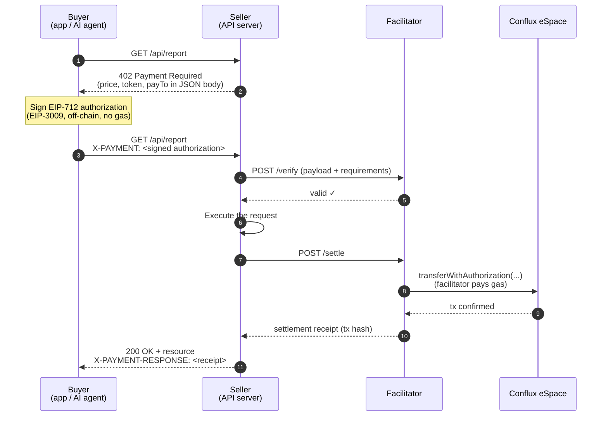

# x402 Payments on Conflux eSpace

[x402](https://www.x402.org/) is an open payment protocol that revives the HTTP `402 Payment Required` status code to make paying for web resources part of the request itself. A client — a human app or, increasingly, an **AI agent** — requests an API, receives a `402` with the price, signs a stablecoin payment authorization, and retries the request with the payment attached. No accounts, no API keys, no invoices: one HTTP round trip settles on-chain.

x402 payments are built on [EIP-3009](https://eips.ethereum.org/EIPS/eip-3009) (*Transfer With Authorization*), so they work with any stablecoin that implements it — and Conflux eSpace has two.

## Compatible stablecoins on Conflux eSpace

| Token | Address (eSpace Mainnet) | Decimals | EIP-712 Domain |
| --- | --- | --- | --- |
| [USDT0](https://evm.confluxscan.org/token/0xaf37e8b6c9ed7f6318979f56fc287d76c30847ff) | `0xAf37E8B6c9ED7F6318979F56Fc287d76C30847FF` | 6 | `name: "USDT0"`, `version: "1"` |
| [AxCNH](https://evm.confluxscan.org/token/0x70bfd7f7eadf9b9827541272589a6b2bb760ae2e) | `0x70bFD7f7eADF9B9827541272589A6b2BB760AE2E` | 6 | `name: "AxCNH"`, `version: "2"` |

Both tokens implement the EIP-3009 authorization functions (`transferWithAuthorization`, `receiveWithAuthorization`, `authorizationState`) — verified on-chain against the deployed contracts. The EIP-712 domain values above (with `chainId: 1030` and the token address as `verifyingContract`) are what buyers must use when signing authorizations; they were verified by reconstructing each token's on-chain `DOMAIN_SEPARATOR`.

## How x402 works

Three parties are involved:

- **Buyer** — the client (app or AI agent) that wants the resource and holds stablecoins.
- **Seller** — the API or content server that prices its resources.
- **Facilitator** — a service that verifies payment payloads and settles them on-chain (paying the gas), so neither buyer nor seller needs to run blockchain infrastructure.



The buyer never spends gas — they only produce an off-chain signature. The facilitator submits the transfer and pays the gas in CFX, and the seller receives the stablecoin directly to their address.

## The EIP-3009 functions

x402's `exact` payment scheme is powered by two functions that EIP-3009 stablecoins expose:

```solidity
function transferWithAuthorization(
    address from,        // buyer
    address to,          // seller's payTo address
    uint256 value,       // payment amount (6 decimals for USDT0/AxCNH)
    uint256 validAfter,  // authorization not valid before this time
    uint256 validBefore, // authorization expires at this time
    bytes32 nonce,       // random 32-byte nonce (not sequential)
    uint8 v, bytes32 r, bytes32 s  // buyer's EIP-712 signature
) external;

function receiveWithAuthorization(
    address from,
    address to,
    uint256 value,
    uint256 validAfter,
    uint256 validBefore,
    bytes32 nonce,
    uint8 v, bytes32 r, bytes32 s
) external;
```

Why they matter for x402:

- **Gasless for the buyer** — the buyer signs a typed message; anyone (the facilitator) can submit it and pay gas.
- **Random nonces** — unlike EIP-2612 permits, nonces are random `bytes32` values, so multiple authorizations can be in flight in parallel; `authorizationState(authorizer, nonce)` reports whether one has been used.
- **Time-bounded** — `validAfter`/`validBefore` limit how long an authorization is usable, which x402 uses to enforce payment timeouts.
- **`receiveWithAuthorization`** is callable only by the `to` address, preventing a third party from front-running the submission — useful when the recipient is a contract.

## Seller: middleware example

The x402 ecosystem ships middleware that turns any route into a paid route ([x402-express](https://www.npmjs.com/package/x402-express), with equivalents for Hono, Next.js, and others). Payments in USDT0 on Conflux eSpace use the custom-token form of the price config, with the EIP-712 domain values from the table above:

```javascript
import express from "express";
import { paymentMiddleware } from "x402-express";

const app = express();

app.use(
  paymentMiddleware(
    "0xYourSellerAddress", // payTo: receives the stablecoin
    {
      "GET /api/report": {
        price: {
          amount: "10000", // 0.01 USDT0 (6 decimals)
          asset: {
            address: "0xAf37E8B6c9ED7F6318979F56Fc287d76C30847FF", // USDT0
            decimals: 6,
            eip712: { name: "USDT0", version: "1" },
          },
        },
        network: "conflux-espace", // custom network — must match your facilitator's config
      },
    },
    { url: "https://your-facilitator.example.com" } // facilitator that supports chain id 1030
  )
);

app.get("/api/report", (req, res) => {
  res.json({ report: "paid content" });
});

app.listen(3000);
```

:::note Facilitator for Conflux eSpace
Hosted facilitators (e.g. the Coinbase Developer Platform facilitator behind x402.org) list specific networks and do not currently include Conflux eSpace. To accept x402 payments on eSpace, run a self-hosted facilitator configured for chain id `1030` — the [x402 repository](https://github.com/coinbase/x402) includes the facilitator implementation; it needs only an eSpace RPC endpoint and a funded CFX account for gas.
:::

## The HTTP exchange in detail

### 1. Server responds `402` with payment requirements

```json
{
  "x402Version": 1,
  "error": "X-PAYMENT header is required",
  "accepts": [
    {
      "scheme": "exact",
      "network": "conflux-espace",
      "maxAmountRequired": "10000",
      "resource": "https://api.example.com/api/report",
      "description": "Market report",
      "mimeType": "application/json",
      "payTo": "0xYourSellerAddress",
      "maxTimeoutSeconds": 60,
      "asset": "0xAf37E8B6c9ED7F6318979F56Fc287d76C30847FF",
      "extra": { "name": "USDT0", "version": "1" }
    }
  ]
}
```

### 2. Buyer retries with the `X-PAYMENT` header

The header value is the base64-encoded JSON of the signed authorization:

```
X-PAYMENT: eyJ4NDAyVmVyc2lvbiI6MSwic2NoZW1lIjoiZXhhY3QiLCJuZXR3b3JrIjoi...
```

Decoded:

```json
{
  "x402Version": 1,
  "scheme": "exact",
  "network": "conflux-espace",
  "payload": {
    "signature": "0x8f3c…1b",
    "authorization": {
      "from": "0xBuyerAddress",
      "to": "0xYourSellerAddress",
      "value": "10000",
      "validAfter": "1784817600",
      "validBefore": "1784817900",
      "nonce": "0x7f1c…d4"
    }
  }
}
```

Buyer-side libraries such as [x402-fetch](https://www.npmjs.com/package/x402-fetch) and [x402-axios](https://www.npmjs.com/package/x402-axios) handle the `402 → sign → retry` loop automatically around an existing wallet client, which is what lets AI agents pay for APIs unattended.

### 3. Server responds with `X-PAYMENT-RESPONSE`

After settlement, the success response carries a base64-encoded receipt header:

```json
{
  "success": true,
  "transaction": "0x2d9a…c7",
  "network": "conflux-espace",
  "payer": "0xBuyerAddress"
}
```

The `transaction` hash can be checked on [ConfluxScan](https://evm.confluxscan.org) — the settled transfer appears as a `transferWithAuthorization` call on the stablecoin contract.

## Further reading

- [x402.org](https://www.x402.org/) — protocol site and specification
- [coinbase/x402](https://github.com/coinbase/x402) — protocol source, middleware packages, and facilitator implementation
- [EIP-3009: Transfer With Authorization](https://eips.ethereum.org/EIPS/eip-3009)
- [USDT0 on ConfluxScan](https://evm.confluxscan.org/token/0xaf37e8b6c9ed7f6318979f56fc287d76c30847ff) · [AxCNH on ConfluxScan](https://evm.confluxscan.org/token/0x70bfd7f7eadf9b9827541272589a6b2bb760ae2e)
