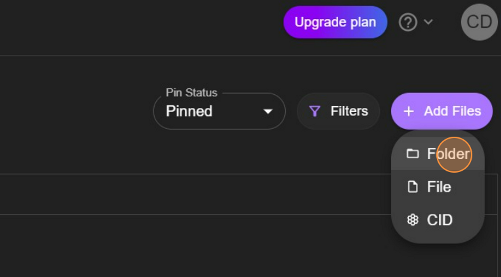

# Uploading files to IPFS using Pinata

The initial phase in establishing an NFT smart contract involves preparing your NFT files. In this instance, the files will be uploaded to **[Pinata](https://www.pinata.cloud/)**, a service that keeps files from being purged on IPFS. If you haven't created an account yet, please do so.

## What is Pinata?

Pinata is an NFT media management service that allows users to host, manage and share files of any kind on the blockchain of their choice. As an IPFS pinning service, Pinata focuses on giving both technical and non-technical creators a fast, easy, and reliable way to share content without limits.

For developers, Pinata iis one of the easiest ways to pin content to IPFS and build web3 applications without having to build and manage your own IPFS nodes. We do all the heavy lifting for you.

For creators, Pinata makes it easy to serve content at scale without any technical experience. Pinata offers the ability to start creating without having to worry about the technical side of web3 or IPFS right away.

When you “pin” data on an IPFS node, you are telling that node that the data is important, and it should be saved. A node is a program that connects you to IPFS and stores files.

Pinning prevents important data from being deleted from your node. You and only you can control and pin data on your node(s)—you can not force other nodes on the IPFS network to pin your content for you. So, to guarantee your content stays pinned, you have to run your own IPFS nodes.

Once your file is pinned to IPFS, you have full control to share, distribute, monetize and share your files however you’d like.

## Getting the Images Ready

This guide will focus on creating a single NFT, but if you want to make more, feel free to do so. The image being used can be found here if you'd like to utilize it.


Put your image file in a folder on your computer. Name this image **`0`**, making it the first image retrieved by the smart contract. It will be the first (and only) NFT in this collection; however, if you're adding more images, continue naming them in ascending numerical order. Upload this folder to Pinata once your images are properly organized and named.

:::note
💡 Some projects begin file names with **`0`**, while others with **`1`**. Make sure to be consistent with the smart contract code. We'll name this file **`0`**.
:::


Upon logging into Pinata, you'll see your dashboard. The upload button is located on the left. Click **`Add Files`**, followed by **`Folder`**.



Next, select the folder containing the image. You may receive a pop-up from your browser asking you to confirm the folder and its files' upload. If so, click **`Upload`**.


You'll be asked to name the folder you've uploaded. This is helpful when you have multiple folder sets uploaded to Pinata and need to keep them organized. After naming it, click **`Upload`** and wait for your file to upload. The number and size of the images could impact the upload time, but it should only take a few seconds for a small start.

Once the upload is finished, your folder will appear in your dashboard.


Clicking on the folder name will take you to the Pinata gateway to view your recently uploaded files. If you have a paid Pinata account, it will open the folder via your own gateway. A paid plan and personal gateway are NOT required for this tutorial but are recommended for larger collection sizes and hosting multiple folders.

Right-click on the image to copy its URL. This URL is crucial. Save it for the next step as we set up the metadata. In this example, the URL is **`https://gateway.pinata.cloud/ipfs/Qmb9WSGE66AJyYpggnxWPvmgHJo3mmyK5eNQJhKUK1ZpQn/0.png`**

## Setting Up the Metadata

With the image uploaded and its URL available, we can create the corresponding metadata file.

As this NFT will be an ERC-721, we know we can utilize metadata standards commonly found on Marketplaces like **[Joepegs.com](https://joepegs.com/)**. The .json file below demonstrates what the **[metadata](https://docs.opensea.io/docs/metadata-standards#metadata-structure)** should resemble.

```
{
  "name": "",
  "tokenId": 0,
  "image": "",
  "description": "",
  "attributes": []
}
```

Now, let's fill in the metadata file values. You can choose any **`name`** and **`description`**.

The **`tokenId`** here will be **`0`** to correspond with the uploaded image. If uploading multiple files, this needs to increment in each file.

Paste the **`image`** link (the URL that was saved earlier) here, so the smart contract knows where to locate the image file for your NFT. If uploading multiple files, the end of the URL (the specific image) needs to increment in each file.

The **`attributes`** field is not as crucial here, but if you were uploading NFTs with multiple layers, the attributes would represent those specific layers' information. This is often employed when determining NFT rarity to rank them based on the frequency of their layers throughout the entire collection. We'll leave it empty in this tutorial.

Below is an example of filling out the fields in the metadata file.

```
{
  "name": "Confi Art",
  "tokenId": 0,
  "image": "https://gateway.pinata.cloud/ipfs/Qmb9WSGE66AJyYpggnxWPvmgHJo3mmyK5eNQJhKUK1ZpQn/0.png",
  "description": "A beaver cartoon inspired in Confi."
}
```

When saving this file, ensure it has the same name as the corresponding image. In this case, it is 0.

After uploading the metadata file to Pinata, the file extension will no longer be necessary. It will search for the file as a directory and extract its information from there. To remove the file extension, follow these steps for a **[Mac](https://support.apple.com/guide/mac-help/show-or-hide-filename-extensions-on-mac-mchlp2304/mac)** environment, or these for a **[Windows](https://www.techwalla.com/articles/how-to-remove-file-extensions)** environment.

Place the file extension-less metadata in a separate folder, just as you did with the image file.


Now, repeat the folder upload process to add the metadata to Pinata. Follow the same steps as before. Once completed, both folders will be accessible on your dashboard.


Click on the metadata folder to be directed to the IPFS gateway and save the URL. This URL will be your base URL and won't need the direct file links. The smart contract will append the necessary file information for each NFT as needed. For example, our URL is **`https://gateway.pinata.cloud/ipfs/QmewVNwWYW27gKTrwhDG1Ge1ABqyQGxACCAdpx9a47d3sm`**.
