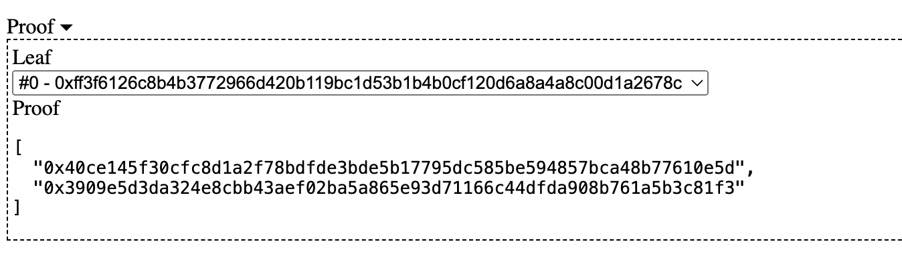

## Basic Concept

A Merkle Tree, also referred to as a hash tree, is an essential cryptographic structure in blockchain technology. It is widely implemented in blockchains such as Bitcoin and Ethereum. The construction of a Merkle Tree begins from the bottom, with each leaf node representing the hash of a data block. The non-leaf nodes are formed by hashing the combination of their two child nodes. This hierarchical structure ensures efficient and secure verification of large datasets, making Merkle Trees a critical component of blockchain integrity and security.


A `Merkle Tree` enables efficient and secure verification of large data structures through a mechanism known as `Merkle Proof`. In a `Merkle Tree` with `N` leaf nodes, if the root value is known, verifying the validity of a data block (i.e., whether it is a leaf node in the `Merkle Tree`) requires only `ceil(log₂N)` pieces of data, referred to as `proof`, making the process highly efficient. If the data is incorrect or the provided `proof` is invalid, the root value cannot be correctly reconstructed.

For instance, the `Merkle Proof` for leaf `L1` includes `Hash 0-1` and `Hash 1`. Using these two values, we can verify if `L1` is part of the `Merkle Tree`. Here’s how it works: starting with leaf `L1`, we can calculate `Hash 0-0`. With `Hash 0-1`, we then compute `Hash 0`. Finally, using `Hash 1`, we combine `Hash 0` and `Hash 1` to derive the `Top Hash`, which is the root node's hash.

## Generating a Merkle Tree

We can use [this webpage](https://lab.miguelmota.com/merkletreejs/example/) or the JavaScript library [merkletreejs](https://github.com/miguelmota/merkletreejs) to generate a `Merkle Tree`.

Here, we'll use the webpage to generate a `Merkle Tree` with 4 addresses as leaf nodes. Input the leaf nodes as follows:

```solidity
0x173e5015f0D954826027e474EC725C7277F6ccc6
0x1454092Db3F4430E8aa2912D776CAEd0359afBd5
0x1b45fE1eF21F8cc8870C9b46ab785bDA58B84Ee6
0x1e793505C23FbE6Ca98293782DA389D798F499E4
```


Select the options `Keccak-256`, `hashLeaves`, and `sortPairs` from the menu, and then click `Compute` to generate the `Merkle Tree`. The expanded `Merkle Tree` looks like this:

```
└─ Root: bd03a754a3ce4f3a7fde0905f483667a3b7e4fbe045fb9d64a6332ac370edc0d
   ├─ 3fa79a5abffff5fb4a81bc7fcbb897b4f8614e904dadadea75e3aa61683411ad
   │  ├─ Leaf0: ff3f6126c8b4b3772966d420b119bc1d53b1b4b0cf120d6a8a4a8c00d1a2678c
   │  └─ Leaf1: 40ce145f30cfc8d1a2f78bdfde3bde5b17795dc585be594857bca48b77610e5d
   └─ 3909e5d3da324e8cbb43aef02ba5a865e93d71166c44dfda908b761a5b3c81f3
      ├─ Leaf2: 1007ff1353d00afa8cab69db454edb27a5d3701206f8a561f7cf61987ed53a52
      └─ Leaf3: 675dd8032657ba91f22c38b195b236fd0392475765cb348702fd5fe2b273becd
```

## Merkle Proof Verification

Using the website, we can obtain the `proof` for `address 0`: `0x173e5015f0D954826027e474EC725C7277F6ccc6`, which consists of the hash values of the blue nodes in the second diagram:

```solidity
[
  "0x40ce145f30cfc8d1a2f78bdfde3bde5b17795dc585be594857bca48b77610e5d",
  "0x3909e5d3da324e8cbb43aef02ba5a865e93d71166c44dfda908b761a5b3c81f3"
]
```



In our smart contract, we can use the `MerkleVerification` library to verify proofs.

```solidity
library MerkleVerification {
    /**
     * @dev Returns true if a `leaf` can be proved to be a part of a Merkle tree defined by `root`.
     * For this, a `proof` must be provided, containing sibling hashes on the branch from the leaf to the root of the tree.
     */
    function verify(
        bytes32[] memory proof,
        bytes32 root,
        bytes32 leaf
    ) internal pure returns (bool) {
        return processProof(proof, leaf) == root;
    }

    /**
     * @dev Returns the rebuilt hash obtained by traversing a Merkle tree up from `leaf` using `proof`.
     * A `proof` is valid if and only if the rebuilt hash matches the root of the tree.
     */
    function processProof(bytes32[] memory proof, bytes32 leaf) internal pure returns (bytes32) {
        bytes32 computedHash = leaf;
        for (uint256 i = 0; i < proof.length; i++) {
            computedHash = hashPair(computedHash, proof[i]);
        }
        return computedHash;
    }

    // Sorted pair hash
    function hashPair(bytes32 a, bytes32 b) private pure returns (bytes32) {
        return a < b ? keccak256(abi.encodePacked(a, b)) : keccak256(abi.encodePacked(b, a));
    }
}
```

The `MerkleVerification` library contains three functions:

1. `verify()`: Uses the `proof` to verify if the `leaf` belongs to the `Merkle Tree` defined by the given `root`. It calls the `processProof()` function.

2. `processProof()`: Computes the `root` hash from the `leaf` and `proof`. It calls the `hashPair()` function.

3. `hashPair()`: Computes the hash of a pair of nodes using `keccak256()` after sorting them.

By inputting the hash of `address 0`, the `root`, and the corresponding `proof` into the `verify()` function, it returns `true`. This confirms that the hash of `address 0` is in the `Merkle Tree` with the given `root`, and the `proof` is correct. Changing any of these values will return `false`.

## Using Merkle Tree for NFT

Merkle Trees can be effectively used to manage whitelists for NFT issuance. By leveraging Merkle Trees, you can efficiently verify if an address is part of the whitelist without needing to store the entire list on-chain. This method ensures security and reduces gas costs.

If you are interested in using a Merkle Tree to issue whitelisted NFTs on Conflux Core Space, please refer to this detailed tutorial: [Merkle Tree NFT Whitelist on CoreSpace using Hardhat](docs/core/tutorials/nft-tutorials/whitelists). This guide provides step-by-step instructions on setting up a Merkle Tree, generating proofs, and integrating them into your smart contracts using the Hardhat development environment.