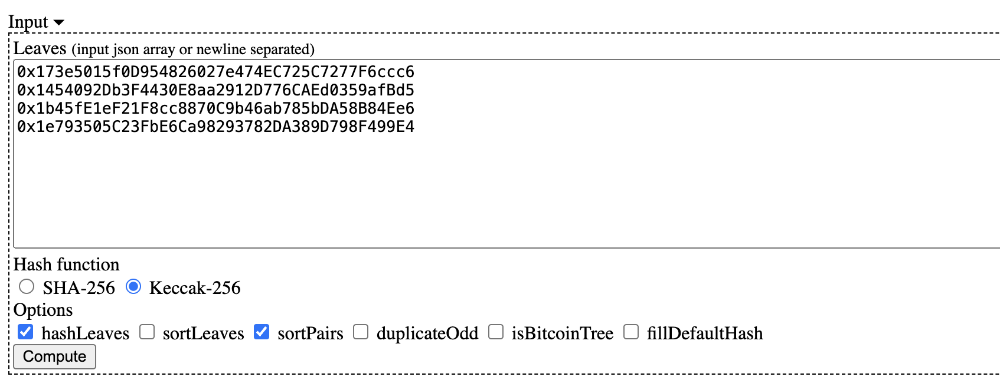

## Merkle Tree

A Merkle Tree, also referred to as a hash tree, is an essential cryptographic structure in blockchain technology. It is widely implemented in blockchains such as Bitcoin and Ethereum. The construction of a Merkle Tree begins from the bottom, with each leaf node representing the hash of a data block. The non-leaf nodes are formed by hashing the combination of their two child nodes. This hierarchical structure ensures efficient and secure verification of large datasets, making Merkle Trees a critical component of blockchain integrity and security.


A `Merkle Tree` enables efficient and secure verification of large data structures through a mechanism known as `Merkle Proof`. In a `Merkle Tree` with `N` leaf nodes, if the root value is known, verifying the validity of a data block (i.e., whether it is a leaf node in the `Merkle Tree`) requires only `ceil(log₂N)` pieces of data, referred to as `proof`, making the process highly efficient. If the data is incorrect or the provided `proof` is invalid, the root value cannot be correctly reconstructed.

For instance, the `Merkle Proof` for leaf `L1` includes `Hash 0-1` and `Hash 1`. Using these two values, we can verify if `L1` is part of the `Merkle Tree`. Here’s how it works: starting with leaf `L1`, we can calculate `Hash 0-0`. With `Hash 0-1`, we then compute `Hash 0`. Finally, using `Hash 1`, we combine `Hash 0` and `Hash 1` to derive the `Top Hash`, which is the root node's hash.

## Generating a Merkle Tree

We can use [this webpage](https://lab.miguelmota.com/merkletreejs/example/) or the JavaScript library [merkletreejs](https://github.com/miguelmota/merkletreejs) to generate a `Merkle Tree`.

Here, we'll use the webpage to generate a `Merkle Tree` with 4 addresses as leaf nodes. Input the leaf nodes as follows:

```solidity

[

"cfx:aanx6yaz8dpzkaxae9whk5dwnv3ht70p22kmbn53h3",

"cfx:aaryn9u88jt23wehbwryrm52ntrfvscs62zu50kdj2",

"cfx:aaryn9u88jt23wehbwryrm52ntrfvscs62zu50kdj2",

"cfx:aathwrjf2j9565fkumk1unrdvhn3v7e36umd4x19eg"

]

```



Select the options `Keccak-256`, `hashLeaves`, and `sortPairs` from the menu, and then click `Compute` to generate the `Merkle Tree`. The expanded `Merkle Tree` looks like this:

```
└─ Root: 3feed4f7cfb49827608c4258efc809f3e27974d2a847994f47bf9c7708aa8577
   ├─ 94305a302419b3c151d5b7c245ff84b378dad8b71c029778db3efcb592e90a1a
   │  ├─ Leaf0: a5f45399dc49dae9f9281ed725c4ad02c0368ec94e1ec70020d46a27e96f3eb3
   │  └─ Leaf1: 5119b53b5927b759eeb3bc8c199b3e60abd0d21b1ec98be559c41a261c9f78ed
   └─ 64f96d6c9416af8ac853ee5c3c728793e26c78fcbe3040a7d1b1dbc02a32c14d
      ├─ Leaf2: 5119b53b5927b759eeb3bc8c199b3e60abd0d21b1ec98be559c41a261c9f78ed
      └─ Leaf3: 2045f6fd5cf771d18ca0701676d1431a9642c87b42f2f4b1154736295ef8d929
```

## Merkle Proof Verification

Using the website, we can obtain the `proof` for address 0, which consists of the hash values of the blue nodes in the second diagram:

```solidity
[
  "0x999bf57501565dbd2fdcea36efa2b9aef8340a8901e3459f4a4c926275d36cdb",
  "0x4726e4102af77216b09ccd94f40daa10531c87c4d60bba7f3b3faf5ff9f19b3c"
]
```


```solidity
library MerkleVerification {
    /**
     * @dev Returns true if a `leaf` can be proved to be a part of a Merkle tree defined by `root`.
     * For this, a `proof` must be provided, containing sibling hashes on the branch from the leaf to the root of the tree.
     */
    function verify(
        bytes32[] memory proof,
        bytes32 root,
        bytes32 leaf
    ) internal pure returns (bool) {
        return processProof(proof, leaf) == root;
    }

    /**
     * @dev Returns the rebuilt hash obtained by traversing a Merkle tree up from `leaf` using `proof`.
     * A `proof` is valid if and only if the rebuilt hash matches the root of the tree.
     */
    function processProof(bytes32[] memory proof, bytes32 leaf) internal pure returns (bytes32) {
        bytes32 computedHash = leaf;
        for (uint256 i = 0; i < proof.length; i++) {
            computedHash = hashPair(computedHash, proof[i]);
        }
        return computedHash;
    }

    // Sorted pair hash
    function hashPair(bytes32 a, bytes32 b) private pure returns (bytes32) {
        return a < b ? keccak256(abi.encodePacked(a, b)) : keccak256(abi.encodePacked(b, a));
    }
}
```

The `MerkleVerification` library contains three functions:

1. `verify()`: Uses the `proof` to verify if the `leaf` belongs to the `Merkle Tree` defined by the given `root`. It calls the `processProof()` function.

2. `processProof()`: Computes the `root` hash from the `leaf` and `proof`. It calls the `hashPair()` function.

3. `hashPair()`: Computes the hash of a pair of nodes using `keccak256()` after sorting them.

By inputting the hash of address 0, the `root`, and the corresponding `proof` into the `verify()` function, it returns `true`. This confirms that the hash of address 0 is in the `Merkle Tree` with the given `root`, and the `proof` is correct. Changing any of these values will return `false`.
