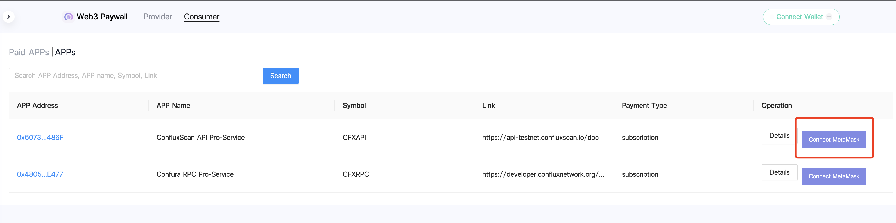
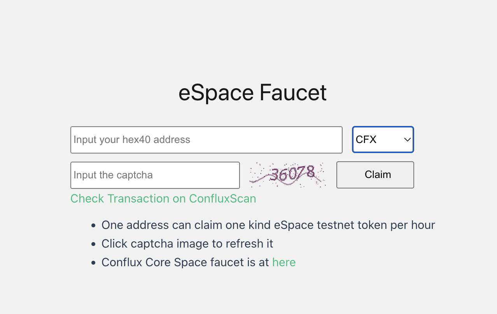

# Introduction
Web3 Paywall is a set of smart contracts on Conflux eSpace that you can purchase development resource with cryptocurrency as a consumer, and you can configure your own developed resource and receive cryptocurrency such as CFX or USDT.

## As a consumer

1.View app resource services provided by developers.

2.Connect Metamask or Fluent Wallet and switch to Conflux eSpace network.

3.Select service to purchase, and choose the cryptocurrency you want to pay, CFX or USDT are supported.

4.The purchased services show in the paid apps.

5.Click the ApiKey button to obtain the key with signature.

You can purchase mainnet subscriptions with cryptocurrency of Confura RPC and ConfluxScan API upgrade services on [**confluxhub**](https://confluxhub.io/payment/consumer/apps) currently.

If you want to purchase the testnet Confura RPC and ConfluxScan API upgrade service, you can visit [**confluxhub**](https://test.confluxhub.io/payment/consumer/apps) to purchase it.

Before you purchase the services of testnet, you can obtain some eSpace test tokens first.

1.Visit [**Conflux eSpace Faucet**](https://efaucet.confluxnetwork.org/)

2.Select test token, then fill the received address and the capcha code.

3.Click claim button and wait for a few minutes.

4.Follow the above process to purchase the testnet Confura RPC and ConfluxScan API upgrade service.

## As a provider

You can configuring your own developer services through contracts and receiving cryptocurrency as a service charge.

**Configure your app resource service:**

1.Connect Metamask or Fluent Wallet and switch to Conflux eSpace network.

2.Fill your app informations.

**Name:** your app service name.

**Symbol:** your app service token symbol that will be issued as resource information.

**Link:** your app service website.

**Description:** your app service description.

**Payment type:** subscription or billing compatible with your service.

**Default weight:** the weight is used for per deduction of resource charging.

3.You need to configure the information of the subscription items when you set the subscription type.

**Resource name:** item‘s name.

**Price:** pricing of subscription.

**Basic days:** period of using the service.

**Giveaways:** gifted period of the service.

**Configurations:** resource extensions.

Value: extended parameters that can be used for your service or description of the project.

Description: parameters description.

4.Submit configuration information and sign with wallet.

In your app details, you can modify your own configured apps information and airdrop services to users. You can withdraw the settlement fee of the service, which can be withdrawn as CFX or USDT.