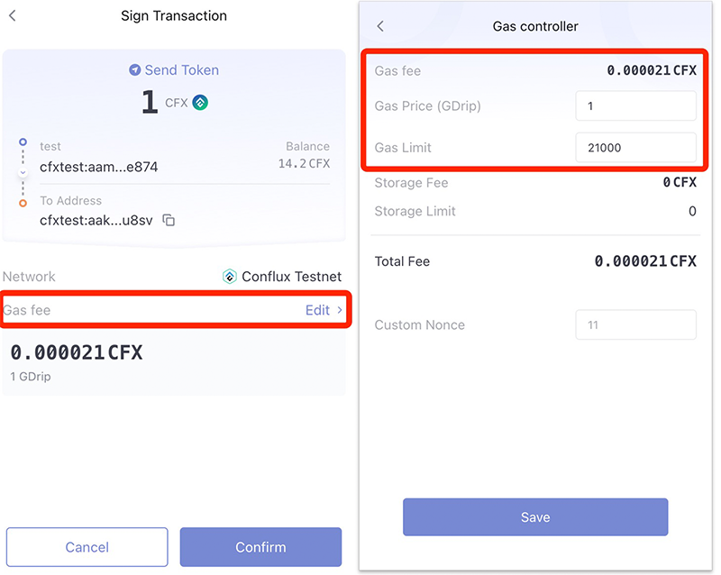
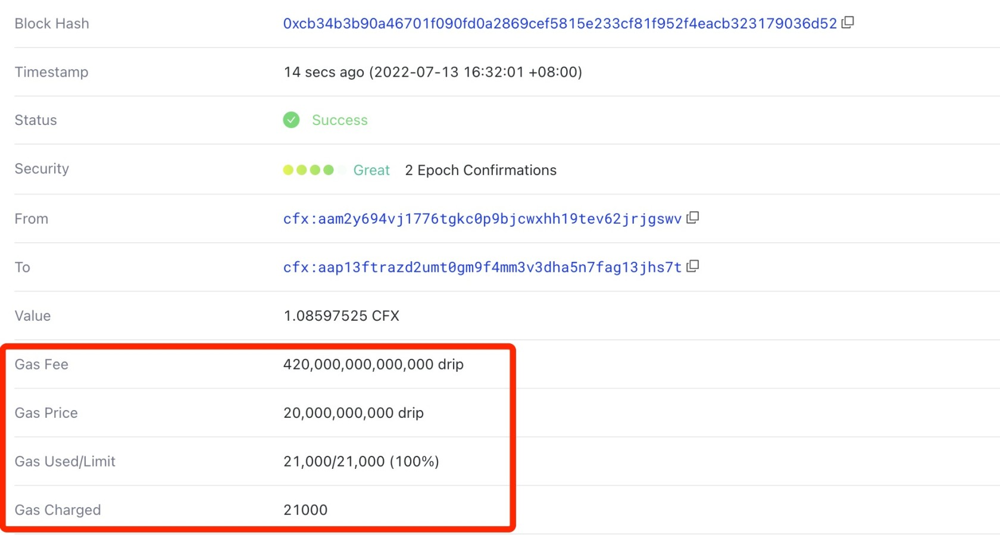

Conflux users(both Core Space and eSpace) usually see fields like ```gasFee```, ```gas```, and ```gasPrice``` when they are sending transactions using their wallets (Fluent) or SDK. This article is going to explain in detail about what these concepts mean.



## gasFee

In real life, when we send money to someone else at a bank, we usually have to pay transaction fees. It is the same for sending transactions in blockchains (Bitcoin, Ethereum, Conflux). ```gasFee``` is the fee for sending a transaction. Usually, it needs to be paid by the native token of the chain. Take Conflux as an example, CFX is needed for paying the transaction fee (gas fee).



## Why Pay Fees

As we all know, blockchain is in fact a decentralized ledger, which is maintained by miners. There is a cost for miners to store data and generate blocks (calculating hashes). Therefore, in order to motivate miners to actively participate in the chain maintenance and protect the network security, the blockchain consensus system is designed to include a reward mechanism for miners, and the transaction fee is one of the rewards for miners, which will be paid to miners who participate in generating blocks. This mechanism can ensure the sustainability of the entire decentralized network.

In addition, the gas fee mechanism can also prevent abusive transactions and thus improve the efficiency of blockchain utilization.

## What is Gas

The concept of gas is borrowed from the real 'gas', petrol. Vehicles consume gasoline to drive. The further a car travels, the more gasoline it consumes. In EVM blockchains, gas represents the work amount required to execute a transaction. Therefore, it is a **unit that measures the amount of computation** required to perform certain operations.

To provide more details, all Conflux transactions are executed by EVM, including regular CFX transfers and smart contract method calls. When these operations are executed, they are compiled into individual OPCodes. The amount of work required to execute each OPCode varies. More information for OPCode gas fees can be found [here](https://ethereum.org/en/developers/docs/evm/opcodes/).

Usually, the gas consumed for a regular CFX transfer is ```21000```. A smart contract transaction usually needs more, depending on the complexity of the contract execution.

## Gas Limit

When constructing a transaction, the ```gas``` field is very important, as the field itself means the ```maximum amount of gas``` that can be consumed by the execution of the transaction.

It is very important to fill the gas field correctly. If the gas limit is set to a value less than the actual amount of gas needed, the transaction will fail. If the gas limit is set too high, you may pay more gas than you actually need to.

:::info

It should be mentioned that transaction will typically fail if the gas limit is exactly set to gas consumption due to [EIP-150](https://eips.ethereum.org/EIPS/eip-150).

:::

The maximum gas limit for a single transaction in the Conflux network is 15M. This ensures that the transactions will not overconsume EVM resources.

## gasPrice

The gasPrice of a transaction is specified by the sender of the transaction and represents the fee that the person is willing to pay per unit of gas. The unit of gasPrice is GDrip, where 1 GDrip is equal to 0.000000001 CFX (10**-9 CFX).

A transaction's gasPrice value affects how fast the transaction is packaged by miners, as miners will prioritize packaging transactions with higher gasPrice in order to make more profits. When the network is not congested, setting gasPrice to ```1Gdrip``` is enough to be packed normally. However, when the network is congested, more transactions are waiting to be packed. At this time, if the gasPrice is set to be less than most other transactions, it will not be packed but keep waiting.

Therefore, if you want the transaction to be packaged quickly, you can set the gasPrice higher. Usually setting it to 10G-1000G is high enough in Conflux to ensure it is executed quickly.

NOTE: Do not set gasPrice too high. It may lead to sky-high transaction fees. If gasPrice is set to 1CFX, then the fee for a regular transfer is 21000 CFX, which is quite a lot for a transaction.

## How gasFee is Calculated

gasFee is the total gas fee paid for a transaction. It is calculated as ```gasFee = gasCharged * gasPrice```. gasFee takes the smallest unit of CFX, Drip.

Suppose there is a regular transfer of 1 CFX, the gas limit can be set to 21,000. If the gasPrice is set to 1GDrip, then the total cost of the transaction is ```1 + 21000 * 0.000000001 = 1.000021 CFX```, where 1 CFX is transferred to the recipient's account, and 0.000021 CFX is the reward for the miner.

## How do I pay less gas?
There are strategies you can use to reduce the cost:

1.Gas prices go up and down every once in a while based on how congested Conflux is. When gas prices are high, waiting just a few minutes before making a transaction could see a significant drop in what you pay.

2.If you are interacting with a contract on coreSpace, you can pay less gas if the contract has applied for gas payment. Conflux implements the Sponsorship Mechanism, a system that allows project owners or contract operators to cover transaction fees for users, thereby reducing the entry barrier of their projects. 

3.The contract sponsorship application link is: https://confluxscan.io/sponsor. If you wish to discuss sponsorship-related issues with the Conflux Foundation, please send an email to: bd@confluxnetwork.org.


### gasUsed

The actual gas consumed during transaction execution.

### gasCharged

The charged amount of gas. **The `gasCharged` may be greater than `gasUsed`, because not all unused gas will be refunded.**

In a Conflux transaction, if the ```gas limit``` is more than the actual amount of gas consumed (```gasUsed```), the exceeding part will be returned. The returning amount of gas **can only be up to** a quarter of the ```gas limit```.

### Example

Suppose the gas limit for a regular CFX transfer is set to 100k and the actual execution consumed 21,000, since the gas limit for the transaction is set too high, at most 25,000 of the gas fee will be returned(25% of the gas limit). The gas used for the transaction will be ```0.000075 CFX```.

If the gas limit setting of the transaction is not that high, take the same example as above but set the gas limit to 25000, which is 4000 more than the actual amount used, the exceeding part is not more than a quarter of the gas limit. This part will be returned fully, and the final amount of fees charged will still be ```0.000021 CFX```.

## Further Readings

- [Ethereum Developer Documentation: Gas and Fees](https://ethereum.org/en/developers/docs/gas/)

## FAQs

### 1. Are there any EIP-1559 transactions in the Conflux network?

Currently, in the Conflux network, there are only transactions that correspond to the EIP-155 standard.