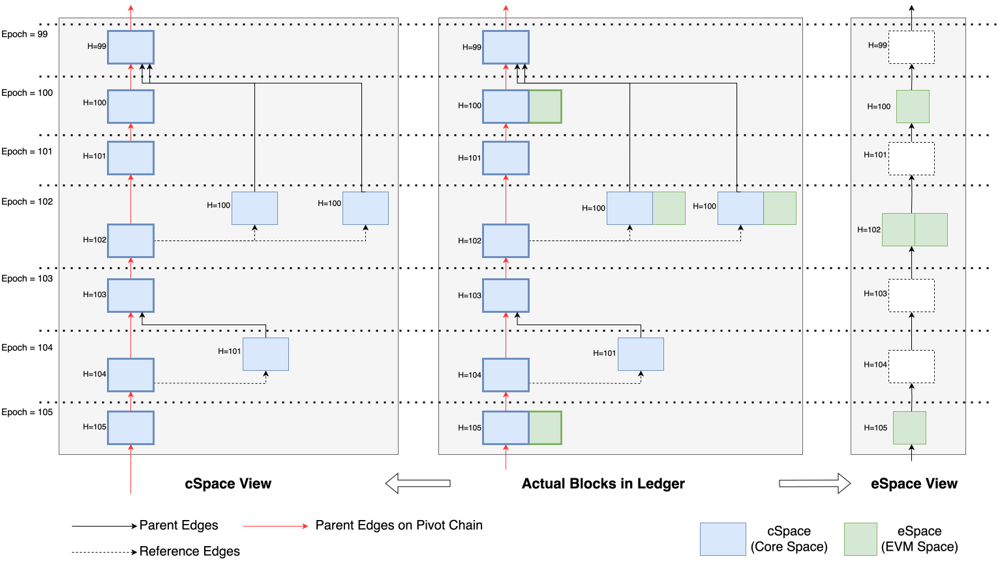

## **Introduction to Spaces**

In the Conflux v2.0 (Hydra) upgrade, a new feature called Spaces was introduced through **[CIP-90](https://github.com/Conflux-Chain/CIPs/blob/master/CIPs/cip-90.md)**. Spaces is an abstract concept that is used to distinguish Conflux-format transactions from Ethereum-format transactions. Spaces is a way to virtually create a sub-chain of the original Conflux network, known as **`eSpace`**.

Core Space refers to the original Conflux network, while eSpace is the virtualized Ethereum chain running on top of the Core Space network. The two spaces are logically independent of each other and do not affect each other.

In other words, we can think of Spaces as a virtualization technology from operating system concepts, where eSpace is a virtualized Ethereum chain running on the original Conflux network.

## **Why Introduce eSpace?**

Conflux is a high-performance, fully decentralized public chain enabled by an innovative Tree-Graph consensus algorithm. The transaction fee of Conflux is very low, which can be seen as almost free compared to other networks such as Ethereum. However, Ethereum has already built a mature ecosystem, including tools, SDKs, wallets, and Solidity libraries. To reduce the migration cost of projects and users and make users experience the advantages of low fees and high TPS of Conflux, eSpace was introduced.

Through the fully compatible interface, smart contracts, and dApps of Ethereum can be directly deployed to eSpace without any modification. Development tools, SDKs, wallets, and services of Ethereum can be directly used in eSpace. Users do not need to learn new knowledge but can use the original tools to get started directly.

eSpace is very easy to use for Ethereum developers and users, just like BSC, Polygon, Aurora.

## **The Relationship Between the Two Spaces**

Core Space and eSpace share the same ledger for underlying data storage. A single block can contain transactions from both spaces, which are distinguished by their transaction encoding. However, they function as two logically independent spaces, each with its own transactions, account statuses, and contracts.

From a dApp developer's perspective, Core Space and eSpace can be seen as two separate chains with an internal bridge that allows for specific atomic calls. Transactions in each space only affect the account status within that particular space unless cross-space calls are made.

### eSpace Transaction Packing

In Conflux, eSpace transactions are only included in blocks if the block height is a multiple of 5. Since the [v2.4 hardfork](../hardforks/v2.4.md), including eSpace transactions does not affect the packing of Core Space transactions. As a result, the maximum block size can be larger at block heights that are multiples of 5 compared to those that are not.

#### How to think about it

- **A gas limit caps how much work one block may contain**, so that no block is so large that other nodes struggle to validate it. Conflux has one set of blocks carrying both spaces, so that cap has to be shared between them.
- **Core Space gets 90% of the block gas limit and eSpace 50%.** These add up to more than 100% deliberately: they are two independent budgets rather than slices of one, so a quiet space never forces a busy one to leave capacity unused.
- **Only blocks whose height is a multiple of 5 may carry eSpace transactions.** At every other height eSpace capacity is zero rather than merely small, and a block breaking the rule is rejected by every node. This is what stops a surge of eSpace activity from crowding Core Space out of the ledger — there is nowhere for it to expand into.
- **Block heights advance roughly once per second**, so a block able to carry eSpace transactions comes along roughly every five seconds.
- **eSpace still presents one block per epoch**, about one per second, so that Ethereum tooling sees the block-after-block structure it expects. Most of those blocks are necessarily empty, and every one reports the same `gasLimit` whether it had any capacity or not. The sections below cover which field to read instead.

### Graph Illustration

The graph above illustrates the relationship between the actual blocks in the ledger and the views from Core Space and eSpace. The text `H=..` indicates the block height.

Two details in the graph are worth reading closely, because they explain behaviour that often looks wrong from the eSpace side:

- The two `H=100` blocks on the right of the ledger column carry eSpace transactions, as their height allows, but they are not on the pivot chain. They are pulled in by reference edges and executed in **epoch 102**, which is why the eSpace view shows eSpace content at block 102 even though 102 is not a multiple of 5.
- Because epoch 102 executes two such blocks, its eSpace block is drawn double width. That block genuinely has twice the usual eSpace capacity.

#### Actual Blocks

In the Conflux ledger, blocks are organized as a Directed Acyclic Graph (DAG) and divided into epochs. For blocks whose height is a multiple of 5, eSpace transactions can be included, utilizing the isolated block space.

The parameter `block.gasLimit` represents the **expected** block size for overall Conflux blocks and is set to 60,000,000. The `coreSpace.gasLimit` is set to 90% of `block.gasLimit` (54,000,000), while the `eSpace.gasLimit` is 50% of `block.gasLimit` (30,000,000).

Note that the 60,000,000 figure is not what the RPCs return. [cfx_getBlockByHash](../../core/build/json-rpc/cfx-namespace.md) and similar Core Space methods report the already-derived `coreSpace.gasLimit` of 54,000,000, and `eth_getBlockByNumber` reports 30,000,000 — so the 90% and 50% factors have already been applied to those values and should not be applied again.

Consequently, for blocks whose height is a multiple of 5, their size can reach up to `1.4 * block.gasLimit`, while for those that are not, their maximum size is `0.9 * block.gasLimit`.

:::note

Miners can adjust the block gas limit by 1% higher or lower for each block, but it is typically set to a constant value.

:::

#### Core Space View

From the Core perspective, the view is nearly the same as the actual block structure, except for the eSpace transactions. Blocks are organized as a DAG and divided into epochs, with each block having the same gas limit.

#### eSpace View

The eSpace view differs significantly from the actual block structure as it simulates the Ethereum ledger structure. Each Conflux epoch is mapped into an eSpace block. From the eSpace perspective, transactions in the epoch are included in the corresponding block. This means the maximum size of the block from the eSpace view is not fixed; it can be zero or more than twice the `eSpace.gasLimit`, depending on the blocks included in the original epoch.

An eSpace block is assembled when you request it, rather than stored. The node takes one Core Space epoch, uses that epoch's pivot block for the header fields — number, hash, timestamp, miner — and collects the eSpace transactions from **every** block in the epoch, not only the pivot block.

Because the block number is taken from the pivot block's height, and the pivot block's height is the epoch number, **an eSpace block number is a Core Space epoch number**. The two are the same value, and `eth_getBlockByNumber(N)` and `cfx_getBlockByEpochNumber(N)` describe the same point in the ledger.

### Reading an eSpace block's real capacity

The `gasLimit` field of an eSpace block always reports 30,000,000, on every block, whether or not that block can hold any eSpace transaction at all. It is a fixed value supplied for compatibility with Ethereum tooling that expects the field to be present and stable.

The block's actual capacity is reported in a Conflux-specific field, **`espaceGasLimit`**:

| Field | Meaning |
| --- | --- |
| `gasLimit` | Always 30,000,000. Not the usable capacity. |
| `espaceGasLimit` | The real capacity: 30,000,000 for each block in the epoch whose height is a multiple of 5, so `0` for most epochs. |
| `gasUsed` | eSpace gas consumed across the whole epoch. |

Two consequences follow, and both surprise tools ported from Ethereum:

- `gasUsed / gasLimit` is not a meaningful utilisation figure. Use `espaceGasLimit` as the denominator.
- `gasUsed` can legitimately exceed `gasLimit`, because an epoch that orders in more than one multiple-of-5 block has more than 30,000,000 of eSpace capacity.

### Packing height and executing epoch are not the same

eSpace transactions may only be placed into a block whose own height is a multiple of 5. That rule is enforced by consensus: in a block at any other height the eSpace gas limit is zero, so a block carrying an eSpace transaction there is rejected by every node.

The eSpace block number, however, is the epoch that **executed** the transaction, not the height of the block that carried it. When a multiple-of-5 block is the pivot block of its own height, the two coincide. When it is not the pivot block, it is ordered into a later epoch by a reference edge, and its transactions surface in that epoch's eSpace block instead — the `H=100` blocks executing in epoch 102 in the graph above.

This is why eSpace transactions are observed in blocks whose number is not a multiple of 5. Nothing is wrong when that happens: the transaction was packed legally at a multiple-of-5 height, and the block number you see is where it executed.

In the **eSpace view** shown in the graph, empty blocks are present at heights 99, 101, 103, and 104. At heights 100 and 105, the blocks are of size equal to the `eSpace.gasLimit`. At height 102, the block size is `2 * eSpace.gasLimit`.

### Where transactions and state are stored

Both spaces write into the same structures, which is why a transaction's parts end up in several different places.

Taking the example above — a transaction packed into a block at height 100 and executed in epoch 102:

| Part | Where it lives |
| --- | --- |
| The transaction | In the block at height 100 that packed it. It is never copied into epoch 102 or into any block at height 102. |
| The receipt | Stored against the pair *(the height-100 block, epoch 102's pivot block)*. The same block executed under a different pivot produces different receipts, which is why a pivot change can alter the receipt of a block whose own contents never changed. |
| The state change | In the shared state, committed as part of epoch 102's execution. The resulting state root appears in the header of the block five epochs later. |
| The eSpace block | Nowhere. It is assembled from the epoch each time it is requested. |

One consequence is worth knowing before it surprises you: `eth_getTransactionByHash` reports the executing epoch as `blockNumber`, and that epoch's pivot block as `blockHash`. The pivot block's own transaction list does not contain your transaction, because the transaction is in the height-100 block instead. This is consistent within the eSpace view, but it means an eSpace transaction cannot be located by looking inside the Core Space block whose hash it reports.

#### One state, two namespaces

There is a single state for the whole network, and a single state root in block headers covering both spaces. There is no separate eSpace state.

The two spaces are kept apart inside it by tagging the storage key: an eSpace key carries an extra marker byte after the account address, so `0xabc…` in Core Space and `0xabc…` in eSpace resolve to different entries. They are unrelated accounts that happen to be written the same way, not one account visible from two places.

Contract bytecode is held in that same state, referenced from the account record, and is likewise space-tagged. [Internal contracts](../../core/core-space-basics/internal-contracts/internal-contracts.mdx) are the exception: they are implemented in the node itself rather than deployed as bytecode, so retrieving their code returns nothing even though calling them works normally.

Account records also differ by space. Both hold a balance, a nonce and a code reference, but the fields backing [storage collateral](../../core/core-space-basics/storage.md) and [sponsorship](../../core/core-space-basics/internal-contracts/sponsor-whitelist-control.md) are only ever populated for Core Space accounts. eSpace has no collateral or sponsorship mechanism; storage there is paid for through gas instead.

### Block tags and finality in both spaces

A Conflux epoch passes through several stages, and each space exposes them under its own names. They describe the same epochs.

| Core Space | eSpace | What it means | Typical lag behind the tip |
| --- | --- | --- | --- |
| `latest_mined` | *(no equivalent)* | The newest mined epoch. Its state has not been computed yet, so state cannot be read at this tag. | 0 |
| `latest_state` | `latest` | The newest epoch whose state has been executed and can be read. Execution is deferred by 5 epochs, so this always trails the tip. | ~4 epochs |
| `latest_confirmed` | `safe` | Reversal is estimated to be very unlikely. This is a probabilistic risk estimate computed from the current weight distribution, not a fixed depth. | tens of epochs, varies |
| `latest_finalized` | `finalized` | Finalized by the PoS chain. Irreversible. | roughly 2–4 minutes, in steps |

Three points that matter when choosing one:

**`latest`/`latest_state` is not the tip.** Because execution is deferred by 5 epochs, a transaction can be included in a block and visible in the ledger several epochs before its effects can be read. Code that submits a transaction and immediately polls for its result should expect this gap.

**`safe`/`latest_confirmed` is a risk estimate, not a depth.** Conflux does not define a number of confirmations after which a transaction is safe. The node continuously computes a reversal risk from the current weight distribution and network delay assumptions, and this tag reports the epoch where that risk is negligible. It moves with network conditions.

**`finalized` is a real guarantee, and it moves in steps.** Unlike networks where the tag is an approximation, on Conflux `finalized` is the epoch the PoS chain has committed to. Once finalized, an epoch cannot be reorganised, because the PoW pivot chain is not permitted to diverge from a PoS-finalized prefix. PoS decisions land only on epoch numbers that are multiples of 60, so the tag does not advance smoothly — it jumps forward 60 epochs at a time, and the lag behind the tip grows between jumps.

For anything where reversal would be costly — exchange credits, bridge releases, high-value settlement — read `finalized` rather than `safe`.

## Development

To interact with Core Space, use Conflux-compatible wallet (Fluent), SDK (*-conflux-SDK), and development tools (chainIDE, hardhat). To interact with eSpace directly, use the existing tools and products from the Ethereum ecosystem, such as Metamask, Hardhat, Ethers.js, etc. (by simply setting the RPC network of the tool to **[Conflux eSpace RPC](../../espace/network-endpoints.md)**).

## **How to Communicate Between Spaces**

To communicate between Conflux Core Space and eSpace, the [CrossSpaceCall](../../core/core-space-basics/internal-contracts/crossSpaceCall.md) contract can be used to transfer CFX and deploy contracts from Core Space to eSpace, as well as call eSpace contract methods in Core Space. Each account in Core Space has a corresponding [mirror address](../../espace/build/accounts.md#mapped-addresses-in-cross-space-operations) in eSpace, calculated by decoding the original Base32 address and hashing it with Keccak. The internal contract provides **synchronous** cross-space transfers of CFX, making it simple, safe, and fast. The built-in event system and On-chain Message Passing can also be used for communication between spaces.

## **Which To Choose**

Conflux Core Space is a native space that supports [contract sponsorship](../../core/core-space-basics/internal-contracts/sponsor-whitelist-control.md) and has more network capacity (higher TPS). However, its [address format](../../core/core-space-basics/addresses.md) and [RPC](../../core/build/json-rpc/cfx-namespace.md) is different from Ethereum, so developers is expected to adopt Conflux-specific [toolchains](../../core/build/sdks-and-tools/sdks.md) to develop. Therefore, if you want to develop a brand new project, you can choose the Core Space. The contract sponsorship mechanism makes it possible for project users to interact with the contract without a balance, helping to lower the threshold of blockchain usage and expand the user base. Moreover, this feature allows developers to develop public chain applications in compliance with regulations in countries or regions where digital currencies are strictly monitored.

If you want to deploy an Ethereum project to take advantage of Conflux's high performance and low cost in order to reduce user costs, you can choose eSpace. The project can be deployed directly without any modification. If you are a skilled Ethereum engineer, you can also choose eSpace directly and use the tools and SDKs that you are familiar with to get started quickly.

## Reference

- [CIP-90](https://github.com/Conflux-Chain/CIPs/blob/master/CIPs/cip-90.md).
- [Espace RPC Compatibility](../../espace/build/jsonrpc-compatibility.md).
- [Espace EVM Compatibility](../../espace/build/evm-compatibility.md).
