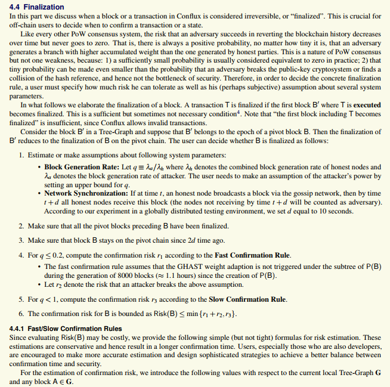
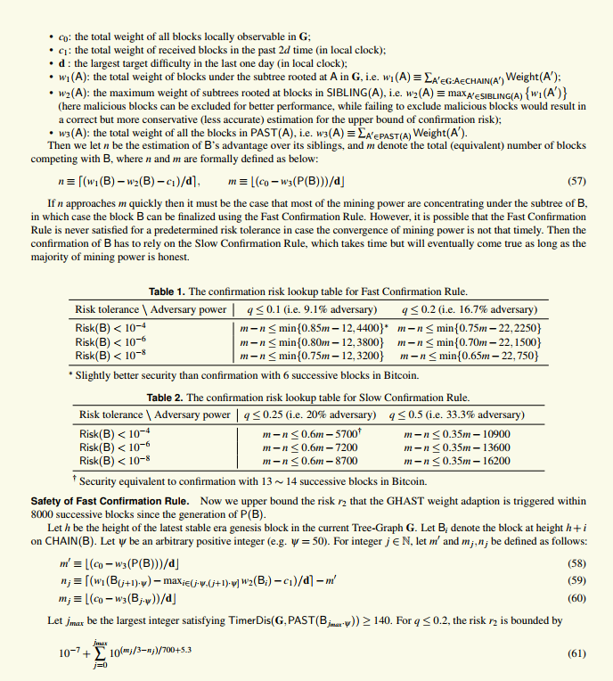

# PoS FAQs

## What is the new Proof-of-Stake chain for Conflux?

The PoS chain is an overlay chain that works alongside the PoW chain. The PoS chain will bring added security to the PoW chain and provide finality to transactions.

## How is PoS in Conflux different from other PoS-based chains?

Conflux will use a hybrid PoW-PoS chain. There is currently no plan to do a full migration to a PoS chain.

## Will the PoS upgrade break compatibility?

Yes. Users running Conflux nodes will need to update their clients to be able to run the PoS chain.

## How can I become a validator in the PoS chain?

For instructions on how to join the PoS public tests, check the Mining section of the forum or [click here](https://forum.conflux.fun/c/English/mining).

## What are the main advantages of the PoS chain?

There are two main advantages to the PoS chain: increased security and transaction finality.

With the upgrade, the network can sustain a 51% attack without risking the integrity of the pivot chain.

In a scenario where an attacker successfully takes over 17% of the committee members, the PoW chain will continue to operate as usual, but it transactions won't be finalized until the attacker disappears.

To conduct a successful attack where the pivot chain can diverge, an attacker will need to to control at least 84% of the committee members.

## I'm a developer, how will the PoS upgrade affect me?

The PoS upgrade won't affect the execution environment of smart contracts.

## What is CIP-43 doing?

CIP-43 introduces a PoS chain as the witness chain to prevent 51% attacks.

## Will Conflux become a PoS chain after CIP-43?

In CIP-43, PoS requires the consensus from at least 84% of the PoS participants to interfere with the PoW chain's behavior. Also need to mention that according to the protocol, PoS nodes should only sign blocks that have been confirmed by the PoW consensus.

This means that unless more than 84% of staking voters unite to attack the network, Conflux acts no differently than running with only the PoW chain if there are no PoW attacks. Transaction packaging, transaction executing, and block sorting are still done by the miners.

If users believe that at least 17% of the PoS nodes are honest, then they only need to consider the PoW rules.

## Conflux does not recognize PoS, so why did it choose to introduce it?

In a PoS chain, a group with more than 34% of the Stake can prevent any transaction from being recorded to the chain and thus stop the chain. A group with more than 67% of the Stake can take full control of the chain and launch a double-spend attack at will. In Long Range Attacks, the attacker can rewrite the whole history by buying the private keys of the investors who made a sell-off.

Then what does CIP-43 look like? Without a 51% attack, 34% of the Stake can't do anything, and 67% of the Stake still can't do anything either. (17% of the Stake can stop the PoS chain, but the PoW chain can still run as usual, just like how it behaves without CIP-43). It takes at least 84% of the Stake (>5/6) to have a tangible impact on the PoW chain, and the Long Range Attacks of PoS have almost no effects here as well.

Overall, the dependency of CIP-43 on Staking nodes is completely different from that of a pure PoS chain.

## Does PoS increase the complexity of transaction confirmation?

Firstly, due to the special nature of the Conflux consensus, the transaction confirmation cannot be achieved by simply counting the number of confirmed blocks. If you know anything about GHOST, the GHOST protocol requires comparing the size of each level of subtrees and sibling subtrees. Conflux's GHAST protocol is even more complex. Conflux transaction confirmation rules are listed below. The process in which you saw the flashing of the “security level” icon on ConfluxScan is in fact supported by these mathematical formulas in behind.

Compared with these formulas, it is not very expensive to take an extra look at the state of the PoS chain.

## What is forced retirement?

If a candidate is elected to join the committee but does not participate in signing between two elections, all the locked votes will unlock automatically. This can happen if your PoS node is offline for some reason. In this case, the node's PoS account will be unable to acquire voting power for the following 1-14 days. This mechanism is often referred to as *forced retirement*.

## How can I safely restart my PoS node?

To prevent forced retirement while restarting your PoS node, it is recommended to follow the these steps:

1. Run `./conflux RPC local pos stop_election` on the PoS node. The node will return either `NULL` or a future PoS block number. After running this command, the node will not apply to join the PoS committee in the next term.
2. If the command returns a block number, keep the node running. Run the same command again after the PoS block of the returned block number has been generated (est. several hours later). At this point, the command should return `NULL`. The node will no longer receive PoS rewards after this block.
3. Once the command returns `NULL`, the node can be safely stopped. The PoS voting process will resume to normal automatically after the node has been restarted (est. 2-3 hours to generate new PoS rewards).
