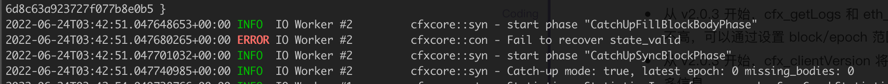

## Node startup failure.

### Linux: illegal instruction?

If you encounter an 'illegal instruction' error when starting the node using the official provided binary, it indicates a mismatch between your CPU instruction set and the one used to compile the binary. You may try downloading the compatible version from the release page or compile it yourself.

### Linux: GLIBC_2.27 not found?

The Conflux binary depends on the **glibc** library. If it is not installed on your system or the installed version is **too low**, you may encounter this error.

### kvdb_rocksdb - DB has been previously marked as corrupted, attempting repair

This error occurs because the data files of the node have been corrupted, making it unable to start. In such cases, you can try deleting the data directory and allowing the node to resynchronize the data.

If you want to quickly start the node, you can directly download the node data snapshot, unzip it, and start the node.

### Err value: PKCS#8 cryptographic error


This error may be caused by an incorrect password input for the pos_key.

### No such device or address

`failed to start full client: Os { code: 6, kind: Uncategorized, message: "No such device or address" }`

This error occurs when starting the node using Docker. The node attempts to read the pos_key password from standard input, and if it cannot be read, it returns an error. In this case, you can configure the password in the configuration file or set it as an environment variable. 

### Mac System Symbol not found


If this occurs, it indicates that the host system's version is too low. Currently, only systems with macOS 12 or above are supported.

Additionally, when running the node program on a Mac, it's important to choose the correct processor version based on your computer's architecture. M1 and x86 versions are not interchangeable.

### Windows System  ExecutionContext exists for cur_era_genesis core\src\block_data_manager\mod.rs

When using a data snapshot on a Windows system to start a node, you may encounter the following error:


### The node crashes shortly after startup.

If this issue occurs on a Linux system, it may be due to insufficient permissions for the startup account. You can try starting it in sudo mode.

## Node data synchronization issue.

### The node is unable to connect to peers after startup.

It is possible that an incorrect configuration file was used, such as using the mainnet binary with testnet configuration, testnet binary with mainnet configuration, or **not specifying a configuration file** when starting the node.

The fundamental reason for not connecting to peers is often **the lack of correctly specified bootnodes**.

Another possibility is that the node is unable to connect to the network due to network issues.

### How to determine if a node is running properly?

1. Check the **latest epoch** in the running logs:

If the **latest epoch** in the node's running logs keeps increasing, or if the **epochNumber** obtained through the `cfx_getStatus` method continues to rise, it indicates that the node is running normally.

```txt
Catch-up mode: false, latest epoch: 85959xxxx
```

2. Check **StatisticsInner** in the running logs:

If the **latest epoch** in the node's running logs is not increasing, but the numbers in **SyncGraphStatistics** and **ConsensusGraphStatistics** within **StatisticsInner** keep growing, the node is still running normally.

```txt
Statistics: StatisticsInner { 
    sync_graph: SyncGraphStatistics { 
        inserted_block_count: 1195746, 
        inserted_header_count: 1324647 
    }, 
    consensus_graph: ConsensusGraphStatistics { 
        inserted_block_count: 154808, 
        activated_block_count: 1305980, 
        processed_block_count: 1305982 
    } 
}
```

3. Check **construct_pivot_state** in the running logs:

If the **index** or **height** keep increase, the node is running normally.

```txt
cfxcore::con - construct_pivot_state: index 30774 height 86370774 compute_epoch true
```

### How to determine if a node is synchronized to the latest block?

If the node's running log shows **Catch-up mode: false**, it indicates that the node has synchronized to the latest data.

### Why is my node not synchronizing?

The node synchronization may encounter various issues, with common ones including:

1. Insufficient disk space on the node machine.
2. Network issues, such as inadequate incoming and outgoing bandwidth (recommended at least 5M).
3. Linux maximum file open limit not set high enough (ulimit -n 10000).
4. Incorrect specification of the configuration file; without proper configuration file settings, bootnodes cannot be located, leading to data synchronization issues. (When starting via Docker and mounting directories, it is easy to forget to specify the configuration file.)
5. Check for any error in node's running log. (When starting via start.sh, error messages are saved in stderr.txt.)

If after checking none of the above issues are present, but the node's **latest epoch** is not increasing, the node is likely running normally but engaged in other tasks, such as creating a checkpoint. In such cases, it is advisable to observe for an extended period, as this situation may persist for several hours or even tens of hours.

### After restarting the node, the epoch height remains unchanged?

After restarting the node, there might be a state rebuilding operation at the era checkpoint. This process takes a considerable amount of time, ranging from half an hour to several hours. Please be patient and wait.

### Why does synchronization take a long time after restart?

After a node is restarted, it synchronizes data from the last checkpoint and replays block data. It will take different amounts of time according to the distance to the last checkpoint. After that, it will start synchronizing from the latest block.

It’s normal, generally it will take a few minutes to more than ten minutes.

### Why does the block height stop increasing?

If the block height stops increasing, you can check the log or terminal to determine whether there is any error. If there is no error, it is most likely due to network reasons, you can try to restart the node.

### How to check the error log?

If you run the node through `start.sh`, you can check the error log in `stderr.txt` in the same directory.

### Synchronizing data from the beginning on the testnet, the synchronization process gets stuck in the middle.

To perform a full sync on the testnet, you need to increase the option `additional_maintained_snapshot_count` to 50.

### failed to calculate mempool broadcast RTT: SystemTimeError(1.2762543s)

```text
details = '''panicked at 'failed to calculate mempool broadcast RTT: SystemTimeError(1.2762543s)', core\src\pos\mempool\shared_mempool\peer_manager.rs:400:18'''
backtrace = '''
   0:     0x7ff737fa5645 - backtrace::backtrace::trace::hab5abe5046f447b5
   1:     0x7ff737fa4aac - backtrace::capture::Backtrace::new::hd9f1f4afb992e4d5
   2:     0x7ff73781b172 - crash_handler::setup_panic_handler::he3eed2ba07c7a235
   3:     0x7ff7380d6cf6 - std::panicking::rust_panic_with_hook
                               at /rustc/9d1b2106e23b1abd32fce1f17267604a5102f57a\/library\std\src\panicking.rs:610
   4:     0x7ff7380d6afb - std::panicking::begin_panic_handler::closure$0
                               at /rustc/9d1b2106e23b1abd32fce1f17267604a5102f57a\/library\std\src\panicking.rs:502
   5:     0x7ff7380d4377 - std::sys_common::backtrace::__rust_end_short_backtrace<std::panicking::begin_panic_handler::closure$0,never$>
                               at /rustc/9d1b2106e23b1abd32fce1f17267604a5102f57a\/library\std\src\sys_common\backtrace.rs:139
   6:     0x7ff7380d67f9 - std::panicking::begin_panic_handler
                               at /rustc/9d1b2106e23b1abd32fce1f17267604a5102f57a\/library\std\src\panicking.rs:498
   7:     0x7ff7384c8e10 - core::panicking::panic_fmt
                               at /rustc/9d1b2106e23b1abd32fce1f17267604a5102f57a\/library\core\src\panicking.rs:116
   8:     0x7ff7384c8f23 - core::result::unwrap_failed
                               at /rustc/9d1b2106e23b1abd32fce1f17267604a5102f57a\/library\core\src\result.rs:1690
   9:     0x7ff7374fcb6f - cfxcore::pos::mempool::shared_mempool::peer_manager::PeerManager::process_broadcast_ack::h66a5c6263f1cb4c5
  10:     0x7ff7374f5e19 - cfxcore::pos::mempool::shared_mempool::coordinator::coordinator::{{closure}}::h6c1ff8196b71855b
  11:     0x7ff737543216 - std::panicking::try::hd909c3032f511b0c
  12:     0x7ff73776aca6 - tokio::runtime::task::harness::Harness<T,S>::complete::hf2bbf17ca3ded03d
  13:     0x7ff73775b7ee - tokio::runtime::task::harness::Harness<T,S>::poll::h0348d72954fb7fe3
  14:     0x7ff7379a174f - std::thread::local::LocalKey<T>::with::h1b1b4832535dd8eb
  15:     0x7ff7379a0508 - tokio::runtime::thread_pool::worker::Context::run::h1871366c06b8b19b
  16:     0x7ff73799f313 - tokio::runtime::thread_pool::worker::Context::run::h1871366c06b8b19b
  17:     0x7ff737997b08 - tokio::macros::scoped_tls::ScopedKey<T>::set::h72c7679a82ac49e7
  18:     0x7ff73799ee3a - tokio::runtime::thread_pool::worker::run::he96293bdc96c9c85
  19:     0x7ff7379a25d5 - tokio::runtime::task::core::CoreStage<T>::poll::hfebd390d78b509ef
  20:     0x7ff7379a6036 - std::panicking::try::h2cdfe9794da6da4e
  21:     0x7ff7379a4150 - tokio::runtime::task::harness::Harness<T,S>::poll::h32aca2917e8ece97
  22:     0x7ff737994efc - tokio::runtime::blocking::pool::Inner::run::h50dc8a99eae64ddb
  23:     0x7ff737990855 - std::sys_common::backtrace::__rust_begin_short_backtrace::hd7f858c23b97e5cf
  24:     0x7ff7379a1203 - <&T as core::fmt::Debug>::fmt::hd9ffef8910ae9eb8
  25:     0x7ff7380dd69c - alloc::boxed::impl$44::call_once
                               at /rustc/9d1b2106e23b1abd32fce1f17267604a5102f57a\library\alloc\src\boxed.rs:1854
  26:     0x7ff7380dd69c - alloc::boxed::impl$44::call_once
                               at /rustc/9d1b2106e23b1abd32fce1f17267604a5102f57a\library\alloc\src\boxed.rs:1854
  27:     0x7ff7380dd69c - std::sys::windows::thread::impl$0::new::thread_start
                               at /rustc/9d1b2106e23b1abd32fce1f17267604a5102f57a\/library\std\src\sys\windows\thread.rs:58
  28:     0x7ffc35637034 - BaseThreadInitThunk
  29:     0x7ffc36822651 - RtlUserThreadStart
```

This error is caused by the system API returning a system time that is set backward. It is recommended to synchronize the time promptly to avoid the widening of the system time deviation.

## Normal node running logs.

During the node's operation, the following information appears, which does not affect the normal functioning of the node and can be ignored.

### ERROR IO Worker #2 cfxcore::con - Fail to recover state_valid



### INFO COW copy failed, check file system support

INFO Background Snapshot cfx_storage: - COW copy failed, check file system support. Command "cp" "-R" "--reflink=always"

This message is a prompt indicating that the machine's file system does not support the Copy on Write (COW) feature. It does not affect the node's operation. If the machine supports COW, it can help improve node performance.

### WARN  Socket IO Worker #2  cfxcore::tra - an unexecuted tx is garbage-collected.

Excessive transactions in the transaction pool result in the recycling of transactions in the pool. This does not affect the normal operation of the node.