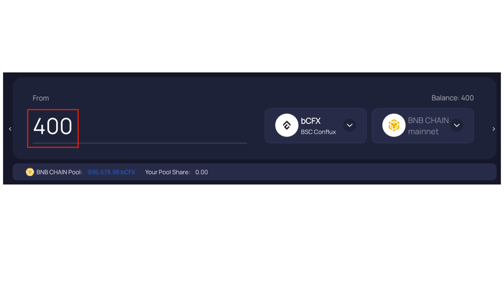
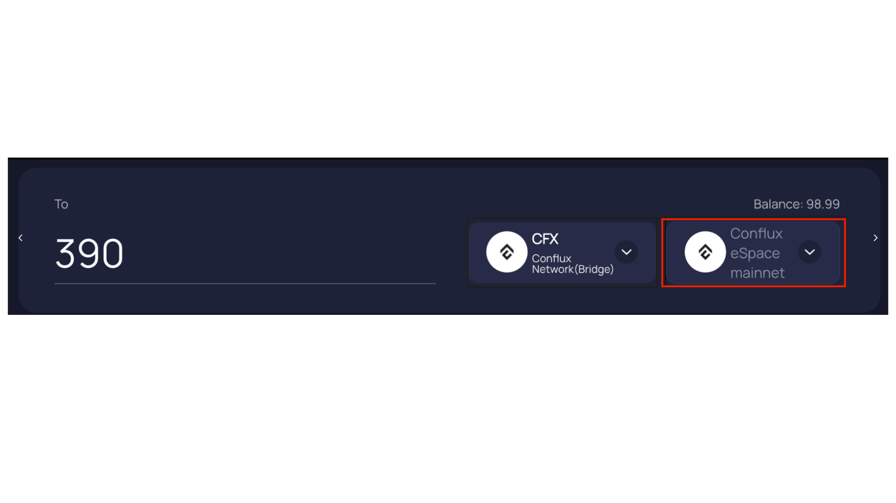

:::note Note to Binance users and bCFX holders: Conflux on Binance is listed as wrapped ERC-20 token (bCFX), it is not native CFX. Conflux eSpace and BNB Chain use EVM-compatible addresses, but those addresses live in different chains.
:::

[Multichain](https://conflux.multichain.org/#/router) is a cross-chain bridge that supports multiple networks. With Multichain, you can bridge different tokens across different networks into Conflux eSpace, or from Conflux eSpace to other networks.
In this guide, we'll bridge bCFX from BNB Chain to Conflux eSpace through Multichain.

## Prerequisites
- A BNB Chain account funded with bCFX and BNB.
- For the purposes of this guide, we'll bridge bCFX from BNB Chain to Conflux eSpace. However, other chains and tokens are also supported.
- Your MetaMask wallet connected to Conflux eSpace.

## Bridging bCFX to Conflux eSpace with Multichain

1. Go to [Multichain](https://conflux.multichain.org/#/router)
2. Click the **Connect Wallet** button to start connecting your wallet.

3. In the Connect to a Wallet dialog, click **MetaMask**.

4. In the Connect With MetaMask notification, select the wallet(s) that you wish to connect and click **Next**.

5. Click **Connect** to confirm the connection to the site.

6. In the From box, switch to the **BNB CHAIN mainnet** network.

7. In the token list, search for bCFX and click the **bCFX** token.

8. In the amount field, enter the amount of bCFX that you wish you transfer to Conflux eSpace.

9. In the To box, switch to the **Conflux eSpace mainnet** network.

10. Since Multichain only supports bridging bCFX from BNB Chain to Conflux as CFX, leave CFX as the token.

11. Confirm the amount of CFX that you'll receive in Conflux.

12. Click **Approve bCFX** to start bridging your tokens.

13. In the Cross-Chain Router dialog, click **Approve bCFX** to start approving Multichain to transfer your tokens.

14. In MetaMask, click **Confirm** to grant permission to Multichain to transfer your tokens.

15. Once the transfer is approved, click Swap to start withdrawing your funds in Conflux eSpace.

16. In the Cross-Chain Router dialog, review and confirm the transaction details and click **Confirm**.

17. In the MetaMask notification, click **Confirm** to confirm the transaction and bridge your assets.
- **Note**: This transaction may take a few minutes.

18. Once the transaction is completed, click the Tx hash to view the transaction details in [Confluxscan](https://confluxscan.io/).

You have now bridged your funds to Conflux eSpace!

