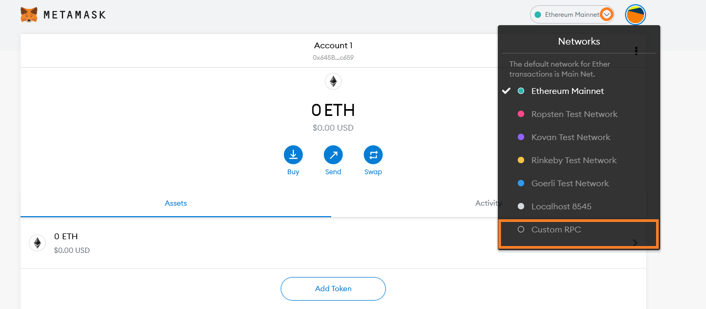
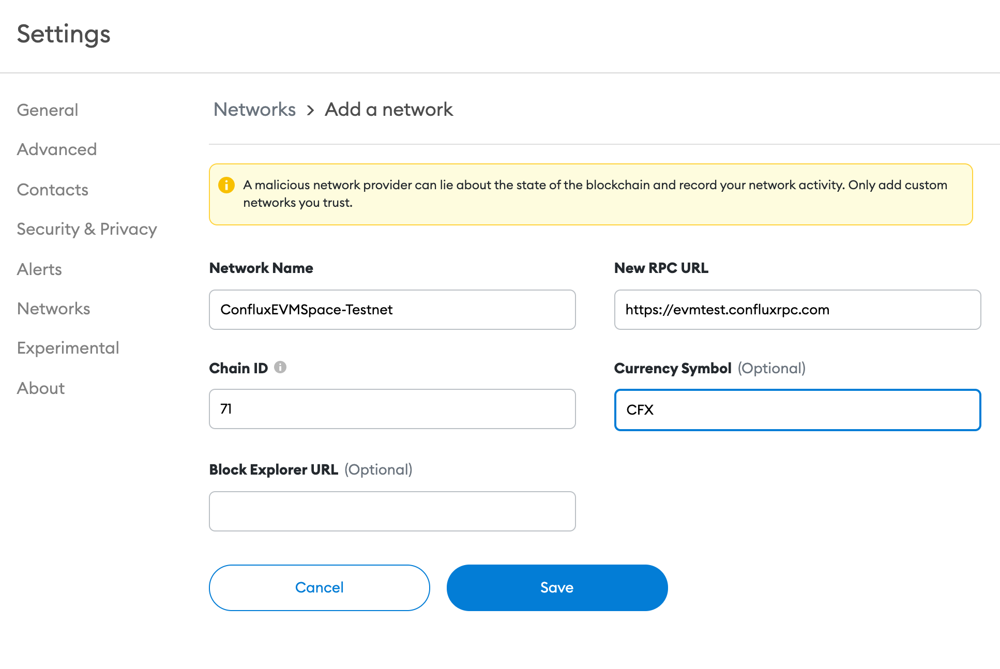

## Introduction

[MetaMask](https://metamask.io/) is a convenient UI for interacting with Ethereum-compatible blockchains (such as Conflux eSpace).
For the purpose of this guide, we will assume you are already familiar with MetaMask and have it installed.
If you need help getting started with MetaMask itself, [check out their documentation](https://metamask.io/faqs.html).

In this tutorial we will walk through connecting MetaMask to the Conflux eSpace Testnet , deploying a simple ERC-20 contract using [Remix](https://remix.ethereum.org), and transferring the new token using MetaMask.

:::note
Screenshots in this tutorial are taken from the MetaMask browser extension version 10.8.1.
:::

## Connecting MetaMask to Conflux eSpace

You can add the Conflux eSpace network to your MetaMask wallet by following these steps:

1. Open your browser and navigate to https://chainlist.org.
2. Search for "Conflux eSpace".
1. Click "Connect Wallet" under "Conflux eSpace" to allow this site to send requests to Metamask.
1. Click "Add to Metamask" under "Conflux eSpace".
1. When MetaMask prompts "Allow this site to add a network?", click "Approve".
1. When MetaMask prompts "Allow this site to switch the network?", click "Approve".

Your MetaMask wallet is now connected to Conflux eSpace. You can switch to other networks anytime through the network selection dropdown menu in MetaMask.

Alternatively, you can add Conflux eSpace to MetaMask manually by selecting "Add Network" (or "Custom RPC") in the network selection drop-down menu:

 

For the eSpace **mainnet**, please use the following configuration values:

- **Network Name**: Conflux eSpace
- **New RPC URL**: https://evm.confluxrpc.com
- **Chain ID**: 1030
- **Currency Symbol**: CFX
- **Block Explorer URL**: https://evm.confluxscan.net

For the eSpace **testnet**, please use the following configuration values:

- **Network Name**: Conflux eSpace (Testnet)
- **New RPC URL**: https://evmtestnet.confluxrpc.com
- **Chain ID**: 71
- **Currency Symbol**: CFX
- **Block Explorer URL**: https://evmtestnet.confluxscan.net

:::note
All the Conflux eSpace RPC endpoint URLs and chain IDs can be found on our Networks page.
:::

Click `Save`, and you should see `Conflux eSpace` is now the network selected in MetaMask.
To see MetaMask in action, we will connect it to Remix and perform some transactions.
The rest of this guide will assume your MetaMask is connected to `Conflux eSpace (Testnet)`.

