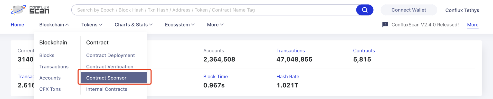

Developers can submit a request to the Foundation for sponsorship.

> Refer to [SponsorWhitelistControl](../core-space-basics/internal-contracts/sponsor-whitelist-control.md) and check out the basics of sponsorship mechanism.

## Tutorial

1. Go to the ConfluxScan official website (confluxscan.io)
2. Click on "Blockchain", select "Sponsorship Contracts" under "Contracts" column and enter the sponsorship contract interface
3. Fill in the search field with the address of the contract you want to apply for sponsorship, click "Search"
4. Click on "Apply"

 

## Rules of Sponsorship

Undifferentiated storage collateral sponsorship: 1 * 10 cfx. Undifferentiated gas sponsorship: 5 * 1 Gdrip, upper bound 500,000 drip (roughly Gas with price 1 and Gas limit of no more than 500,000)

Applications for sponsorship require individual negotiation for each project specifically (currently self-service is not open), project groups are requested to complete the following two steps and wait for review. Complete the contract verification on Confluxscan, fix the warning messages in the project, and set the built-in contract Admin (note: not the admin in contract management)to zero address. After completing item 1, contract scan@confluxnetwork.org with the following details: Project Name. Purpose (gas sponsorship/storage sponsorship). Contract Address. Contact information.

Usually, the result will be returned within 7 business days. Please note that the submission does not mean the sponsorship application is approved. Therefore, please pay attention to the reply to the email and the contact information filled in the application.
