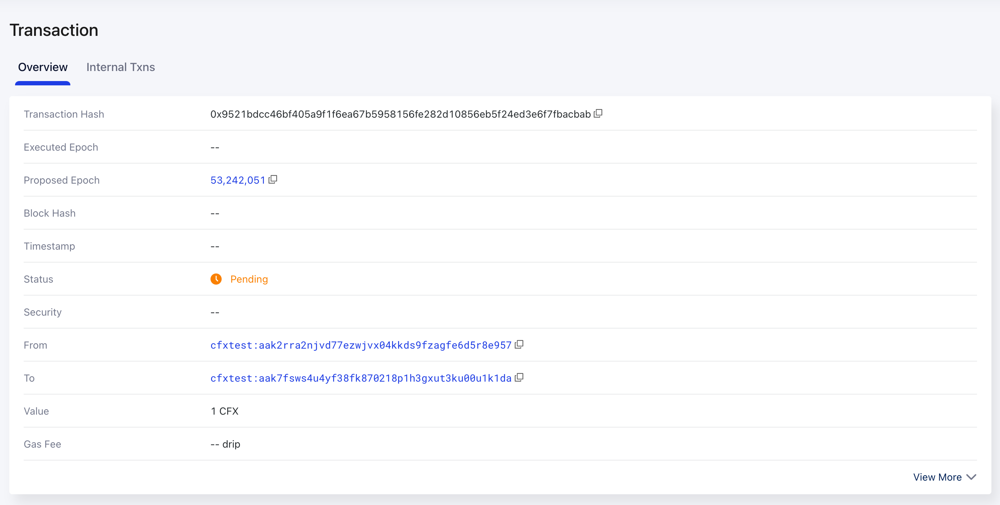
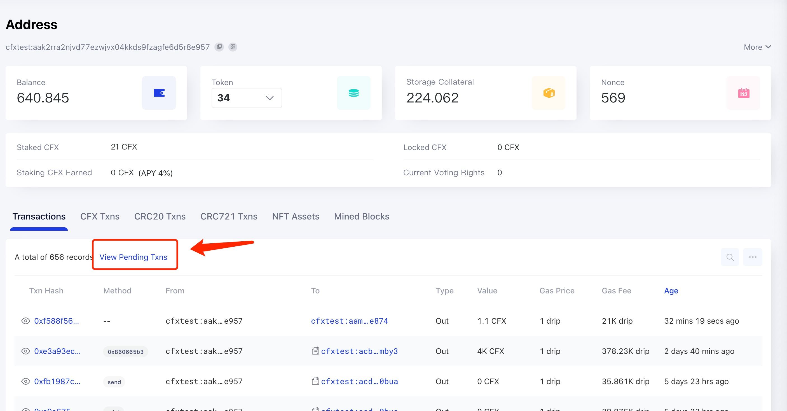

Because today’s blockchain systems may have problems such as low throughput and high entry barriers, it is inevitable that some transactions will not be packaged when sent through the blockchain. Take Conflux as an example, the Conflux network normally produces two blocks per second. After a transaction `is successfully sent`, it should be packaged and executed within `20 seconds` depending on the network congestion level. If the transaction is not packaged for a long time, it’s very likely that something went wrong, and requires the sender to manually intervene.

## How to find out the reason for a pending transaction

If the pending transaction is successfully inserted into the transaction pool of the node used by [Scan](https://www.confluxscan.org/), the transaction can be searched by hash on Scan, and the status of the transaction can be seen as `Pending` on the transaction details page.

 At this time, we can go to the `account details page` of the transaction sender, and view the pending transactions of the user through the `View Pending Txns` tab on the account page.

In this tab, you can see the total number of pending transactions of this user and the earliest pending transactions (up to 10). The most important thing is that you can also see the **pending reasons for the first pending transaction**.

This page uses the RPC method [`cfx_getAccountPendingTransactions`](../../../core/build/json-rpc/cfx-namespace.md#cfx_getaccountpendingtransactions) to obtain the current pending transaction information of an account.

## Possible Pending Reasons

There are four possible reasons:

* Wrong nonce
* Stale epoch height
* Internal error
* Ready to pack

### Wrong Nonce

This kind of error means that the sent transaction used the wrong nonce. Normally, the transaction needs to be executed one by one in the order of nonce. If there are transactions with a smaller nonce pending in the queue or missing, this transaction will wait until all previous transactions are successfully executed.

If non-consecutive nonce are used when sending a transaction or if certain transactions in the transaction pool are cleared by garbage collection (GC) during network congestion, it will result in some transactions pending in the transaction pool, unable to be packaged for an extended period.

In this case, we need to **resend the transaction with the correct nonce**. It should be noted that the pending transaction will be automatically executed after all previous transactions are executed (and the balance is sufficient).

### Stale Epoch Height

The error message tells that `The epoch height of the first tx is too old to be packed. The sender needs to submit a new transaction to update the tx pool.`. Update the corresponding transaction with a correct `epochHeight` parameter(e.g. use `cfx_epochNumber`) will solve the issue.

### Internal Error

The error message tells that `The full node internal error. The sender needs to submit a new transaction to update the tx pool.`. This is typically triggered by certain complex balance setting. Make sure your account has enough balance, then submit a new transaction will solve the issue.

### Ready to Pack

This situation means that the transaction itself has reached the conditions that can be packaged, but because the entire network is relatively congested or for other reasons, it has not been packaged.

If the transaction is in this state for a long time, the gasPrice of the transaction can be increased appropriately to resend the transaction, which can improve the speed to package and execute a transaction.

## How to solve?

First make sure your account has enough balance, then if a transaction is pending for a skipped nonce, you should resend the transaction with **the correct nonce**. If a transaction is pending for other reasons, you can **resend the transaction with a higher gasPrice** and same nonce.

### How to set gasPrice correctly

The speed to package and execute a transaction is mainly affected by the gasPrice of the transaction. The higher the gasPrice, the faster it is packaged by miners, so it is very important to set the gasPrice correctly.

You can use the [`cfx_gasPrice`](/docs/core/build/json-rpc/cfx-namespace#cfx_gasprice) RPC method of fullnode to get a suggested gasPrice value. This method will give a recommended value based on the gas usage of a certain number of the latest blocks and the gasPrice of the transactions in it.

In the case of network congestion, you can check the current gasPrice situation on Scan's gasPrice panel. Using the highest gasPrice allows you to achieve the fastest transaction processing speed.

