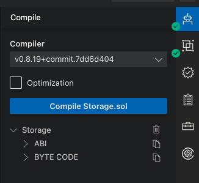

[ChainIDE](https://chainide.com/) is a web-based IDE tailored for blockchain smart contract development. It offers a comprehensive solution for developing, testing, debugging, and deploying smart contracts. Comparable to Ethereum's Remix, ChainIDE is more versatile, supporting multiple blockchains including Conflux Core Space.


This tutorial will guide you through using ChainIDE to develop and deploy a smart contract on Core Space.

## Creating a Project

To start, create a project on ChainIDE. Select `Conflux` from the left-hand chain list, then choose a template from the right. For this tutorial, we will use the **Storage** template.


## Workspace Overview

Once you create a project, you'll see ChainIDE's workspace, reminiscent of VSCode. It features a file explorer on the left, an editor on the right, and a terminal at the bottom.


The example Solidity code is:

```solidity
// SPDX-License-Identifier: MIT
pragma solidity ^0.8.0;

/**
 * @title Storage
 * @dev Store & retrieve values in a variable
 */
contract Storage {

    uint256 number;

    /**
     * @dev Store value in variable
     * @param num value to store
     */
    function store(uint256 num) public {
        number = num;
    }

    /**
     * @dev Return value 
     * @return value of 'number'
     */
    function retrieve() public view returns (uint256){
        return number;
    }
}

```

## Compiling the Contract

In the right-side toolbox, the first option is **Solidity Compiler**. Here, you can select the compiler version and then click the **Compile** button to compile your contract.

After compilation, you will get the `ABI` and `BYTECODE`.



## Connecting Fluent Wallet

Before deploying this contract to the Core Space Testnet, connect your Fluent Wallet. Click the **Connect Wallet** button at the top right of the window.

Then, in the popup window, select **Injected Web3 Provider**.


Next, choose the Fluent Wallet, as we aim to deploy the contract to Core Space.


Finally, click **approve** in the wallet popup window. You will then see the wallet connection status (top right) as **Connected**, along with the connected account address and balance at the bottom right.

Remember to switch the network to **Conflux Testnet** in Fluent.

## Deploying the Contract

Click on **Deploy & Interaction** in the right toolbox, select a contract, and hit the **Deploy** button. A deployment confirmation popup will appear; click **Confirm**. This action sends a transaction to the Core Space Testnet and deploys the contract upon execution.


The **Output** area will display the deployment progress, including the transaction hash.

Once deployed, a new contract will appear in the **Interact** area.


## Interacting with the Contract

The Interact tool lists all public functions of the contract. For read-only functions, click the **Get** button. If the function requires parameters, enter them in the input box.

For state-changing functions, click the **Submit** button to send a transaction to the Core Space Testnet. The result will appear in the **Output** area after the transaction executes.


## Additional Tools

Other tools in the right toolbox include:

1. Contract Verifier: Verifies contract source code on ConfluxScan.
2. Address Converter


## Summary

ChainIDE is a powerful IDE for smart contract development, offering convenience and suitability for beginners. It is an excellent tool for developing and deploying smart contracts on the Core Space Testnet.
