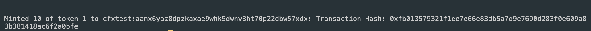
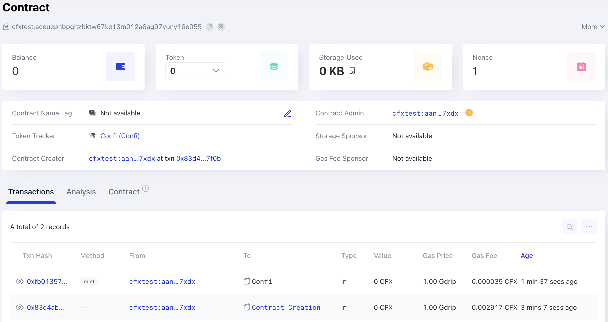

# Create and Deploy ERC1155 NFT on Conflux with Hardhat

This tutorial will guide you through the steps to create, write, and deploy an ERC1155 NFT smart contract on Conflux CoreSpace using Hardhat. Additionally, it will show you how to view your contract on ConfluxScan. You can find a practical example in the [Conflux-NFT-CRC1155](https://github.com/ConfluxDAO/Conflux-NFT-CRC1155) repository.

If you are not familiar with Hardhat, please refer to the [Hardhat documentation](https://hardhat.org/getting-started/).

## Prerequisites

Before you start, ensure you have the following:

- Node.js installed on your computer.
- A text editor, such as Visual Studio Code.
- A basic understanding of smart contract development and the Solidity programming language.

## Step 1: Setting Up Your Environment

Start by setting up your development environment:

```bash
mkdir conflux-nft-crc1155
cd conflux-nft-crc1155
npm init -y
npm install --save-dev hardhat
```

Then, create a Hardhat project:

```bash
npx hardhat
```

Choose the default project setup by pressing Enter for all questions. This will generate a basic Hardhat project setup with all the necessary configurations. Your project directory should now include the Hardhat configuration files.
[](../imgs/nft-tutorials/crc1155-hardhat-create-project.png)

## Step 2: Installing Dependencies

Install the OpenZeppelin contracts for a secure, audited implementation of ERC1155 tokens, and the Hardhat-Conflux-Plugin, which is built on top of js-conflux-sdk, making its usage for deployment and interaction very similar to that of js-conflux-sdk:

```bash
npm install @openzeppelin/contracts hardhat-conflux js-conflux-sdk
```

For additional information, refer to the [Hardhat Conflux Plugin Tutorials](/docs/core/tutorials/hardhat-conflux-plugin) and [JS-Conflux-SDK Documentation](https://confluxnetwork.gitbook.io/js-conflux-sdk).

## Step 3: Writing the Smart Contract

Create a new file named `ConfluxERC1155NFT.sol` in the `contracts` folder with the following Solidity code:

```solidity
// SPDX-License-Identifier: MIT
pragma solidity ^0.8.24;

import "@openzeppelin/contracts/token/ERC1155/ERC1155.sol";
import "@openzeppelin/contracts/access/Ownable.sol";

contract ConfluxERC1155NFT is ERC1155, Ownable {
    // Token name
    string public name;
    // Token symbol
    string public symbol;

    //  Replace the example tokenURI with the actual metadata URI for the NFT
    constructor(
        string memory name_,
        string memory symbol_
    )
        ERC1155(
            "https://raw.githubusercontent.com/conflux-fans/dual-space-nft-metadata/main/2023040104"
        )
        Ownable(msg.sender)
    {
        name = name_;
        symbol = symbol_;
    }

    function mint(
        address to,
        uint256 id,
        uint256 amount,
        bytes memory data
    ) public onlyOwner {
        _mint(to, id, amount, data);
    }

    function setURI(string memory newuri) public onlyOwner {
        _setURI(newuri);
    }
}
```

This contract uses OpenZeppelin's ERC1155 and Ownable contracts, allowing only the owner to mint new tokens.

## Step 4: Configuring Hardhat

Modify the `hardhat.config.js` to include the Conflux network configuration:

```javascript
require("@nomicfoundation/hardhat-toolbox");
require("hardhat-conflux");

const PRIVATE_KEY = "YOUR_PRIVATE_KEY_HERE";

module.exports = {
  solidity: "0.8.24",
  defaultNetwork: "cfxTestnet",
  networks: {
    cfx: {
      url: "https://main.confluxrpc.com",
      accounts: [PRIVATE_KEY],
      chainId: 1029,
    },
    cfxTestnet: {
      url: "https://test.confluxrpc.com",
      accounts: [PRIVATE_KEY],
      chainId: 1,
    },
  },
};
```

Replace `YOUR_PRIVATE_KEY_HERE` with your private key.

## Step 5: Deploying the Contract

Create a deployment script in the `scripts` folder named `deploy.js`:

```javascript
const hre = require("hardhat");

async function main() {
  const signers = await hre.conflux.getSigners();
  const defaultAccount = signers[0];

  const ConfluxERC1155NFT = await hre.conflux.getContractFactory(
    "ConfluxERC1155NFT"
  );
  const receipt = await ConfluxERC1155NFT.constructor("Confi", "Confi")
    .sendTransaction({
      from: defaultAccount.address,
    })
    .executed();

  console.log(
    `Contract deployment ${
      receipt.outcomeStatus === 0 ? "succeeded" : "failed"
    }`
  );
  console.log("ConfluxERC1155NFT deployed to:", receipt.contractCreated);
}

main()
  .then(() => process.exit(0))
  .catch((error) => {
    console.error(error);
    process.exit(1);
  });

```

Deploy the contract by running:

```bash
npx hardhat run scripts/deploy.js --network cfxTestnet
```

You will see the following message after successful deployment:
[](../imgs/nft-tutorials/crc1155-deploy-success.png)

## Step 6: Minting NFTs

Create a script in the `scripts` folder named `mintNFT.js` for minting NFTs:

```javascript
const hre = require("hardhat");

async function main() {
  const signers = await hre.conflux.getSigners();
  const defaultAccount = signers[0];

  const contractAddress = "YOUR_CONTRACT_ADDRESS";
  const recipientAddress = "RECIPIENT_WALLET_ADDRESS";
  const tokenID = 1; // Example token ID
  const amount = 10; // Number of tokens to mint
  const data = "0x00"; // Data field for additional information (if necessary)

  const ConfluxERC1155NFT = await hre.conflux.getContractAt(
    "ConfluxERC1155NFT",
    contractAddress
  );

  const receipt = await ConfluxERC1155NFT.mint(
    recipientAddress,
    tokenID,
    amount,
    data
  )
    .sendTransaction({
      from: defaultAccount.address,
    })
    .executed();

  console.log(
    `Minted ${amount} of token ${tokenID} to ${recipientAddress}: Transaction Hash: ${receipt.transactionHash}`
  );
}

main().catch((error) => {
  console.error(error);
  process.exit(1);
});
```

Replace `YOUR_CONTRACT_ADDRESS` and `RECIPIENT_WALLET_ADDRESS` with appropriate values.

Mint an NFT by running:

```bash
npx hardhat run scripts/mintNFT.js --network cfxTestnet
```

You will see the following message after successful mint
[](../imgs/nft-tutorials/crc1155-mint-success.png)

## Step 7: Viewing Your Contract on ConfluxScan

Navigate to [ConfluxScan](https://testnet.confluxscan.io/), enter your contract address in the search bar, and view details about your contract, including transactions.

[](../imgs/nft-tutorials/crc1155-detail-on-confluxscan.png)

If you wish to verify your contract using Hardhat, please refer to this [article](/docs/core/tutorials/hardhat-conflux-plugin#verify-contract).

## Step 8: Sponsoring Your Contract (Optional)

Conflux implements a sponsorship mechanism to subsidize the usage of smart contracts. If you want to get your contract sponsored, please refer to the following articles:

- [How to Sponsor a Contract](/docs/core/tutorials/how-to-sponsor-contract)
- [How to Sponsor a Contract Example](/docs/core/core-space-basics/internal-contracts/sponsor-whitelist-control#example)

## Conclusion

This guide provided a comprehensive process for creating, deploying, and managing an ERC1155 NFT on Conflux CoreSpace using Hardhat. By following these steps, you can launch your NFT project on Conflux effectively.
