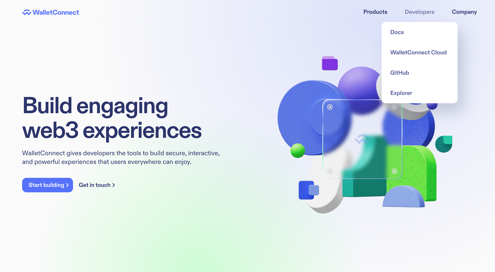
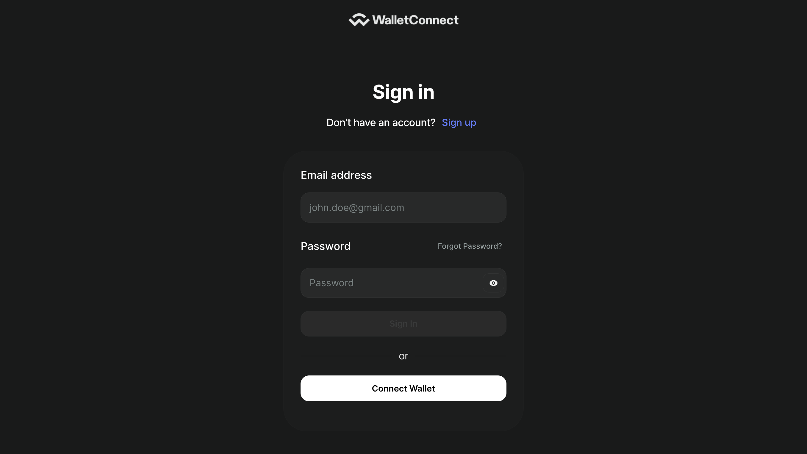
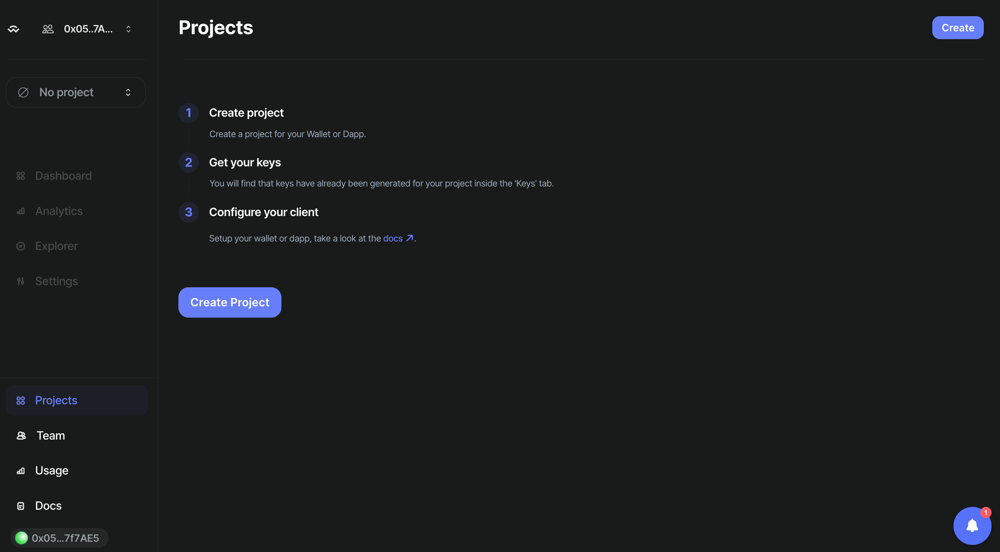
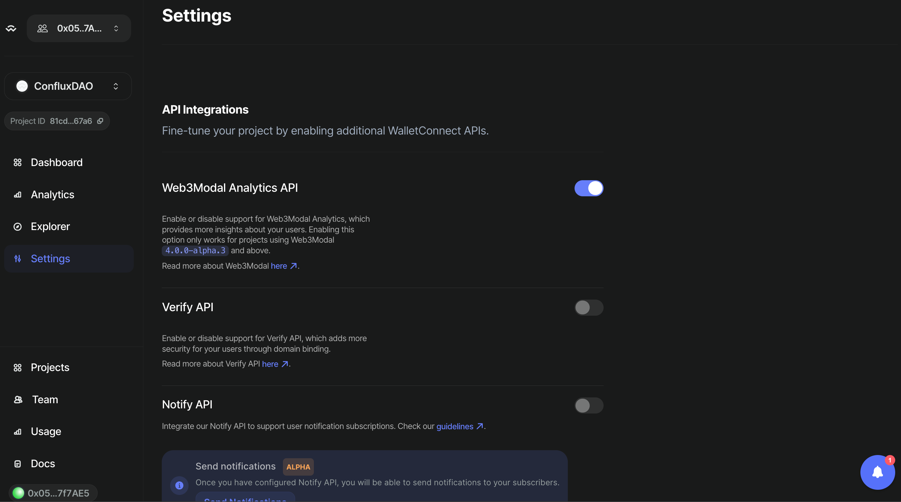

# Creating a WalletConnect Project and Obtaining a `ProjectId`

### Step 1: Visit the WalletConnect Official Website

1. Open your web browser and navigate to the WalletConnect official website: [WalletConnect](https://walletconnect.com).
2. Find the section dedicated to developers, often labeled "Developers", and click on "WalletConnect Cloud"

### Step 2: Sign Up or Log In

1. If you don’t already have an account, you will need to sign up. Click the "Sign Up" button and follow the provided instructions.
2. If you have an account, click the "Log In" button and enter your credentials.

### Step 3: Create a New Project

1. Once logged in, navigate to the dashboard or the area where you can manage projects.
2. Look for a button or link labeled **"Create Project"** and click on it.
3. Enter the required details about your project:
   - **Project Name:** Assign a name to your project.
   - **Type:** Choose a type of your project.
   - **Website URL:** Enter the URL of your project's website if available.

### Step 4: Configure Project Settings

1. After creating the project, configure settings that are relevant to how you will use WalletConnect.
2. Settings may include callback URLs, permissions, and other integration details specific to your project's needs.

### Step 5: Obtain Your `ProjectId`

1. After your project is set up and configured, navigate to a section in the dashboard labeled "Dashboard".

2. Your `ProjectId` will be displayed here. It is a unique identifier necessary for your application to interact with WalletConnect services.

### Step 6: Use `ProjectId` in Your Dapp

- If you are building a Dapp on Conflux using the React.js framework, please refer to the following guide: [React.js WalletConnect Integration](/docs/espace/tutorials/walletConnect/reactjs)
- If you are using the Vue.js framework to develop a Dapp on Conflux, please consult this tutorial: [Vue.js WalletConnect Integration](/docs/espace/tutorials/walletConnect/vuejs)
- For those developing a Dapp on Conflux with the Next.js framework, please follow this link: [Next.js WalletConnect Integration](/docs/espace/tutorials/walletConnect/nextjs)

This guide helps developers set up a WalletConnect project and get a `ProjectId`, which is essential for integrating WalletConnect into dapps. Make sure your settings and configurations align with your application's needs to ensure a smooth user experience.
