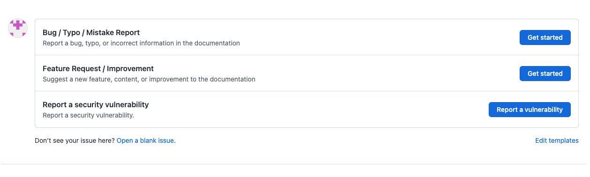
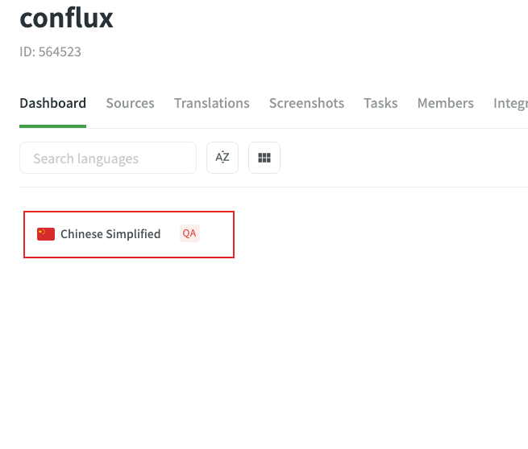

# Contributing

:::info
Thank you for your interest in contributing to our documentation site! We appreciate your support and value the insights and expertise of our community. This page outlines the guidelines and process for contributing, as well as the rewards you can earn for your efforts.
:::

## How to Contribute

We welcome contributions in a variety of forms, including but not limited to:

1. Pointing out a mistake/typo and (optionally) providing a solution
2. Providing translation
3. Creating or improving diagrams, charts, or visual aids
4. Suggesting improvements to the documentation structure or organization
5. Writing or updating a tutorial or guide
6. Creating or updating code samples, examples, or demos
7. Polishing or improving document writing

To submit a contribution, please follow these suggestions:

### Create an Issue

You can create an issue to

- report any mistake / typo
- or request new content / current content improvement



It would be wonderful if you are able to take the initiative and resolve the issue on your own!

```
// in BUG template
- [ ] I'd be willing to fix this issue myself.
// in Feature Request template
- [ ] I'd be willing to contribute this feature myself
```

### Create a Pull Request

You can create a Pull Request to submit content changes **EXCEPT FOR [TRANSLATIONS](#provide-translation)**.

If you are not working on an issue created by yourself, it is suggested to follow these steps:

:::note
These are not mandatory steps but will decrease the possibility your PR will be rejected.
:::

1. Make sure a relevant open issue with "ACCEPTED" label exists.
2. Leave a comment in the issue in case duplicate people working on the same issue.
3. Mention the issue `#xx` in the commit message. Example `fix: typo. Ref #123456`.


### Provide Translation

:::note

A translation PR in the Github repo will NEVER be accepted.

:::

We are using [Crowdin](https://crowdin.com/project/conflux) for document translation integration. Crowdin helps us to know whether translation strings are outdated after the source files are changed. Anyone can submit translation strings in Crowdin, and translation strings will be pushed to Github repo after they are reviewed.

#### Crowdin Tutorial

Visit our project page on Crowdin at either https://crowdin.com/project/conflux or https://zh.crowdin.com/project/conflux and select the language you wish to translate.



You will be able to select a file to begin translating.


In order to edit, you will need to be logged in. No need to fret though, you can easily log in with your Github account by clicking a few buttons.


Once you are in, you can start the translation process! Simply click on a source string on the left-hand panel and input the translation or edited string. Remember to click SAVE and wait for your translation to be reviewed.


Once reviewed, the translation string will be pushed to the Github repository and you can visit your translation on the official documentation site.

## Contributor POAPs

Individuals who ever engage in contribution to the documentation site during a season will be able to mint a Contributor POAP. To qualify for minting the POAP, your contribution must also be "ACCEPTED" , meaning:

- any issue has been created with the "ACCEPTED" label added by admin
- any Pull Request has been successfully merged into the main branch
- or any translation string has been fully reviewed

### Special POAPs

In addition to the regular contributor POAPs, we recognize and reward significant contributions with special POAPs. Examples of significant contributions include high-quality guides or consistent, frequent contributions to the project. The decision to award a special POAP is made on a case-by-case basis by the project maintainers.

### Issuing Rule Updates

Please note that the POAP issuing rules are subject to review and possible changes every 3 months. This ensures that our guidelines remain relevant and effective in promoting and rewarding valuable contributions.

We look forward to your contributions and thank you for helping us improve our documentation site! If you have any questions or need assistance, please feel free to create an issue in our Github repo.
