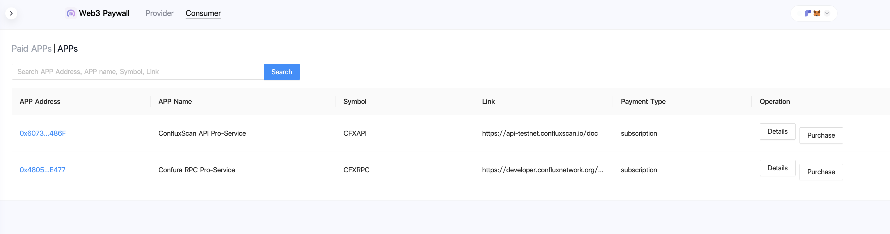
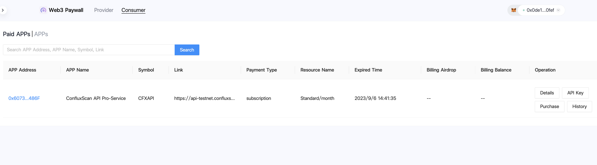
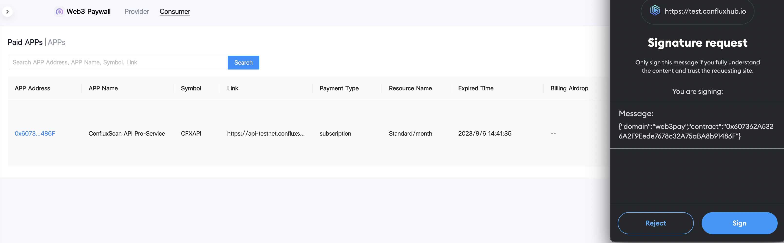

# Web3 Paywall

## Introduction
[Web3 Paywall](https://confluxhub.io/payment/consumer/paid-apps) is a set of smart contracts on Conflux eSpace that you can purchase development resource with cryptocurrency as a consumer.

## As a consumer

1.View app resource services provided by developers. 

2.Connect Metamask or Fluent Wallet and switch to Conflux eSpace network. 

3.Select service to purchase, and choose the cryptocurrency you want to pay, CFX or USDT are supported. 

4.The purchased services show in the paid apps. 

5.Click the ApiKey button to obtain the key with signature.  

You can purchase mainnet subscriptions with cryptocurrency of Confura RPC and ConfluxScan API upgrade services on [**confluxhub**](https://confluxhub.io/payment/consumer/apps) currently.

## Purchase on Testnet

If you want to purchase the testnet Confura RPC and ConfluxScan API upgrade service, you can visit [**confluxhub**](https://test.confluxhub.io/payment/consumer/apps) to purchase it.

Before you purchase the services of testnet, you can obtain some eSpace test tokens first.

1.Visit [**Conflux eSpace Faucet**](https://efaucet.confluxnetwork.org/)

2.Select test token, then fill the received address and the capcha code. 

3.Click claim button and wait for a few minutes.

4.Follow the above process to purchase the testnet Confura RPC and ConfluxScan API upgrade service.
