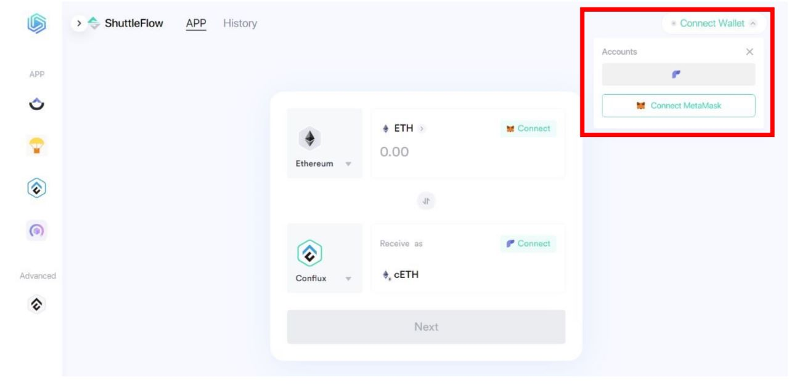
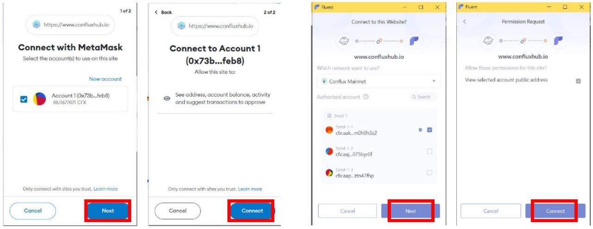
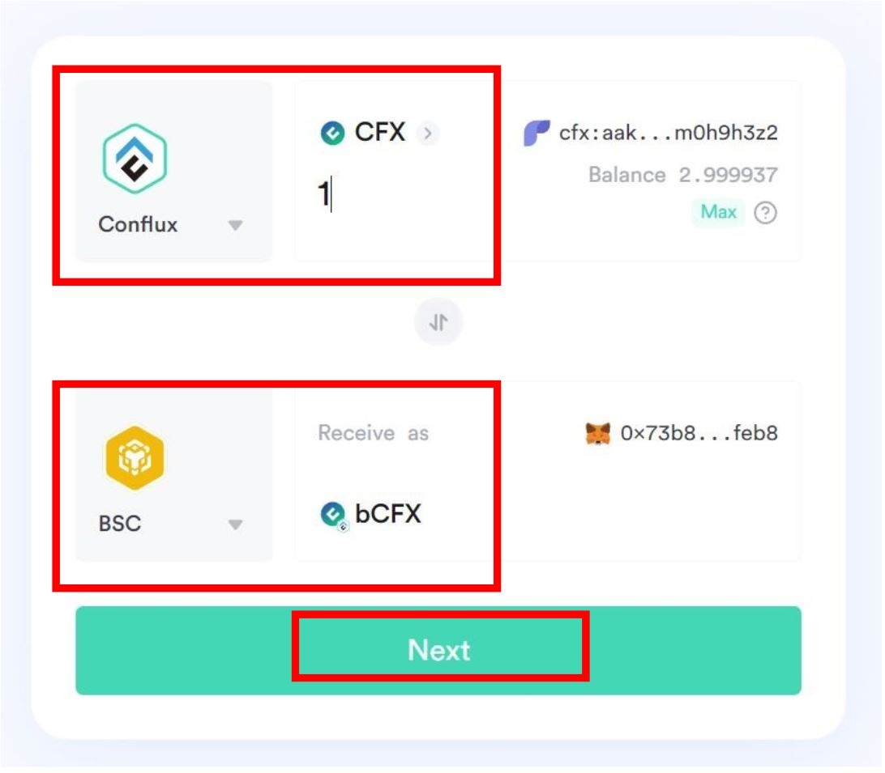
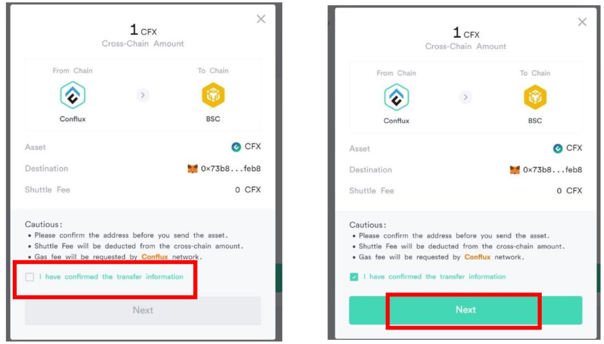
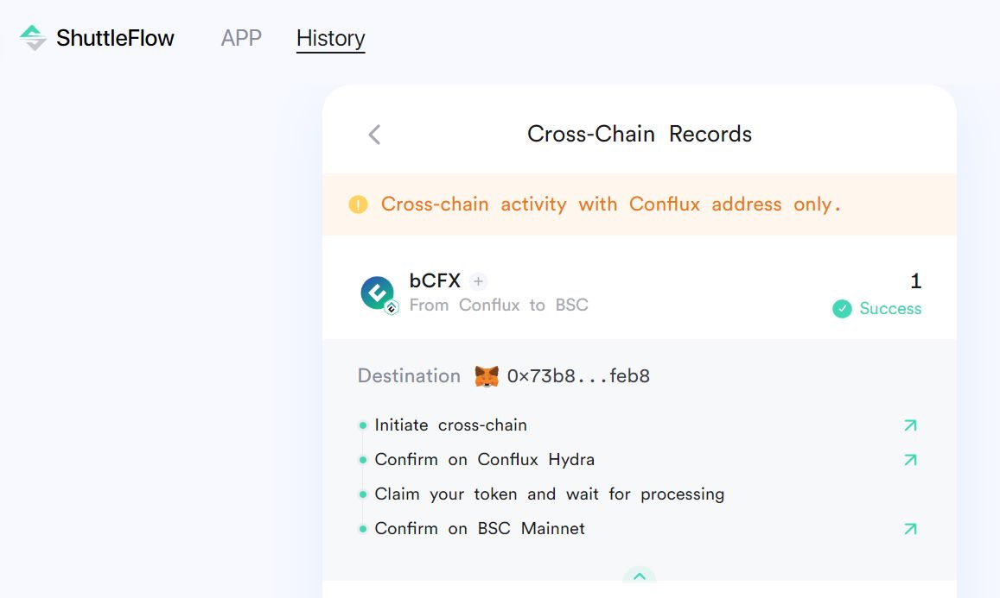

## Transferring Funds Across Chains Using ShuttleFlow

To transfer Funds to Conflux Core Space from other chains, users can do it on [ConfluxHub](https://www.confluxhub.io/shuttle-flow)’s ShuttleFlow page.

ShuttleFlow is a decentralized cross-chain asset transfer protocol that allows users to move their assets between different blockchain networks, such as Conflux Core, Ethereum, and Binance Smart Chain. By using ShuttleFlow, users can transfer their assets quickly, securely, and at a low cost.

Here's a step-by-step guide on how to transfer funds using ShuttleFlow:

**Step 1: Connect your Wallets**

The first step is to connect your wallets. You need to use Fluent Wallet for Conflux Core and MetaMask for the other network.

 

**Step 2: Choose the Asset and Network**

Once your wallets are connected, select the asset that you want to transfer and the network that you want to transfer it to. In this case, we will be transferring CFX from Conflux Core to Binance Smart Chain.

**Step 3: Initiate the Transfer**

Click on the **Next** button to initiate the transfer.

**Step 4: Input Transfer Information**

Enter the amount of CFX that you want to transfer and the BSC address where you want to receive the tokens. You will also need to approve the transaction and pay the gas fees.

**Step 5: Confirm and Wait for the Transfer**

Once you have entered all the necessary information and paid the gas fees, confirm the transaction. The transfer will then be processed by ShuttleFlow, and you will need to wait for the confirmation.

**Step 6: Check Your Wallet**

After the transfer is complete, you should see the transferred assets in your BSC wallet. Congratulations! You have successfully transferred your assets using ShuttleFlow.

:::note 
The process is similar when transferring from another chain to Conflux Core.
:::