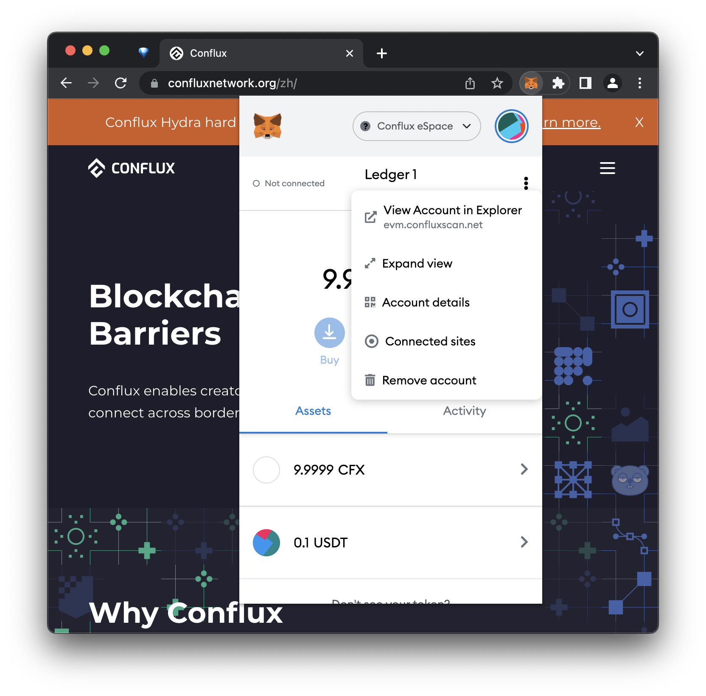

import { DiscordLink } from "../../../templates/links.tsx"

:::tip

This wallet supports both Core and eSpace

:::

## Introduction

You can now use your **Ledger Nano S+**, **Nano X**, **Stax**, or **Flex** hardware wallet to securely store your assets on both Core and eSpace. In this guide, we will show you how to interact with Conflux using your Ledger device and how to transfer assets.

:::note
For Ledger Nano S users: You'll need to manually set up the development environment and load the app. Please refer to the [detailed instructions](https://github.com/conflux-chain/app-conflux?tab=readme-ov-file#2-if-my-device-is-a-nano-s-what-should-i-do).
:::

## Using Ledger on Core Space

### Before You Start

Before you start, make sure that you have done the following:

- Updated your Ledger device to the latest firmware version

- Installed [Ledger Live](https://www.ledger.com/ledger-live) and updated it to the latest version

- Installed [Fluent Wallet](https://fluentwallet.com/) version 2.8.0 or later on Chrome or Edge browser (Firefox is not supported)

If you encounter any issues, find us on <DiscordLink>Discord</DiscordLink> or [Telegram](https://t.me/Conflux_English), we are happy to help.

For detailed usage instructions, you can refer to the [official documentation](https://github.com/Conflux-Chain/app-conflux/tree/develop/docs/how-to-use).

### Installation

You can install the **Conflux app** on your Ledger device by following these steps:

**1.** Connect your Ledger device to your computer through USB.

**2.** Unlock your device by entering your PIN.

**3.** Open Ledger Live.

**4.** In the menu on the left, click "Manager" to open the Ledger Live app manager.

**5.** When your Ledger device displays "Allow Ledger manager", press both buttons to continue.

**6.** Back in Ledger Live, under the "App catalog" tab, enter "Conflux" in the search field.

**7.** Once Ledger Live shows the Conflux app, press "Install".

The Conflux app is now installed successfully.

### Connecting Your Ledger Device to Fluent

You can import accounts from your Ledger device into your Fluent wallet by following these steps:

**1.** Quit Ledger Live if it is currently opened.

**2.** Connect your Ledger device to your computer through USB.

**3.** Unlock your device by entering your PIN.

**4.** Navigate to the Conflux app on your device and press both buttons to open it.

**5.** In Fluent, open the menu in the top right corner and select "Account Management".

**6.** Click "Add" and select "Hardware Wallet". Read the instructions carefully and click "Ready".

**7.** On the "Connect your Ledger" page, click "Connect".

**8.** A browser popup will appear saying "Fluent wants to connect". Select your Ledger device from the list and click "Connect".

**9.** After a few seconds, the "Choose Address" page shows up in Fluent. Select one or more accounts that you would like to import to Fluent and click "Import".

Your account is now available in Fluent as "LedgerNanoS-1" (or similar).

### Using Ledger: Sending Crypto Assets

Assuming your account on the Ledger device has some CFX tokens, the steps below show how to make a CFX transfer on Conflux.

:::note
If you do not have CFX, you can purchase at one of the exchanges listed [here](https://123cfx.com/#Exchanges).
:::

Make sure you have already imported your Ledger account into your Fluent wallet by following the steps in the previous section. Quit Ledger Live if it is currently opened.

**1.** Connect your Ledger device to your computer through USB.

**2.** Unlock your device by entering your PIN.

**3.** Navigate to the **Conflux app** on your device and press both buttons to open it.

**4.** In Fluent, select your Ledger account (e.g., "LedgerNanoS-1").

**5.** Click "Send" and enter the recipient address.

**6.** Under "Token and Amount", enter the amount of CFX to transfer and click "Next".

**7.** Double check the transaction details, and click "Confirm".

**8.** Your Ledger device will now show "Review transaction". **Carefully review the transaction amount and receipient address** by repeatedly pressing the right button on your device.

**9.** If everything looks correct, press both buttons at the "Accept and send" screen to approve the transaction. Otherwise, press both buttons at the "Reject" screen to reject the transaction.

After the transaction has been approved, it is now signed and sent to the Conflux Network. You can see the transaction status in Fluent. If you click on "History", then click on the arrow icon at the top right corner of your transaction, you can see more details on [Conflux Scan](https://confluxscan.io).

### Next Steps

You can learn more about Conflux at [confluxnetwork.org](https://confluxnetwork.org). You can check transaction and account details on [Conflux Scan](https://confluxscan.io).

If you encounter any issues, find us on <DiscordLink>Discord</DiscordLink> or [Telegram](https://t.me/Conflux_English), we are happy to help.

## Using Ledger on eSpace

:::note
**The Conflux eSpace Ledger app is not yet available in Ledger Live.**
:::

### Before You Start

Before you start, make sure that you have done the following:

- Updated your Ledger device (Nano S+, Nano X, Stax, or Flex) to the latest firmware version
- Installed [Ledger Live](https://www.ledger.com/ledger-live) and updated it to the latest version
- Installed [MetaMask](https://MetaMask.io) on Chrome or Edge browser (Firefox is not supported)

:::note
For Ledger Nano S users: You'll need to manually set up the development environment and load the app. Please refer to the [detailed instructions](https://github.com/conflux-chain/app-conflux?tab=readme-ov-file#2-if-my-device-is-a-nano-s-what-should-i-do).
:::

If you encounter any issues, find us on <DiscordLink>Discord</DiscordLink> or [Telegram](https://t.me/Conflux_English), we are happy to help.

### Installation

You can install the **Ethereum app** on your Ledger device by following these steps:

1. Connect your Ledger device to your computer through USB.
1. Unlock your device by entering your PIN.
1. Open Ledger Live.
1. In the menu on the left, click "Manager" to open the Ledger Live app manager.
1. When your Ledger device displays "Allow Ledger manager", press both buttons to continue.
1. Back in Ledger Live, under the "App catalog" tab, enter "Ethereum" in the search field.
1. Once Ledger Live shows the Ethereum app, press "Install".
1. The Ethereum app is now installed successfully.

### Setting up MetaMask

#### Connecting Your MetaMask Wallet to Conflux eSpace

You can add the Conflux eSpace network to your MetaMask wallet by following these steps:

1. Open your browser and navigate to https://evmchainlist.org.
1. Search for "Conflux eSpace".
1. Click "Connect Wallet" to allow this site to send requests to MetaMask.
1. Click "Add to MetaMask" under "Conflux eSpace".
1. When MetaMask prompts "Allow this site to add a network?", click "Approve".
1. When MetaMask prompts "Allow this site to switch the network?", click "Approve".

Your MetaMask wallet is now connected to Conflux eSpace. You can switch to other networks anytime through the network selection dropdown menu in MetaMask.

Alternatively, you can add Conflux eSpace to MetaMask manually under "Settings", "Networks", "Add Network":

- **Network Name**: Conflux eSpace
- **New RPC URL**: https://evm.confluxrpc.com
- **Chain ID**: 1030
- **Currency Symbol**: CFX
- **Block Explorer URL**: https://evm.confluxscan.net

#### Connecting Your Ledger Device to MetaMask

You can import accounts from your Ledger device into your MetaMask wallet by following these steps:

1. Quit Ledger Live if it is currently opened.
2. Connect your Ledger device to your computer through USB.
3. Unlock your device by entering your PIN.
4. Navigate to the Ethereum app on your device and press both buttons to open it.
5. In MetaMask, navigate to "Settings", "Advanced", "Preferred Ledger Connection Type" and choose "WebHID".
6. Open the menu in the top right corner in MetaMask and click "Connect Hardware Wallet".
7. Select "Ledger" and click "Continue".
8. A browser popup will appear saying "MetaMask wants to connect to a HID device". Select your Ledger device from the list and click "Connect".
9. After a few seconds, the "Select an Account" page shows up in MetaMask. Select one or more accounts that you would like to import to MetaMask and click "Unlock".
10. Your account is now visible in MetaMask as "Ledger 1".

### Using Ledger

#### Sending Crypto Assets

Assuming your account on the Ledger device has some CFX tokens, the steps below show how to make a CFX transfer on Conflux eSpace.

*Note: If you do not have CFX, you can purchase at one of the exchanges listed [here](/docs/category/from-exchanges).*

1. Make sure you have already imported your Ledger account into your MetaMask wallet by following the steps in the previous section. Quit Ledger Live if it is currently opened.
2. Connect your Ledger device to your computer through USB.
3. Unlock your device by entering your PIN.
4. Navigate to the Ethereum app on your device and press both buttons to open it.
5. In MetaMask, select your Ledger account (e.g., "Ledger 1").
6. Click "Send" and enter the recipient address (should start with `0x`).
7. Under "Amount", enter the amount of CFX to transfer and click "Next".
8. Double check the transaction details, and click "Confirm".
9. Your Ledger device will now show "Review transaction". **Carefully review the transaction amount and receipient address** by repeatedly pressing the right button on your device.
10. If everything looks correct, press both buttons at the "Accept and send" screen to approve the transaction. Otherwise, press both buttons at the "Reject" screen to reject the transaction.
11. After the transaction has been approved, it is now signed and sent to the Conflux Network. You can see the transaction status in MetaMask. If you click on the transaction and click "View on block explorer", you can see more details on [Conflux Scan](https://evm.confluxscan.io).

#### Receiving Crypto Assets

In order to receive CFX and ERC20 tokens to your Ledger wallet account, simply copy your address from MetaMask and share it with the sender. You only need to sign transactions using your Ledger device when sending funds, not when receiving them. MetaMask can also provide you with an easy-to-use QR code under "Account details".

#### Obtaining CFX

There are multiple ways of obtaining CFX and other tokens on Conflux eSpace.

- You can obtain CFX and withdraw it to Conflux eSpace through a variety of centralized exchanges (e.g., [KuCoin](https://www.kucoin.com)).
- You can also use a decentralized exchange like [Swappi](https://app.swappi.io/#/swap).
- Finally, you can also transfer crypto assets from other chains to Conflux eSpace through cross-chain apps like [Multichain](https://app.multichain.org/#/router), [meson.fi](https://meson.fi/), [cBridge](https://cbridge.celer.network/#/transfer), or the [Conflux eSpace Bridge](https://confluxhub.io/espace-bridge).

#### Checking Your Balance

The easiest way to check your CFX and ERC20 token balances held by your Ledger account is to simply view them in MetaMask.

Alternatively, you can click on "View Account in Explorer", or navigate to https://evm.confluxscan.net and manually search for your address to see your token balances and transaction history.

