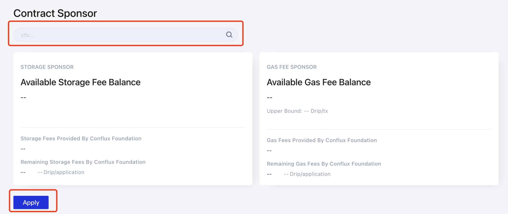

Los desarrolladores pueden enviar una solicitud a la Fundación para el patrocinio.

> Consulte [SponsorWhitelistControl](../core-space-basics/internal-contracts/sponsor-whitelist-control.md) y compruebe las bases del mecanismo del patrocinio.

## Tutorial

1. Ir al sitio web oficial de ConfluxScan (confluxscan.io)
2. Haga clic en "Blockchain", seleccione "Contract Sponsor" en la columna "Contracts" e ingrese la interfaz del contrato de patrocinio
3. Rellene el campo de búsqueda con la dirección del contrato que desea solicitar patrocinio, haga clic en "Buscar"
4. Haz clic en "Aplicar"

 

## Reglas de Patrocinio

Patrocinio colateral de almacenamiento sin diferenciar: 1 * 10 cfx. Patrocinio de gas sin diferenciar: 5 * 1 Gdrip, 500.000 drip superior (aproximadamente gas con precio 1 y límite de gas de no más de 500.000)

Las solicitudes de patrocinio requieren una negociación individual para cada proyecto específicamente (actualmente el auto servicio no está abierto), se solicita a los grupos de proyectos que completen los siguientes dos pasos y esperen a ser revisados. Completar la verificación del contrato en Confluxscan, arreglar los mensajes de advertencia en el proyecto, y establecer el Administrador del contrato integrado (nota: NO el administrador en la gestión del contrato)a la dirección cero. Después de completar el paso 1, contrate scan@confluxnetwork.org con los siguientes detalles: Nombre del proyecto. Propósito (patrocinio de gas/patrocinio de almacenamiento). Dirección del contrato Información de contacto

Normalmente, el resultado será devuelto en un plazo de 7 días hábiles. Tenga en cuenta que el envío de la solicitud no significa que la solicitud de patrocinio sea aprobada. Por lo tanto, por favor preste atención a la respuesta al correo electrónico y a la información de contacto rellenada en la solicitud.
