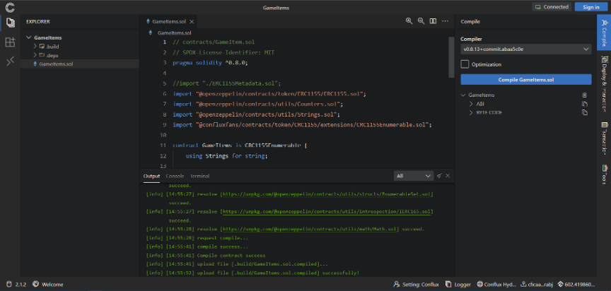

import useBaseUrl from '@docusaurus/useBaseUrl';

Conflux has tools that can help developers quickly build a dapp.

## [hardhat-conflux](https://github.com/conflux-chain/hardhat-conflux)

Hardhat is the morden Solidity developer toolkit, which can also used to develop contracts on ConfluxNetwork with the [hardhat-conflux](https://github.com/conflux-chain/hardhat-conflux) plugin. This plugin brings to Hardhat the `js-conflux-sdk`, which allows you to interact with the Conflux blockchain in a simple way.

## [Conflux-Truffle](https://github.com/Conflux-Chain/conflux-truffle)

Truffle is a world class development environment, testing framework and asset pipeline for blockchains using the Ethereum Virtual Machine (EVM), aiming to make life as a developer easier. We have ported it to Conflux-Truffle, which will work with the Conflux network and will have the same features and usage experience.

To find out how to use it, you can read [Truffle's documentation](https://www.trufflesuite.com/docs/truffle/overview). And `conflux-truffle`'s [setup guide](https://github.com/Conflux-Chain/conflux-truffle/blob/conflux/ultimate-guide.md)

## [Conflux ChainIDE](https://chainide.com/s/createTempProject/conflux)

ChainIDE is a Cloud-Based Multi-Chain IDE. Developers don’t need to install extra tools while working on smart contracts. ChainIDE supports multi-chain development environments that include Conflux(core), Conflux(eSpace), Ethereum, BNB Chain, Polygon, Dfinity, Nervos, Flow, and it also supports consortium blockchains such as Chain33 and FiscoBcos. For more information about how to use ChainIDE, please check [this page](https://chainide.gitbook.io/chainide-english-1/ethereum-ide-1/4.-conflux-ide).

## [Conflux studio](https://github.com/ObsidianLabs/ConfluxStudio/blob/master/README-EN.md)

Conflux Studio is an integrated development environment (IDE), making developing Conflux smart contracts faster and easier, developed by [ObsidianLabs](https://www.obsidians.io/).

You can download it from its [Github release page](https://github.com/ObsidianLabs/ConfluxStudio/releases). Windows, Mac, and Linux systems are supported.

You can find its documentation in [readme](https://github.com/ObsidianLabs/ConfluxStudio), and there is also a [tutorial](https://github.com/ObsidianLabs/conflux-dapp-tutorial) about how to use it to develop a Dapp.

## [Conflux Studio Web](https://conflux.ide.black/)

The Web version of Conflux studio, that enable user develop smart contract in browser with FluentWallet.
