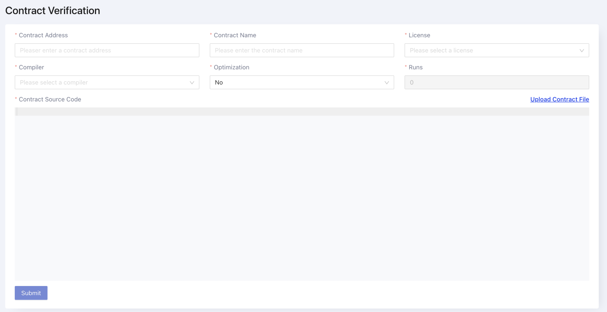

After deploying your smart contracts, it's important to verify your code on a block explorer. This can be done in an automated way using your developer tooling or the Web UI.

## Using Developer Tools

Most smart contract tooling has plugins for verifying your contracts easily on ConfluxScan.

| Network | Scan API                                                                                    |
| ------- | ------------------------------------------------------------------------------------------- |
| Mainnet | https://evmapi.confluxscan.org/api/         |
| Testnet | https://evmapi-testnet.confluxscan.org/api/ |

### Hardhat

Modify `hardhat.config.ts` to point to Conflux eSpace's RPC and block explorer API. A dummy `apiKey` value is required, but anything works for its value.

For example, if you are using eSpace testnet, your config will look like this:

```javascript
...

const config: HardhatUserConfig = {
  ...
  solidity: "0.8.19",
  networks: {
    espaceTestnet: {
      url: "https://evmtestnet.confluxrpc.com",
      accounts:
        process.env.PRIVATE_KEY !== undefined ? [process.env.PRIVATE_KEY] : [],
    },
  },
  sourcify: {
    enabled: false,
  },
  etherscan: {
    apiKey: {
      espaceTestnet: 'espace',
    },
    customChains: [
      {
        network: 'espaceTestnet',
        chainId: 71,
        urls: {
          apiURL: 'https://evmapi-testnet.confluxscan.org/api/',
          browserURL: 'https://evmtestnet.confluxscan.org/',
        },
      },
    ],
  },
}

...
```

Now you can verify the smart contract by running the following command.

```solidity
npx hardhat verify --network espaceTestnet <contract address> <space separated constructor parameters>
```

For example, this is how a smart contract that receives two uint parameters in the constructor should look:

```solidity
npx hardhat verify --network espaceTestnet 0xD9880690bd717189cC3Fbe7B9020F27fae7Ac76F 123 456
```

Note: If the above does not work, try verifying with the following instead: apiURL: 'https://evmapi-testnet.confluxscan.net/api/', and browserURL: 'https://evmtestnet.confluxscan.net/'.

### Foundry

When using Foundry, the `verify-contract` command helps automate the process of verifying contracts. If your contract has constructor arguments, you can specify these in ABI-encoded form with the `--constructor-args` option. For example, if your constructor takes two `uint256` variables:

```bash
 --constructor-args $(cast abi-encode "constructor(uint256,uint256)" 0 7)
```

Refer to the [Foundry documentation](https://book.getfoundry.sh/reference/forge/forge-verify-contract) for further options you can specify.

```bash
forge verify-contract <contract address> <contract name> \
  --verifier-url https://evmapi-testnet.confluxscan.org/api/ \
  --etherscan-api-key <anything is ok> \
  --constructor-args <your constructor arguments>
```

:::warning

Do not specify the chain ID.

:::

## Verify on Web UI Manually

Any contract deployed on eSpace can be verified on the [ConfluxScan](https://evm.confluxscan.net/) block explorer's contract detail page. If contract is not verified, the contract detail page will show a entry to verify page.



Developer can use flatten tools (hardhat, foundry) to merge his contract and it's dependencies into one file. Then copy the flatten code into the editor. And fill in the contract name, compiler version, license. Finally, click the submit button to verify the contract.

If the verification failed, maybe the **compiler version** or **optimization settings** or **evm version** are not correct. Please check the compiler version and optimization settings in the contract deployment configuration.

### Resources

- [EVM Versions to Target](https://docs.soliditylang.org/en/v0.8.23/using-the-compiler.html#setting-the-evm-version-to-target)
