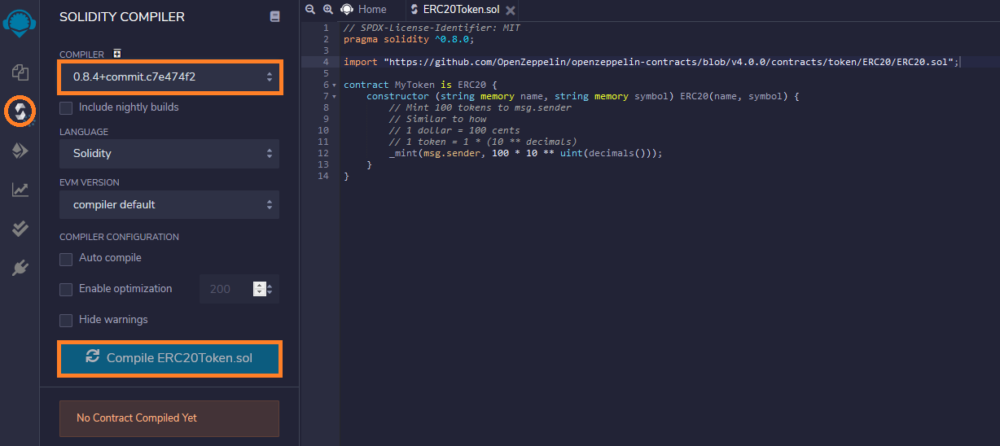
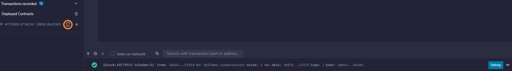
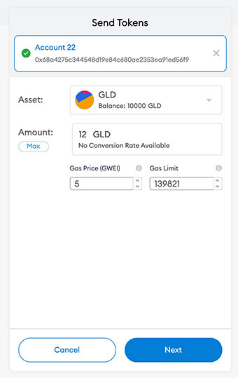

## Introduction

Remix IDE is a powerful online development environment specifically designed for building, deploying, and debugging smart contracts for the Ethereum network and other EVM-compatible blockchains like Conflux eSpace. This tutorial will guide you through the process of deploying an ERC20 token smart contract on Conflux eSpace using Remix IDE. If you're looking to deploy a different smart contract, you can use [Cookbook](../cookbook.md) to access a comprehensive library of pre-written Solidity code, allowing you to find and utilize the specific smart contract functionalities you need.

## Deploying an ERC-20 Token on Conflux eSpace using Remix IDE
In a new tab, open the Remix IDE at [remix.ethereum.org](https://remix.ethereum.org). It might take a minute to load, but once it has, create a new file `ERC20Token.sol` in the workspace panel on the left:


Copy and paste the following code into the central editor panel:

```solidity
// SPDX-License-Identifier: MIT
pragma solidity ^0.8.0;

import "https://github.com/OpenZeppelin/openzeppelin-contracts/blob/v4.0.0/contracts/token/ERC20/ERC20.sol";

contract MyToken is ERC20 {
    constructor (string memory name, string memory symbol) ERC20(name, symbol) {
        // Mint 10000 tokens to msg.sender
        // Similar to how 1 dollar = 100 cents
        // 1 token = 1 * (10 ** decimals)
        _mint(msg.sender, 10000 * 10 ** uint(decimals()));
    }
}
```

Click the `Solidity Compile` button on the far left panel (the second icon down); ensure your selected Solidity compiler version is 0.8 (minor versions within 0.8, e.g., 0.8.4 work too), and click `Compile ERC20Token.sol`.




Once the contract is compiled, click the `Deploy & run transactions` button in the far left panel (the icon below the Solidity compiler). In the `ENVIRONMENT` drop-down select `Injected Web3`.


You will see a MetaMask pop-up window asking you to give the Remix IDE permission to access it. Click `Next` and then `Connect` to grant access.


Back in the Remix interface, click the arrow next to the `DEPLOY` section of the left panel. Fill in the token details with whatever you like (`GoldenToken` and `GLD` in the example), and click `transact`.


Another MetaMask pop-up will appear asking you to confirm the transaction. Click `Confirm`.


After a few moments the transaction will be confirmed by the network. You will see a success message in the bottom panel and the contract listed under `Deployed Contracts` on the left panel. Click the copy button to copy the address of the newly deployed contract.




Now that the contract is deployed on the Conflux eSpace, we can interact with it via MetaMask.

## Adding an ERC-20 Token to MetaMask

In the MetaMask interface (with the Conflux EVM Testnet network still selected), click the `Add Token` button:


Paste the token address copied from Remix in the previous step. The remaining token details should fill in automatically as MetaMask finds the contract on-chain. Click `Next`:


On the next screen you see the balance (100 tokens), as minted in our contract constructor. Click `Add Tokens`:


The token has now been added to MetaMask and we can use the MetaMask interface to view the token balance and to transfer the token to others.

## Transferring an ERC-20 Token with MetaMask

Continuing from the previous step, click the `Send` button in the MetaMask interface:


Select a recipient (if you have multiple accounts in MetaMask you can simply select another account), and an amount of tokens to send. Click `Next`:



:::note
Once again the gas price should be set to zero, but this will change going forward.
:::

Click `Confirm` to send the transaction to the network:


After a few moments the transaction will be confirmed by the network. You can see the updated balance your account holds in the MetaMask interface:


If you transferred to another MetaMask account you hold then you can follow the aforementioned instructions for adding the token to MetaMask on the other account, and view its balance also.


## Video Tutorial

For an on-hands demonstration of how to deploy a smart contract using Remix IDE, please refer to the following video:

import Tabs from '@theme/Tabs';
import TabItem from '@theme/TabItem';

<Tabs>
  <TabItem value="youtube" label="Remix IDE Video Tutorial">
<iframe width="560" height="315" src="https://www.youtube.com/embed/WLbUXQ1FS8M?si=kJD-6-QN3ZqFf0_v" title="YouTube video player" frameborder="0" allow="accelerometer; autoplay; clipboard-write; encrypted-media; gyroscope; picture-in-picture; web-share" allowfullscreen></iframe>
  </TabItem>
</Tabs>
