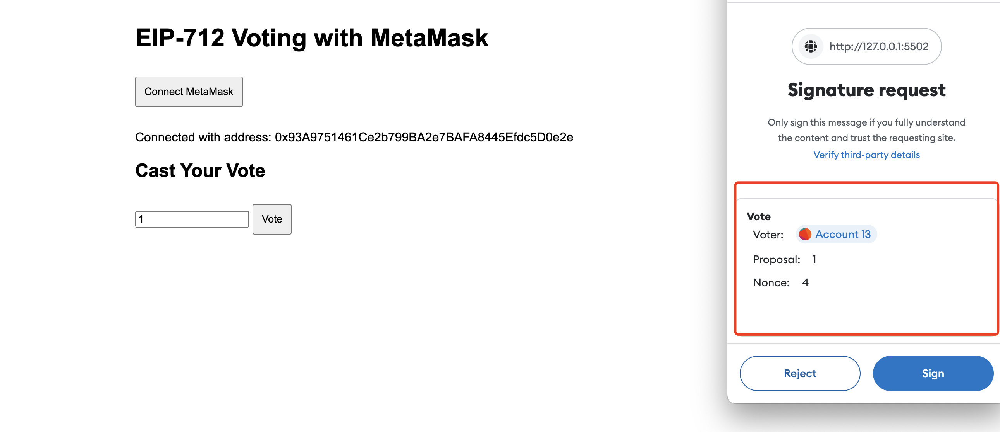

# How to use EIP-712 Signature

## Introduction to EIP-712

EIP-712, or "Typed structured data hashing and signing," is a standard in Ethereum Improvement Proposals. It provides a standardized way to sign structured data, making the signing process more secure and user-friendly.

### Key Components of EIP-712 Signatures

1. **EIP712Domain**: Every EIP-712 signature must include an EIP712Domain section. This section contains crucial information about the contract and the environment:

   ```javascript
   EIP712Domain: [
     { name: "name", type: "string" },
     { name: "version", type: "string" },
     { name: "chainId", type: "uint256" },
     { name: "verifyingContract", type: "address" },
   ];
   ```

   This information is displayed during the signing process and ensures that the signature can only be verified by a specific contract on a specific chain.

2. **Domain Object**: In your signing script, you need to provide the domain information:

   ```javascript
   const domain = {
     name: "EIP712Voting",
     version: "1",
     chainId: 71, // Conflux eSpace testnet
     verifyingContract: "0xDD1184EeC78eD419d948887B8793E64a62f13895",
   };
   ```

3. **Custom Types**: You need to define custom types that match your contract's structure:

   ```javascript
   const types = {
     Vote: [
       { name: "voter", type: "address" },
       { name: "proposal", type: "uint256" },
       { name: "nonce", type: "uint256" },
     ],
   };
   ```

4. **Message**: Create a message object with the data to be signed:

   ```javascript
   const value = {
     voter: await signer.getAddress(),
     proposal: 1, // Voting for proposal 1
     nonce: await contract.nonces(signer.address),
   };
   ```

5. **Signing Process**: Use the wallet's `signTypedData()` method to create the signature:

   ```javascript
   const signature = await signer.signTypedData(domain, types, value);
   ```

### Benefits of EIP-712

1. **Improved Readability**: Users can clearly see what they're signing, reducing the risk of malicious transactions.
2. **Enhanced Security**: The structured format helps prevent certain types of phishing attacks.
3. **Better User Experience**: Wallets and dApps can display more meaningful signing requests.
4. **Cross-Platform Consistency**: Ensures consistent behavior across different Ethereum-compatible platforms.

In this tutorial, we'll implement EIP-712 signatures on the Conflux eSpace network using Hardhat, creating a simple voting system to demonstrate its usage. Our voting system will allow users to sign their votes off-chain and submit them to the blockchain, ensuring both privacy and efficiency.

## 1. Project Setup

First, ensure you have Node.js and npm installed. Then, create a new project directory and initialize it:

```
mkdir eip712-conflux-demo
cd eip712-conflux-demo
npm init -y
```

Install the necessary dependencies:

```
npm install --save-dev hardhat @nomicfoundation/hardhat-toolbox @openzeppelin/contracts dotenv
```

## 2. Configure Hardhat

Create a Hardhat configuration file `hardhat.config.js`:

```javascript:hardhat.config.js
require("@nomicfoundation/hardhat-toolbox");
require("dotenv").config();

module.exports = {
  solidity: "0.8.24",
  networks: {
    eSpaceTestnet: {
      url: "https://evmtestnet.confluxrpc.com",
      accounts: [process.env.PRIVATE_KEY],
    },
  },
};
```

Create a `.env` file to store your private key:

```
PRIVATE_KEY=your_private_key_here
```

Make sure to add `.env` to your `.gitignore` file.

## 3. Write the Smart Contract

Create a `contracts/EIP712Voting.sol` file:

```solidity
// SPDX-License-Identifier: MIT
pragma solidity ^0.8.0;

import "@openzeppelin/contracts/utils/cryptography/ECDSA.sol";
import "@openzeppelin/contracts/utils/cryptography/EIP712.sol";

contract EIP712Voting is EIP712 {
    using ECDSA for bytes32;

    mapping(uint256 => uint256) public voteCount;

    // TypeHash for the Vote struct used in EIP-712 signing
    bytes32 private constant VOTE_TYPEHASH =
        keccak256("Vote(address voter,uint256 proposal,uint256 nonce)");

    mapping(address => uint256) public nonces;

    event VoteCast(address indexed voter, uint256 indexed proposal);

    constructor() EIP712("EIP712Voting", "1") {}

    function castVote(uint256 proposal, bytes memory signature) external {
        // Generate the hash of the structured data
        bytes32 structHash = keccak256(
            abi.encode(
                VOTE_TYPEHASH, // Type hash of the Vote struct, ensures data structure consistency
                msg.sender, // Address of the voter
                proposal, // ID of the proposal being voted on
                nonces[msg.sender] // Current nonce of the voter, prevents replay attacks
            )
        );
        // structHash now contains a unique identifier of the vote data

        // Generate the final hash using the EIP-712 standard's _hashTypedDataV4 function
        bytes32 hash = _hashTypedDataV4(structHash);
        // hash is now the final hash combining the structured data hash and the domain separator
        // This final hash is used to verify the EIP-712 signature
        // The domain separator includes contract name, version, chain ID, and contract address,
        // ensuring the signature is only valid for this specific contract and network
        address signer = ECDSA.recover(hash, signature);

        require(signer == msg.sender, "EIP712Voting: Invalid signature");

        voteCount[proposal]++;
        nonces[signer]++;

        emit VoteCast(signer, proposal);
    }

    function getVoteCount(uint256 proposal) external view returns (uint256) {
        return voteCount[proposal];
    }
}
```

This contract implements EIP-712 signature verification and voting functionality.

## 4. Write the Deployment Script

Create a `scripts/deploy.js` file:

```javascript
const hre = require("hardhat");

async function main() {
  const EIP712Storage = await hre.ethers.getContractFactory("EIP712Voting");
  const eip712Storage = await EIP712Storage.deploy();

  // Wait for the contract to be deployed
  await eip712Storage.waitForDeployment();

  // Get the deployed contract address
  const address = await eip712Storage.getAddress();

  console.log("EIP712Storage deployed to:", address);
}

main().catch((error) => {
  console.error(error);
  process.exitCode = 1;
});
```

## 5. Deploy the Contract

Run the following command to deploy the contract:

```
npx hardhat run scripts/deploy.js --network eSpaceTestnet
```

Note down the output contract address.

## 6. Create the Signing Script

Create a `scripts/sign.js` file:

```javascript
const hre = require("hardhat");
require("dotenv").config();

async function main() {
  const [signer] = await hre.ethers.getSigners();

  const contractAddress = "<YOUR_DEPLOYED_CONTRACT_ADDRESS>";

  const domain = {
    name: "EIP712Voting",
    version: "1",
    chainId: 71, // Conflux eSpace testnet
    verifyingContract: contractAddress,
  };

  const types = {
    Vote: [
      { name: "voter", type: "address" },
      { name: "proposal", type: "uint256" },
      { name: "nonce", type: "uint256" },
    ],
  };

  const EIP712Voting = await hre.ethers.getContractFactory("EIP712Voting");
  const contract = EIP712Voting.attach(contractAddress);

  const nonce = await contract.nonces(signer.address);

  const value = {
    voter: await signer.getAddress(),
    proposal: 1, // Assume we're voting for proposal 1
    nonce: nonce,
  };

  // Use the new signTypedData method
  const signature = await signer.signTypedData(domain, types, value);

  console.log("Signer:", await signer.getAddress());
  console.log("Proposal:", value.proposal);
  console.log("Nonce:", nonce.toString());
  console.log("Signature:", signature);
}

main().catch((error) => {
  console.error(error);
  process.exitCode = 1;
});
```

Remember to update `contractAddress` with your deployed contract address.

## 7. Generate the Signature

Run the signing script:

```
npx hardhat run scripts/sign.js --network eSpaceTestnet
```

This will output the signature information.

## 8. Create the Voting Script

Create a `scripts/vote.js` file:

```javascript
const hre = require("hardhat");

async function main() {
  const contractAddress = "<YOUR_DEPLOYED_CONTRACT_ADDRESS>";
  const EIP712Voting = await hre.ethers.getContractFactory("EIP712Voting");
  const contract = EIP712Voting.attach(contractAddress);

  const proposal = 1; // Same as the proposal number used in the signature
  const signature = "<YOUR_SIGNATURE>";

  const tx = await contract.castVote(proposal, signature);
  await tx.wait();

  console.log("Vote cast successfully");

  const voteCount = await contract.getVoteCount(proposal);
  console.log("Vote count for proposal", proposal, ":", voteCount.toString());
}

main().catch((error) => {
  console.error(error);
  process.exitCode = 1;
});
```

Update `contractAddress` and `signature` with your actual values.

## 9. Execute the Vote

Run the voting script:

```
npx hardhat run scripts/vote.js --network eSpaceTestnet
```

This will cast a vote using the generated signature.

## 10. Create a Frontend Interface

Create a `public/sign.html` file:

```html
<!DOCTYPE html>
<html lang="en">
  <head>
    <meta charset="UTF-8" />
    <meta name="viewport" content="width=device-width, initial-scale=1.0" />
    <title>EIP-712 Voting with MetaMask</title>
    <script src="https://cdnjs.cloudflare.com/ajax/libs/ethers/6.7.0/ethers.min.js"></script>
    <style>
      body {
        font-family: Arial, sans-serif;
        max-width: 800px;
        margin: 0 auto;
        padding: 20px;
      }
      button {
        margin: 10px 0;
        padding: 10px;
      }
      #status,
      #result,
      #voteInfo {
        margin-top: 20px;
      }
    </style>
  </head>
  <body>
    <h1>EIP-712 Voting with MetaMask</h1>
    <button id="connectButton">Connect MetaMask</button>
    <div id="status"></div>
    <div id="votingSection" style="display:none;">
      <h2>Cast Your Vote</h2>
      <input
        type="number"
        id="proposalInput"
        placeholder="Enter proposal number"
      />
      <button id="voteButton">Vote</button>
    </div>
    <div id="result"></div>
    <div id="voteInfo"></div>

    <script type="module">
      import { ethers } from "https://cdnjs.cloudflare.com/ajax/libs/ethers/6.7.0/ethers.min.js";

      const contractAddress = "YOUR_DEPLOYED_CONTRACT_ADDRESS";
      const contractABI = [
        "function nonces(address owner) view returns (uint256)",
        "function castVote(uint256 proposal, bytes memory signature) external",
        "function getVoteCount(uint256 proposal) view returns (uint256)",
        "function getVoterProposal(address voter) view returns (uint256)", // Assuming this function exists in the contract
      ];

      let provider, signer, contract;

      const connectButton = document.getElementById("connectButton");
      const statusDiv = document.getElementById("status");
      const votingSection = document.getElementById("votingSection");
      const proposalInput = document.getElementById("proposalInput");
      const voteButton = document.getElementById("voteButton");
      const resultDiv = document.getElementById("result");
      const voteInfoDiv = document.getElementById("voteInfo");
      const checkVoteButton = document.getElementById("checkVoteButton");

      connectButton.addEventListener("click", async () => {
        if (typeof window.ethereum !== "undefined") {
          try {
            await window.ethereum.request({ method: "eth_requestAccounts" });
            provider = new ethers.BrowserProvider(window.ethereum);
            signer = await provider.getSigner();
            contract = new ethers.Contract(
              contractAddress,
              contractABI,
              signer
            );

            const address = await signer.getAddress();
            statusDiv.innerHTML = `Connected with address: ${address}`;
            votingSection.style.display = "block";
            checkVoteButton.style.display = "block";
          } catch (error) {
            console.error(error);
            statusDiv.innerHTML = "Failed to connect to MetaMask";
          }
        } else {
          statusDiv.innerHTML = "Please install MetaMask";
        }
      });

      voteButton.addEventListener("click", async () => {
        const proposal = proposalInput.value;
        if (!proposal) {
          alert("Please enter a proposal number");
          return;
        }

        try {
          const address = await signer.getAddress();
          const nonce = await contract.nonces(address);

          const domain = {
            name: "EIP712Voting",
            version: "1",
            chainId: Number((await provider.getNetwork()).chainId),
            verifyingContract: contractAddress,
          };

          const types = {
            Vote: [
              { name: "voter", type: "address" },
              { name: "proposal", type: "uint256" },
              { name: "nonce", type: "uint256" },
            ],
          };

          const value = {
            voter: address,
            proposal: BigInt(proposal),
            nonce: nonce,
          };

          const signature = await signer.signTypedData(domain, types, value);

          const tx = await contract.castVote(proposal, signature);
          await tx.wait();

          const voteCount = await contract.getVoteCount(proposal);
          resultDiv.innerHTML = `Vote cast successfully! Current vote count for proposal ${proposal}: ${voteCount}`;
        } catch (error) {
          console.error("Voting error:", error);

          let errorMessage = error.message;
          if (error.data && typeof error.data.message === "string") {
            const match = error.data.message.match(
              /execution reverted: (.*?)(?:\.?$)/
            );
            if (match) {
              errorMessage = match[1];
            }
          }

          resultDiv.innerHTML = "Failed to cast vote: " + errorMessage;
        }
      });
    </script>
  </body>
</html>
```

This HTML file provides a simple user interface for connecting MetaMask, casting votes, and checking voting results.

## 11. Run the Frontend

Use Live Server or another HTTP server to run `public/sign.html`. Make sure to update `contractAddress` with your deployed contract address.

[](../img/eip712-voting-metamask.png)

## Conclusion

Through this tutorial, you've learned how to implement EIP-712 signatures on Conflux eSpace using Hardhat. This includes writing and deploying smart contracts, generating and verifying signatures, and creating a simple frontend interface to interact with the contract.

Remember to always protect your private keys and thoroughly test your application on testnets before conducting any real transactions.
