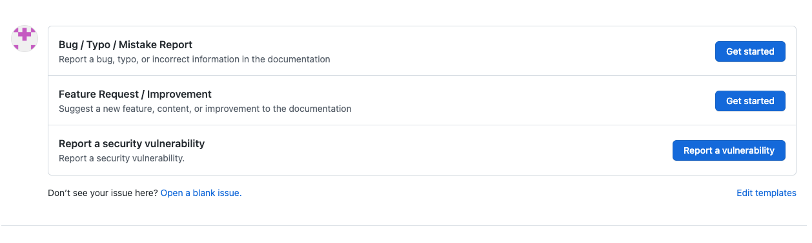

# Contribuir

:::info
¡Gracias por tu interés en contribuir en nuestra documentación! Agradecemos su apoyo y valoramos los conocimientos y la experiencia de nuestra comunidad. Esta página describe las pautas y procesos para contribuir, así como las recompensas que puedes ganar por tus esfuerzos.

If you are seeking funding from the Conflux Foundation, please refer to our [grants](./build/grants.md) page.

:::

## Cómo contribuir

Las contribuciones son bienvenidas de varias formas, incluyendo pero no limitado a:

1. Señalar una falla/error tipográfico y (opcionalmente) proporcionar una solución
2. Proporcionar una traducción
3. Crear o mejorar diagramas, gráficos o ayudas visuales
4. Sugerir mejoras a la estructura de documentación u organización
5. Escribir o actualizar un tutorial o una guía
6. Crear o actualizar ejemplos de códigos o demos
7. Mejorar la redacción de documentos

Para contribuir, sigue estas sugerencias:

### Crear un Issue

Puede crear un Issue para

- reportar algún error / error tipográfico
- o solicitar nuevo contenido / mejora de contenido actual



Sería estupendo que pudiera tomar la iniciativa y resolver el problema por su cuenta!

```
// in BUG template
- [ ] I'd be willing to fix this issue myself.
// in Feature Request template
- [ ] I'd be willing to contribute this feature myself
```

### Crear un Pull Request

Puedes crear una Pull Request para enviar cambios de contenido **EXCEPTO PARA [TRADUCCIONES](#provide-translation)**.

Si no estas trabajando en un Issue creado por ti mismo, se sugiere seguir estos pasos:

:::nota
Estos no son pasos obligatorios pero disminuirán la posibilidad de que tu PR sea rechazada.
:::

1. Asegúrese de que existe un Issue abierto relevante con la etiqueta "ACCEPTED".
2. Deja un comentario en el Issue por si hay algún contribuyente trabajando en la misma Issue.
3. Menciona el Issue `#xx` en el mensaje de commit. Ejemplo `fix: typo. Ref #123456`.


### Proveer traducción

:::note

Un PR para traducciones en el repositorio de GitHub NUNCA será aceptado.

:::

Estamos usando [Crowdin](https://crowdin.com/project/conflux) para integrar la traducción de documentos. Crowdin nos ayuda a saber si las traducciones están desactualizadas después de que cambien los archivos de origen. Cualquiera puede enviar traducciones en Crowdin, y las traducciones se colocarán en el repositorio de Github después de que sean revisadas.

#### Tutorial de Crowdin

Visita nuestra página de proyecto en Crowdin en https://crowdin.com/project/nbux o https://zh.crowdin.com/project/nbux y selecciona el idioma que deseas traducir.


Podrás seleccionar un archivo para empezar a traducir.


Para poder editar, necesitarás iniciar sesión. Puede iniciar sesión fácilmente con su cuenta de Github.


¡Una vez que estés conectado, puedes comenzar el proceso de traducción! Simplemente haga clic en una cadena de origen en el panel de la izquierda e introduzca la traducción o la edición. Recuerde hacer clic en SAVE y espera a que su traducción sea revisada.


Una vez revisado, la traducción será incluida en el repositorio de Github y puede visitar su traducción en el sitio de documentación oficial.

## POAPs de contribuyentes

Las personas que realicen alguna contribución al sitio de documentación durante una temporada podrán mintear un POAP de contribuyente. Para calificar para mintear el POAP, tu contribución debe ser también "ACEPTADA" , lo que significa:

- cualquie Issue creado tenga la etiqueta "ACCEPTED" agregada por el admin
- cualquier Pull Request ha sido fusionado exitosamente en la rama principal
- o cualquier traduccion ha sido revisada completamente

### POAPs especiales

Además de los POAPs regulares de los contribuyentes, reconocemos y recompensamos contribuciones significativas con POAPs especiales. Ejemplos de contribuciones significativas incluyen guías de alta calidad o contribuciones constantes y frecuentes al proyecto. La decisión de otorgar un POAP especial es tomada caso por caso por los encargados del proyecto.

### Actualizaciones de reglas de entrega de POAPs

Tenga en cuenta que las normas de entrega de POAP están sujetas a revisión y posibles cambios cada 3 meses. Esto garantiza que nuestras directrices sigan siendo relevantes y eficaces para promover y recompensar contribuciones valiosas.

¡Esperamos tus contribuciones y gracias por ayudarnos a mejorar nuestro sitio de documentación! Si tiene alguna pregunta o necesita ayuda, por favor siéntase libre de crear un Issue en nuestro repositorio de Github.
