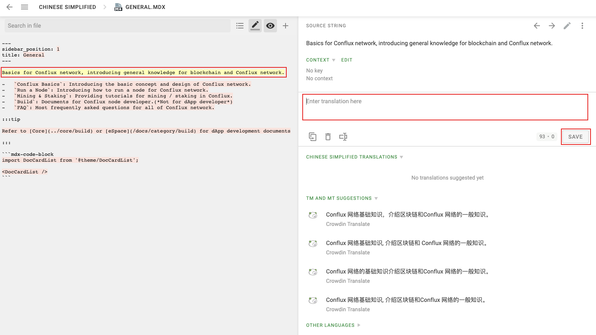

:::info

Thank you for your interest in contributing to our documentation site! Agradecemos su apoyo y valoramos los conocimientos y la experiencia de nuestra comunidad. Esta página describe las pautas y procesos para contribuir, así como las recompensas que puedes ganar por tus esfuerzos.

If you are seeking funding from the Conflux Foundation for your projects, please refer to our [**Grants**](../build/grants.md) page.

:::

We welcome contributions in a variety of forms, including but not limited to:

1. Señalar una falla/error tipográfico y (opcionalmente) proporcionar una solución
2. Proporcionar una traducción
3. Crear o mejorar diagramas, gráficos o ayudas visuales
4. Sugerir mejoras a la estructura de documentación u organización
5. Escribir o actualizar un tutorial o una guía
6. Crear o actualizar ejemplos de códigos o demos
7. Mejorar la redacción de documentos

To make a contribution, please take one of the following actions:

- **Report an Issue**: If you spot a problem or is willing to suggest improvements, [create an issue](#create-an-issue) to let us know.
- **Submit Changes**: For direct contributions to content, [create a pull request](#create-a-pull-request).
- **Help with Translation**: To contribute translations, please follow our [translation guidelines](#provide-translation).

## Create an Issue

You can create an issue for the following purposes:

- To report any mistakes or typos.
- To request new content or improvements to current content.

You can typically create an issue directly through the [GitHub web page](https://github.com/Conflux-Chain/conflux-documentation/issues/new/choose). Here, you'll find various templates to guide your issue submission.


If you're able to address the issue yourself, we encourage you to take the initiative. When creating an issue, you can indicate your willingness to resolve it. For bug reports, select the option “I'd be willing to fix this issue myself” in the BUG template. For feature requests, select “I'd be willing to contribute this feature myself” in the Feature Request template.

```md

// in BUG template
- [ ] I'd be willing to fix this issue myself.
// in Feature Request template
- [ ] I'd be willing to contribute this feature myself

```

Alternatively, you can submit your issue through the [Conflux Documentation Issue Form](https://forms.office.com/r/pKVBywZwLY). If your submission is approved, it will be created on the GitHub repository.


## Create a Pull Request

Contributing to projects through a pull request (PR) is a valuable way to improve existing documentation or code. This guide will walk you through the process step by step, ensuring clarity and ease of understanding, especially for those new to GitHub and git operations.

For complex operations, you can also check the [closed pull requests](https://github.com/Conflux-Chain/conflux-documentation/pulls?q=is%3Apr+is%3Aclosed) for grammar reference. For example,

- [Added Ecosystem Page + Video](https://github.com/Conflux-Chain/conflux-documentation/pull/392) shows how to add an article with video reference.
- [feat: template example](https://github.com/Conflux-Chain/conflux-documentation/pull/410) shows how to make use of mdx's feature to create similar pages using template.

:::note

This process does not apply to [TRANSLATIONS](#provide-translation).

:::

### Minor Changes via Github Web UI

For simple corrections or enhancements like typos or sentence improvements:

1. Navigate to the Page:
   - Go to the **English version** of the page you wish to edit and click the "Edit this page" button. This button is typically found at the top or bottom of the page.
     - 

2. Forking the Repository:
   - You'll be redirected to GitHub, where you might see a prompt saying, "You need to fork this repository to propose changes." Click "Fork this repository".
     - 

3. Making Edits:
   - Once in the editor mode, make the necessary changes. After editing, scroll to the bottom where you'll find the "Commit changes" section. Fill in a brief description of your changes, then click "Propose changes".

4. Submitting the Pull Request:
   - After proposing changes, you'll be directed to a new page to initiate the pull request. Click "Create pull request". Double-check the changes and fill in any additional information if necessary, then finalize by clicking "Create pull request" again.
     - Remember to check preflight checks by adding "x".
     - 

### Local Development for Substantial Changes

:::tip

Refer to [Github's tutorial](https://docs.github.com/en/get-started/exploring-projects-on-github/contributing-to-a-project) if you are not familiar with git or Github operations.

:::

For more significant contributions like adding a new page or extensive revisions:

1. Setting Up:
   - Ensure you have [node.js](https://nodejs.org/en) (version `>= 18`) and [yarn](https://yarnpkg.com/getting-started/install) installed.
   - Fork and clone the [documentation repository](https://github.com/Conflux-Chain/conflux-documentation). Detailed instructions for forking and cloning are available on GitHub's help pages.

2. Making Changes Locally:
   - Run `yarn && yarn start` in your terminal to preview the site at `http://localhost:3000`.
   - Navigate to the `docs/**` folder in your cloned repository to make changes. Refresh your local server to see updates.

3. Submitting Your Changes:
   - After making changes, run `yarn build` to ensure everything compiles correctly.
   - Commit your changes with a meaningful message, then push to your forked repository. Initiate a pull request on GitHub by comparing your branch to the original repository.

### Working on an Existing Issue

To avoid overlapping efforts and streamline contributions, it is suggested to follow these steps:

1. Check for Accepted Issues:
   - Look for issues labeled "ACCEPTED" or similarly indicating readiness for contributions. If unsure, ask in the issue comments.

2. Announce Your Intentions:
   - Comment on the issue stating that you are working on it. This helps prevent duplicate efforts.

3. (Optional)Link Your Contributions:
   - When committing your changes, reference the issue number in your commit message, e.g., `fix: typo. Ref #123456`.

## Provide Translation

:::note

A translation pull request in the Github repo will NOT be accepted.

:::

We are using [Crowdin](https://crowdin.com/project/conflux) for document translation integration. Crowdin helps us to know whether translation strings are outdated after the source files are changed. Anyone can submit translation strings in Crowdin, and translation strings will be pushed to Github repo after they are reviewed.

### Crowdin Tutorial

Visit our project page on Crowdin at either https://crowdin.com/project/conflux or https://zh.crowdin.com/project/conflux and select the language you wish to translate.


You will be able to select a file to begin translating.


In order to edit, you will need to be logged in. No need to fret though, you can easily log in with your Github account by clicking a few buttons.


Once you are in, you can start the translation process! Simply click on a source string on the left-hand panel and input the translation or edited string. Remember to click SAVE and wait for your translation to be reviewed.



Once reviewed, the translation string will be pushed to the Github repository and you can visit your translation on the official documentation site.
