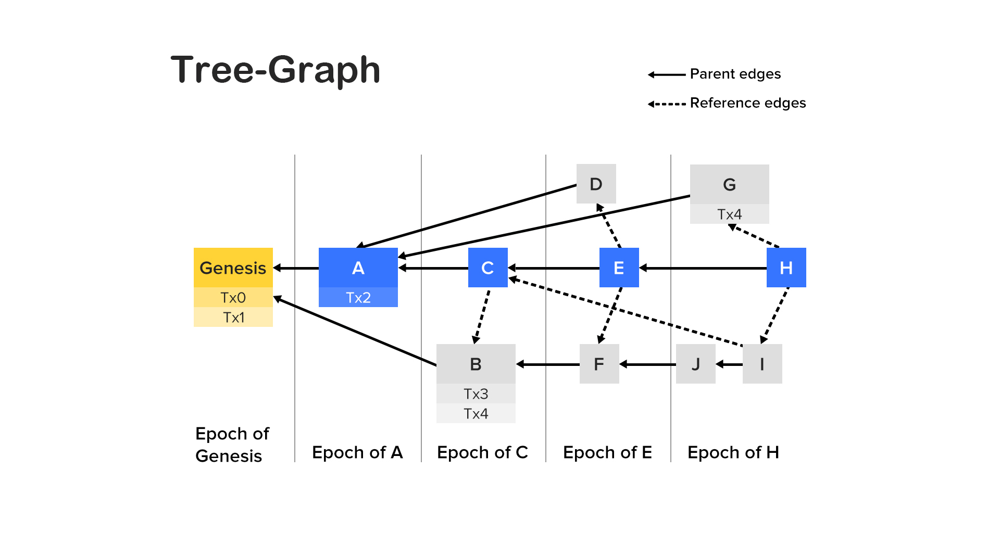

# La estructura Tree-Graph

En el corazón de Conflux se encuentra la estructura de registro [Tree-Graph](https://arxiv.org/pdf/1805.03870.pdf) y la regla de selección de cadena [GHAST](https://confluxnetwork.medium.com/conflux-research-group-ghast-mechanism-adaptive-weight-ghast-explained-part-1-ffe8224a7282).

Los registros distribuidos necesitan lidiar con bloques concurrentes, también conocidos como forks. Blockchains como Bitcoin y Ethereum usan la [regla de la cadena más larga](https://confluxnetwork.medium.com/advantages-and-disadvantages-of-the-longest-chain-rule-bc27225a2728) para seleccionar una bifurcación y descartar todo el resto. Los bloques descartados no contribuyen ni a la seguridad del sistema ni a su desarrollo. Como resultado, hay un [conflicto inherente](https://eprint.iacr.org/2013/881.pdf) entre escalabilidad y seguridad en estas blockchains. Conflux, por otra parte, incorpora todos los bloques concurrentes en su cadena, logrando niveles muy altos de seguridad y rendimiento.

Primero, Conflux reemplaza la regla de la cadena más larga con la regla de selección de cadena GHAST. Con esta regla, la bifurcación es seleccionada basándose en el poder de minado de su subárbol, no sólo en una cadena, lo que a su vez hace que esta selección sea mucho más robusta. Esto permite a Conflux usar una tasa de creación de bloques de hasta 2 bloques por segundo. GHAST también puede soportar Liveness Attacks.

En segundo lugar, Conflux utiliza el Tree-Graph como su estructura de registro. Cada bloque, además de tener un solo bloque padre, también contiene una lista de bloques de referencia a bloques anteriores. Esto introduce nueva información sobre la relación anterior y posterior entre bloques. Esta estructura es esencialmente un [arból dirigido](https://en.wikipedia.org/wiki/Polytree) (solo bbloques padres) incrustado dentro de un [DAG](https://en.wikipedia.org/wiki/Directed_acyclic_graph) (todos los bordes), de ahí el nombre de Tree-Graph.

Cuando se procesan las transacciones, Conflux selecciona primero una cadena pivot en el Tree-Graph usando la regla de selección GHAST. Luego, usando la cadena pivot y los bloques de referencia, ordena el registro en una secuencia lineal de bloques. Finalmente, ejecuta transacciones siguiendo este orden lineal.

