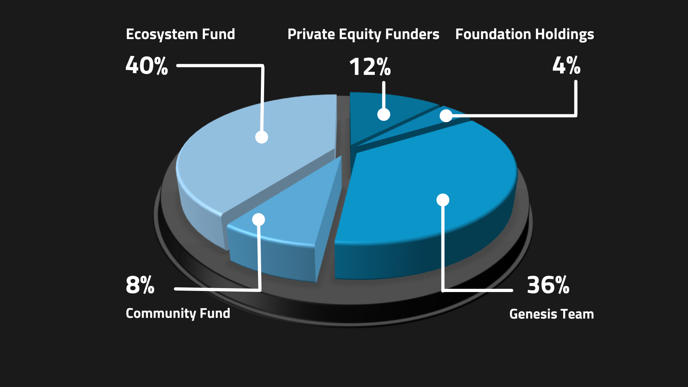

Conflux's economic model encourages participation and growth of the network while supporting technological stability. A well-designed economic model is essential for a decentralized system to operate efficiently. Blockchain technology establishes trust and encourages efficient relationships among cooperators, accelerating the transfer of value.

## **Conflux Economic Model Overview**

### Key Elements

**1. Value System:** Public blockchain systems require tokens to serve as a measurable unit with economic value. Tokens clarify asset ownership and are a transaction medium for value interaction. Tokens are also connected to storage resources and can be distributed as long-term incentives.

**2. Governance Rules:** Governance rules involve the distribution and use of tokens, as well as their economic impact under different conditions. Tokens can be distributed to users as interest or to miners as block rewards. Tokens can also be exchanged into fiat currencies or other digital currencies.

**3. Community Collaboration:** Blockchain systems should be "open to everyone and beneficial to all participants." All users have the right to enter the system without barriers, become a shareholder, contribute to the construction of the system, and benefit from their efforts.

### Key Participants

Participants in the Conflux Network ecosystem include three groups:

1\) _**Direct builders**_: _Conflux Foundation_ and the _founding team_ responsible for developing the underlying technology of the Conflux public chain and the Conflux Network operations;

2\) _**System maintainers**_: _Miners_ and _Stakers_ maintaining the normal operation and security of the whole Conflux Network system;

3\) _**Ecosystem contributors**_: _Community Users_ who continuously generate value for the Conflux Network ecosystem.

### Development Phases

Conflux Network will choose different incentive patterns during different development phases to ensure a stable shift from the initial phase to the operational phase.

- **Initial phase**: the _direct builders_ and the _ecosystem contributors_ are incentivized to resolve the cold start problem of the system;

- **Operational phase**: _system maintainers_ are incentivized to promote continuous system upgrading; self-adaptive configuration of Conflux system resources is promoted through the marketization of system resources.

## **Incentives Mechanism**

Conflux's incentives mechanism has been designed to encourage users to participate in the network. The goal is to ensure that Conflux is safe, reliable, and stable, and can be accessed with minimal barriers to entry, while contributing to the proper usage of Conflux’s computing and on-chain storage resources.

Conflux Network uses the following economic incentives to encourage participation in the network:

1. Financial incentives for system maintainers or miners.
2. Users can earn interest by staking their CFX tokens, which helps secure the network through the PoS consensus layer. Those who don't stake lose out on interest payments, which are generated by the issuance of new CFX tokens.
3. Smart contract deployers must pay a fee to store data on Conflux Network. This fee is staked, generating interest that goes to network maintainers, incentivizing them to do their work well.
4. Users can earn interest and voting rights by locking CFX tokens into the governance platform for a set period. This also incentivizes participation in governance.

## **CFX Token Distribution**

To understand how these factors operate within Conflux’s economic model, we need to take a look at the core of Conflux’s value system: **Conflux’s native token, CFX.**

Each CFX token consists of smaller units called **drips**, which are similar to Gwei on the Ethereum network or Satoshis on Bitcoin. To send a transaction on the Conflux Network, a small amount of drip is paid as a transaction fee. These fees are awarded to system maintainers (miners).

### **Initial Phase CFX Distribution**

In the **initial phase**, direct builders and ecosystem contributors are rewarded to constantly improve the ecosystem and lay a solid foundation for the entire ecosystem during the cold start phase.

The amount of pre-mined tokens in the genesis block of Conflux Network is 5 billion CFX. The pre-mined tokens will be offered as rewards to the _direct builders_ and the _ecosystem contributors_ of Conflux Network.

**Direct builders** are rewarded to constantly improve the ecosystem and to lay a solid foundation for the entire Conflux ecosystem.

- _Private Equity Funders_: 12% of the genesis tokens will be allocated to our private round investors and will be released over two years.
- _Foundation Holdings_: 4% plus any unsold CFXs in the previous category will be allocated to support the long term financial need of Conflux Foundation. These tokens will be unlocked monthly over 2 years.
- _Genesis Team_: 36% of the genesis tokens will be awarded to the founding team including the IIIS team (of Tsinghua University), Conflux Foundation employees, and advisors. The genesis team’s tokens will be released over 4 years and serve as a capital pool. Reasonable marketing activities will be set to solve the cold start problem so that users joining the ecosystem in an early stage and early miners will get extra tokens or higher block-rewards. This will encourage them to contribute more to the ecosystem.
- _Community Fund:_ 8% of the genesis tokens will be provided as rewards for ordinary community users for the encouragement of them to participate in the early stages of developing and maintaining the Conflux ecosystem. This part of the tokens will be unlocked within four years.
- _Ecosystem Fund_: 40% of the genesis tokens will be offered to community developers supporting the DApps in the Conflux ecosystem. This proportion of tokens will be unlocked within four years.
- _Public Fund_: 0% of the genesis tokens will be allocated into the public fund account.

### **Operational Phase CFX Distribution**

In the operational phase, system maintainers are inspired to promote continuous system upgrading; ecosystem contributors are encouraged to constantly generate value for the ecosystem. Meanwhile, self-adaptive configuration of Conflux system resources is promoted through system resource marketization.

Miners, the major maintainers of the Proof of Work (PoW) system, are mainly responsible for confirming transactions recorded in the system. They are important roles for the stability of the system. Incentives are the main source of miner incomes, so the design of the miner incentive model directly affects the sustainability of the system.

Like Bitcoin miners, miners on Conflux receive financial rewards in exchange for the computing power that they contribute to maintaining the network. These rewards are earned in the form of block rewards and transaction fees.

Miners are responsible for confirming transactions in the Proof of Work (PoW) system and receive financial rewards in the form of block rewards and transaction fees. The initial block reward was set at 7 CFX per block and was gradually reduced over epochs until it reached 2 CFX per block at epoch height 3,615,000.

Miners also receive interest income from Collateral for Storage (CFS) tokens paid by smart contract deployers. These incentives are important for the sustainability of the Conflux network.

Stakers are another crucial group of system maintainers in Conflux's Proof of Stake (PoS) consensus mechanism layer. Unlike miners in the Proof of Work (PoW) system, stakers do not compete with each other using computing power. Instead, they stake a certain amount of CFX and either run PoS nodes themselves or delegate their CFX to PoS pools. In return, they earn CFX rewards proportional to their stakes.

#### Votación de la DAO en cadena para los parámetros de la cadena

Conflux introduces internal contract [ParamControl](../../core/core-space-basics/internal-contracts/params-control.md) in [CIP-94](https://github.com/Conflux-Chain/CIPs/blob/master/CIPs/cip-94.md) to control the chain parameters including PoW base block reward and PoS base reward interest rate. In other word, the operational phase CFX distribution is now controlled by DAO.

### **CFX Annual Inflation**

:::note

The calculations presented here offer a snapshot as of August 4, 2023, based on the following conditions:

- Proof of Work (PoW) base block reward is set at 1/block
- Proof of Stake (PoS) base reward interest rate stands at 0.04 (4%)
- PoS APY (Annual Percentage Yield) is 12.9%, with 342.2 million CFX staked in PoS

This article won't update in response to changes in these parameters, so readers should check the current chain parameters to ensure the accuracy of their calculations.

:::

The Conflux Network incorporates a measure of inherent inflation, gradually adding more CFX to the overall circulation. As of now, approximately 3 billion CFX are in circulation, consisting of both the pre-mined distribution and the newly generated mining and staking rewards.

Currently, the Proof of Work (PoW) issuance rate for Conflux is 1 CFX per block, with blocks being mined every 0.5 seconds. This results in about 63 million CFX issued on an annual basis.

The Proof of Stake (PoS) issuance rate is calculated based on an Annual Percentage Yield (APY) of 0.04x, where 'x' represents the square root of the total circulation divided by the total staked amount. At present, the total CFX circulation is 3.1 billion (including 497 million that have been burnt and placed in a zero address), and the total PoS staking stands at 342.2 million. Consequently, the current APY is 12.9%, yielding an annual PoS issuance of roughly 44 million CFX.

The annual inflation rate for CFX is approximately 107 million (63 million from PoW and 44 million from PoS). Adding this to the genesis tokens of 5 billion and the issued tokens of 540 million, we reach a total CFX circulation of 5.54 billion. Hence, the current inflation rate of CFX, in relation to the genesis tokens and issued tokens, is roughly 1.9%.

Furthermore, the introduction of [CIP-107](https://github.com/Conflux-Chain/CIPs/blob/master/CIPs/cip-107.md) will result in token burning. A certain proportion of CFX will be burnt if storage collateral is sponsored, which could potentially further decrease the inflation rate.

## **References**

- [https://confluxnetwork.org/files/Conflux_Economic_Paper_20201230.pdf](https://confluxnetwork.org/files/Conflux_Economic_Paper_20201230.pdf)
- [https://medium.com/conflux-network/conflux-networks-economic-model-concept-40e6a0e52ea9](https://medium.com/conflux-network/conflux-networks-economic-model-concept-40e6a0e52ea9)
- [https://medium.com/conflux-network/conflux-networks-economic-model-pre-mined-token-distribution-and-proportions-f92fe00696ea](https://medium.com/conflux-network/conflux-networks-economic-model-pre-mined-token-distribution-and-proportions-f92fe00696ea)
- [https://medium.com/conflux-network/conflux-networks-economic-model-block-reward-components-under-the-network-s-mining-incentive-ceadd8f8408f](https://medium.com/conflux-network/conflux-networks-economic-model-block-reward-components-under-the-network-s-mining-incentive-ceadd8f8408f)
- [https://medium.com/conflux-network/the-role-of-the-cfx-token-in-the-conflux-network-5a56c2b43bb0](https://medium.com/conflux-network/the-role-of-the-cfx-token-in-the-conflux-network-5a56c2b43bb0)
