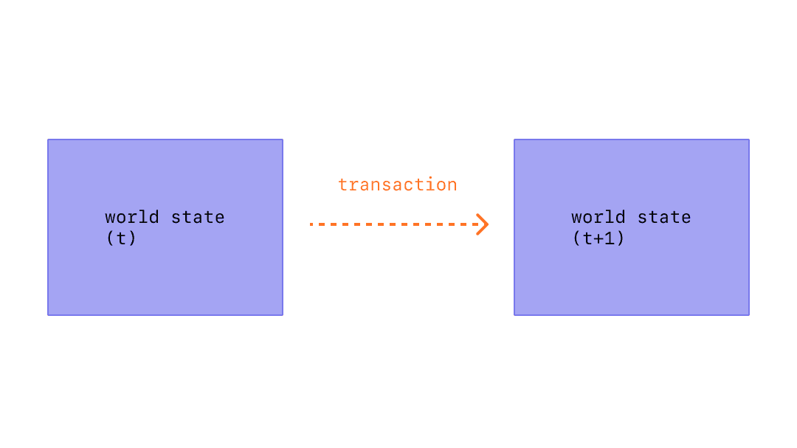

Una transacción es una única instrucción compuesta por un actor externo con una cuenta de Conflux, y esta instrucción está firmada criptográficamente usando la clave privada de la cuenta del remitente. Una transacción puede implicar una **transferencia simple de CFX** (la moneda nativa de Conflux), una **transferencia de tokens** (como ERC20 o ERC721), un **despliegue de un nuevo contrato inteligente**, o una **ejecución de una función en un contrato inteligente existente**. Las transacciones son la única forma de almacenar o actualizar datos en la cadena de bloques.

## Prerrequisitos

Para ayudarte a entender mejor esta página, te recomendamos que leas primero [Cuentas](./accounts.md).

## ¿Qué es una transacción?

Una transacción se refiere a una acción iniciada por una cuenta de propiedad externa, en otras palabras, una cuenta administrada por un ser humano, no un contrato. Por ejemplo, si Bob envía Alice 1 CFX, la cuenta de Bobs debe ser debitada y Alice debe ser acreditada. Esta acción que cambia el estado tiene lugar dentro de una transacción.

Las transacciones que cambian el estado de la EVM, deben transmitirse a toda la red. Cualquier nodo puede emitir una solicitud para que una transacción se ejecute en el EVM; después de que esto suceda, un validador ejecutará la transacción y propagará el cambio de estado resultante al resto de la red.

Una transacción enviada incluye la siguiente información:

* from – la dirección del remitente, que firmará la transacción. Esta será una cuenta de propiedad externa, ya que las cuentas de contrato no pueden enviar transacciones.
* recipient (destinatario) – la dirección de recepción (si es una cuenta de propiedad externa, la transacción transferirá el valor. Si es una cuenta de contrato, la transacción ejecutará el código del contrato)
* signature (firma) – el identificador del remitente. Esto se genera cuando la clave privada del remitente firma la transacción y confirma que el remitente ha autorizado esta transacción
* nonce - un contador de secuencia que indica el número de transacción de la cuenta
* value/valor - cantidad de CFX para transferir del remitente al destinatario (denominada en Drip, donde 1CFX es igual a 1e+18Drip)
* input data (datos de entrada) - campo opcional para incluir datos arbitrarios
* gasLimit – la cantidad máxima de unidades de gas que puede ser consumida por la transacción. La EVM especifica las unidades de gas requeridas por cada paso computacional
* gasPrice - el precio del gas utilizado a ser incluido como una propina para el validador
* chainId - el id del blockchain, que se utiliza para prevenir ataques de doble gasto

La transacción del Core Spacel incluye la siguiente información adicional:

* storageLimit - la cantidad máxima de espacio de almacenamiento que puede ser consumido por la transacción.
* epochHeight - el número de epoch de la blockchain, que se utiliza para establecer un tiempo de caducidad para la transacción

## Tarifa de gas (Gas Fee)

Las transacciones requieren una comisión y deben incluirse en un bloque validado. La tarifa se paga en CFX y se calcula multiplicando el gasCharged por el precio del gas.

Las comisiones de gas se utilizan para compensar a los mineros, motivándolos a empaquetar, validar bloques y mantener la seguridad de la cadena de bloques.

Para detalles específicos de cálculo, por favor consulte [Comisión de transacción](./gas.md).

## Ciclo de vida de la transacción

Una vez que la transacción ha sido enviada ocurre lo siguiente:

1. A transaction hash is cryptographically generated: 0x97d99bc7729211111a21b12c933c949d4f31684f1d6954ff477d0477538ff017
2. La transacción se transmite a la red y se agrega a una pool de transacciones que consiste en todas las demás transacciones de red pendientes.
3. Un validador debe elegir su transacción e incluirla en un bloque para verificar la transacción y considerarla "exitosa".
4. A medida que pase el tiempo, el bloque que contiene su transacción se actualizará a "justificado" y luego "finalizado". Estas actualizaciones hacen que sea mucho más seguro que su transacción fue exitosa y nunca se modificará. Una vez que un bloque es "finalizado" sólo podría ser cambiado por un ataque a nivel de red que costaría muchos miles de millones de dólares.

Para una comprensión más detallada del ciclo de vida de la transacción, puede referirse a [ciclo de vida de la transacción](/docs/core/core-space-basics/transactions/lifecycle.md).

## Estado de la Transacción

Las transacciones que se incluyan en un bloque se ejecutarán finalmente, generando un </a> **Recibo** de transacción

. Sin embargo, no todas las transacciones se ejecutarán con éxito; normalmente, las transacciones pueden tener dos estados: **Éxito** o **Fallo**.
 

Para las transacciones de eSpace, puede determinar el estado de ejecución a través del campo **status** del Recibo, donde **1 representa éxito, y 0 representa fracaso**.

Para las transacciones de Core Space, puede determinar el estado de ejecución a través del campo **status** del Recibo, donde **1 representa éxito, y 0 representa fracaso**.

Además, el recibo también incluye más información sobre la ejecución de la transacción, como información del bloque y los detalles de los eventos.

## Detalles

Si quieres aprender más sobre las transacciones, puedes referirte a la explicación de la transacción en la [Core Space](/docs/core/core-space-basics/transactions/overview.md).

## Intro Video

import Tabs from '@theme/Tabs';
import TabItem from '@theme/TabItem';

<Tabs>
  <TabItem value="youtube" label="Transactions on Conflux Network">
<iframe width="560" height="315" src="https://www.youtube.com/embed/GIeD2khbbXs?si=cTRZo6DalLkLguXi" title="YouTube video player" frameborder="0" allow="accelerometer; autoplay; clipboard-write; encrypted-media; gyroscope; picture-in-picture; web-share" allowfullscreen></iframe>
  </TabItem>
</Tabs>