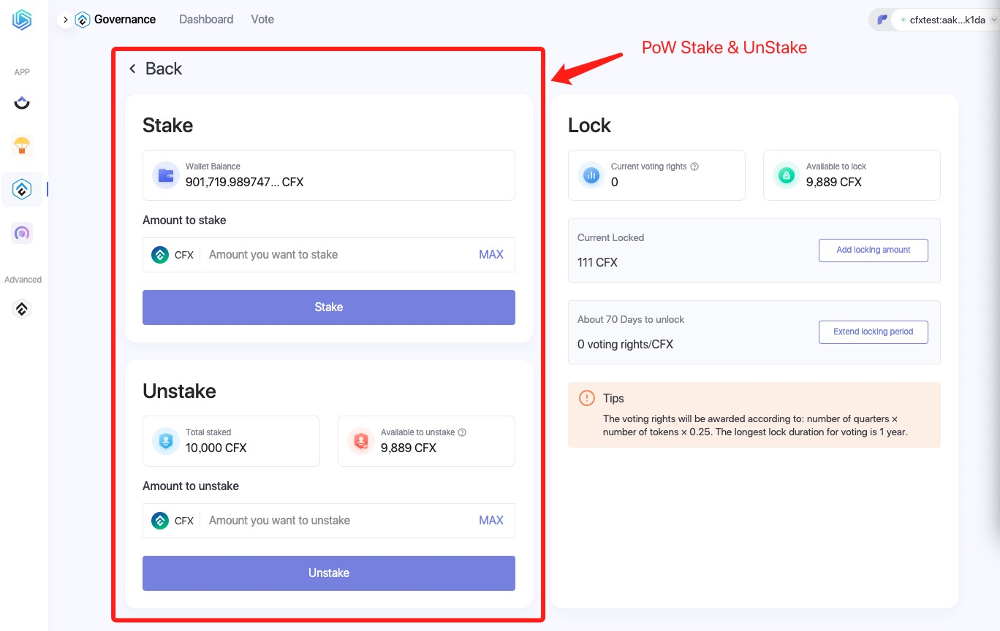

To become a solo validator, you’ll need to:

1. Run a Conflux node.
2. Register it in PoS.
3. Stake CFX in this PoS node.

This guide will walk you through the process of setting up a solo validator.

## 1. Run a Conflux node

For the official Conflux implementation(conflux-rust), the PoS node and PoW node use the same client. A conflux node works as a PoS node and a PoW node at the same time. And the snapshot data of the PoS and PoW also share the same data. So you can run a PoS node following the [run a node](/docs/general/run-a-node/Overview) guide. Either a full node or a archive node is fine.

The PoS configuration file for the node is located in the `pos_config` directory within the downloaded node package. The `pos_config.yaml` file in this directory is the PoS configuration file, and typically, the settings in this file do not need to be modified.

When you first start the node, you will be prompted to set a password to protect the PoS private key of the node. Please remember this password carefully, as it cannot be recovered if forgotten. When the node is restarted later, you will be required to enter this password. The private key is stored in the `pos_config/pos_key` file in the node directory, and it is recommended to create a backup of this file.

When starting the node for the first time, it is recommended to use a blockchain data snapshot, as it can significantly accelerate the node synchronization speed. Please refer to [Blockchain Data Snapshot](/docs/general/run-a-node/snapshot-tool) for information on how to use the blockchain data snapshot.

Once the node data is synchronized to the latest block (and the "Catch-up mode" in the node logs changes to false), you can proceed with PoS registration.

## 2. Register it in PoS

### Prerequisites

To become a validator, you need to register your node in PoS. To register a node, you need a **Conflux Core account** and the node's **PoS register data**.

So first you should have Fluent Wallet installed, and have a account with at least 1000 CFX + gasFee in it. Because one PoS vote is 1000 CFX.

The you can get the PoS register data by running the following command in your node directory:

```bash
./conflux rpc local pos register --power 1
# it will return something like this:
[
  "0xe335b451eb0d497f27d8d73d12d6c5f13b12b5c0ebad872dc59536341cd1f31c4ede98d8000000000000000000000000000000000000000000000000000000000000000100000000000000000000000000000000000000000000000000000000000000a0000000000000000000000000000000000000000000000000000000000000010000000000000000000000000000000000000000000000000000000000000001600000000000000000000000000000000000000000000000000000000000000030808c124f4a9b389f0c53a279cff171083c878437369189f03416836dfe7e10873b28db2df8109e226707388ac6588a6a0000000000000000000000000000000000000000000000000000000000000000000000000000000000000000000000210256c97da1270db8aad8dd7ed6785953c691b77dd9c0830c327ff3b4e637e9bb4200000000000000000000000000000000000000000000000000000000000000000000000000000000000000000000000000000000000000000000000000004000000000000000000000000000000000000000000000000000000000000000a00000000000000000000000000000000000000000000000000000000000000030b748cd4ed52f203e09a8299a5e29444a05fd0e8499de0a81ed4c00bb23ddd910f8eec13f0c67b8833f8bd4fbb1217f2b000000000000000000000000000000000000000000000000000000000000000000000000000000000000000000000020455b9bb17f42f8f6cd14450acb13959a1ddf2302b2c5ecf25c82cee371c2cf1f",
  "eb0d497f27d8d73d12d6c5f13b12b5c0ebad872dc59536341cd1f31c4ede98d8"
]
```

It should return two strings, the first one is the register data, the second one is the **PoS node address**.

### Stake in PoW

Before you can register your node in PoS, you need to stake some CFX in PoW, you can do it use [ConfluxHub's PoW stake tool](https://confluxhub.io/governance/pow-stake).



It is very easy to use, just connect your Fluent wallet, input the amount of CFX you want to stake, and click the "Stake" button. Here we can choose to stake 1000 CFX.

### Register

Then we can use the [ConfluxHub's PoS register tool](https://confluxhub.io/pos/register) to register our node.

1. Paste the register data we got in the previous step into the "Full node data" input box.
2. Input 1 in the "Votes" input box.
3. Click the "Register and Bind" button.
4. It will pop up a window to confirm the transaction, click the "Confirm" button.


After the transaction is executed, the register data will be synced to the PoS chain, and the sync process will take about 10 minute.

## 3. Stake CFX in this PoS node

After the register data is synced to the PoS chain, you can enter a [page like this](https://confluxhub.io/pos/increase).


This is PoS validator dashboard, you can:

1. See validator's status: PoS address, How many votes it has, How much reward it has got, etc.
2. Stake more Votes to this validator, unstake votes from it.
3. See the validator's Locking & Unlocking votes.

### Stake more Votes

You can stake more votes to this validator anytime you want, first you need [**stake more CFX in PoW**](#stake-in-pow), then input the amount of votes you want to stake in the "Votes" input box, and click the "Stake" button. Then these votes will be synced to PoS chain in about 10 minutes.

Normally the new staked votes will be in **locking** status for 13 days. After 13 days, these votes will be in **locked** status. The votes in **Locking** status will also have rewards.

### Unstake votes

If you want to unstake some votes from this validator, you can input the amount of votes you want to unstake in the "Votes" input box, and click the "Unstake" button. Then these votes will be synced to PoS chain in about 10 minutes.

Normally the unstaked votes will be in **unlocking** status for 1-14 days. After that, these votes will be in **unlocked** status, and can be withdrawn to your account use the [ConfluxHub's Pow Stake Tool](#stake-in-pow)

## View validator's status in ConfluxScan

You can also view validator's status in [ConfluxScan](https://confluxscan.io/). By visiting this url **`https://confluxscan.io/pos/accounts/0x<your-pos-node-address>?tab=overview`**

In this page you can view:

1. Validator's status in detail.
2. Incoming history.
3. Voting History.
4. Pending Rights Status: The locking and unlocking votes.


## Mainnet & Testnet ConfluxHub

- [Confluxhub Mainnet](https://confluxhub.io/governance/pow-stake)
- [Confluxhub Testnet](https://test.confluxhub.io/governance/pow-stake)

## FAQs

### Which Conflux Space does the register process take?

It's in Core Space, and Fluent Wallet is required in this process.

### How do I claim my rewards?

The rewards will be automatically sent to your Core Space account every half hour.

### What's the expected reward rate?

The expected reward rate is 10-14% per year.

### Why my node is not elected?

The more votes you have, the more likely you will be elected. Please check [Incentive Mechanism](/docs/general/conflux-basics/consensus-mechanisms/proof-of-stake/pos_overview.md#incentive-mechanism) for more details.

The other reason is that your node is not running correctly, you can check your node's status:

1. Is your node synced to the latest block?
2. Are your node's `pos_key` and `pos_db/secure_storage.json` matching? If you are unsure, you can delete the `pos_db/secure_storage.json` file and restart your node; the node will regenerate the `pos_db/secure_storage.json` file.

### The risks to be aware of when running a node?

Please check [Penalties and Slash](/docs/general/conflux-basics/consensus-mechanisms/proof-of-stake/penalties_and_slash.md) for more details.

### How to regenerate the PoS private key?

Deleting `pos_config/pos_key` and `pos_db/secure_storage.json`, and restarting the node will regenerate the PoS private key.**Please be sure that you want to delete these two files because once deleted, your PoS account cannot be recovered.**

### How long does it take for CFX to go from staking to withdrawal in PoS?

Please check [Staking Lock-up Examples](/docs/general/conflux-basics/consensus-mechanisms/proof-of-stake/pos_overview#example) for more details.

### Can the PoS node bound to a PoW account be modified?

Modification is possible, but it requires unstaking all votes associated with the PoS node. Once the unstaking process is complete, the node can be directly bound to another PoS node.

### Can a PoS node be bound to a PoW account that is a contract account? Does the contract need to implement the receive or fallback functions?

It can be a contract account, and there is no need to implement receive or fallback functions. This is because rewards are directly mined to the PoW account by the chain and do not involve transfers.
