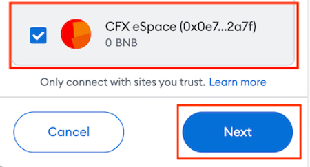
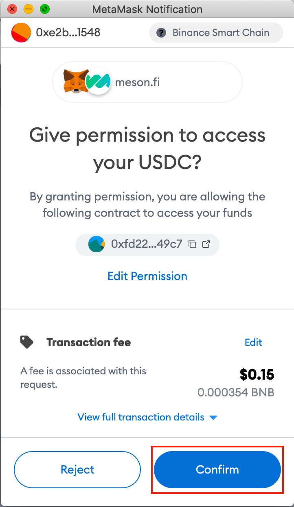
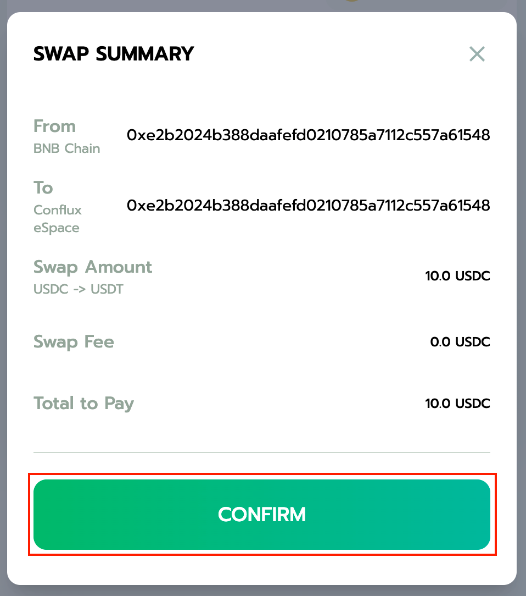
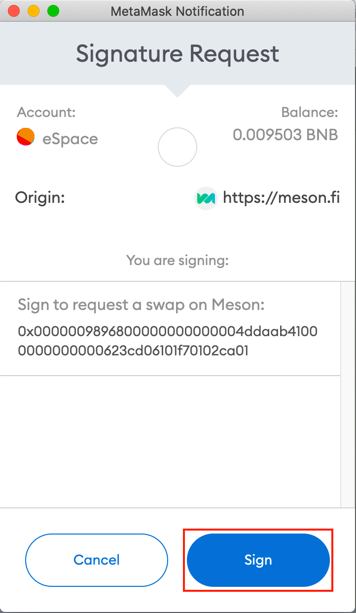
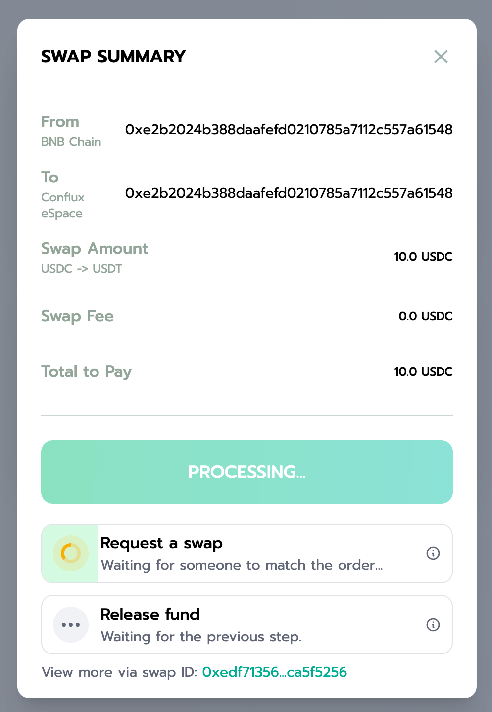

# Transfer Stablecoins Across Chains Using Meson

[Meson](https://meson.fi/zh) is a stablecoin cross-chain swap protocol that supports multiple networks. With Meson, you can bridge either USDC or USDT tokens from different networks into Conflux eSpace, or from Conflux eSpace to other networks.
- In this guide, we'll bridge USDC on BNB Chain to USDT on Conflux eSpace through Meson.

## Prerequisites

- A USDC or USDT stablecoin on any of the following networks:
- Ethereum (USDC/USDT)
- BNB Chain (USDC/USDT)
- Tron (USDT)
- Avalanche (USDC)
- Fantom (USDC)
- Polygon (USDC)
- Conflux (USDC/USDT)
- Your MetaMask wallet connected to Conflux eSpace.

## Bridging Stablecoins to Conflux eSpace with Meson

1. Go to [Meson](https://meson.fi/zh).​
2. Click **Connect Wallet** to connect MetaMask to Meson.

3. Select the account(s) that you wish to use on Meson and click Next.

4. Confirm the connection to the site by clicking **Connect**.

Your MetaMask wallet is now connected to Meson. Let's now bridge our tokens.

5. In the **FROM** drop-down list, select the network that you'll transfer your assets from (for example: BNB Chain).

6. In the token type drop-down list, select **USDC**.

7. Enter the amount of USDC that you want to transfer.

8. In the **TO** drop-down list, select **Conflux eSpace**.

9. Confirm the transaction details and click **Swap**.

10. In the Approve dialog, click **Approve** to invoke MetaMask and grant Meson permission to access your funds.

:::note  
The approval operation requires a gas fee, however, this is the only time you'll need to pay for gas, the gas fee for other steps are on Meson.
:::

11. In MetaMask, click **Confirm** to give permission to Meson to access your funds.

12. Once you grant permission to MetaMask, click **Confirm** in the Swap Summary to confirm the swap transaction you're about to do.

13. Now, in MetaMask, click **Sign** to sign and proceed with the transaction.

14. In the Swap Summary, wait for the swap request to be processed. :::note    
    This may take around 1 minute.
:::

15. Once the swap request transaction is processed, click **Sign** on MetaMask to release the funds in Conflux.

You have now bridged your funds to Conflux eSpace!

## Verifying Transactions

To verify the transaction:

1. Open the wallet menu.

2. Click on the Swap ID to open the Meson transaction explorer.

3. You can verify the transactions on both networks' transaction explorers.

## Recursos Adicionales

- To learn more about Meson, check out [Meson's blog](https://medium.com/@mesonfi.)
