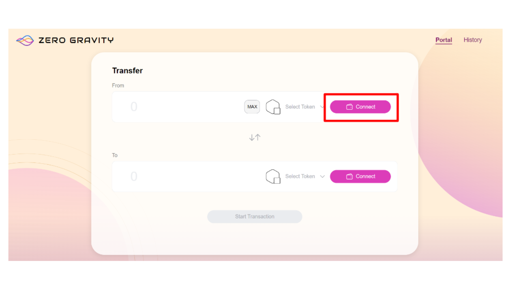
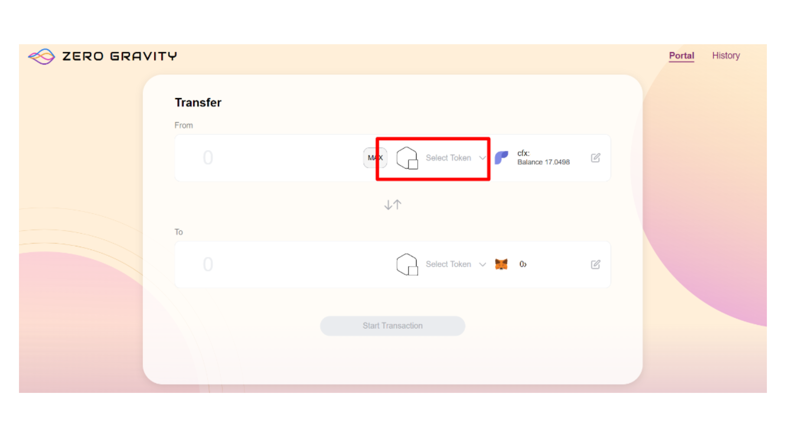
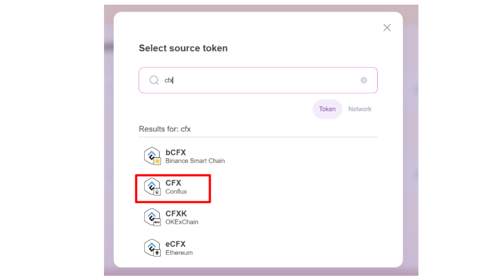
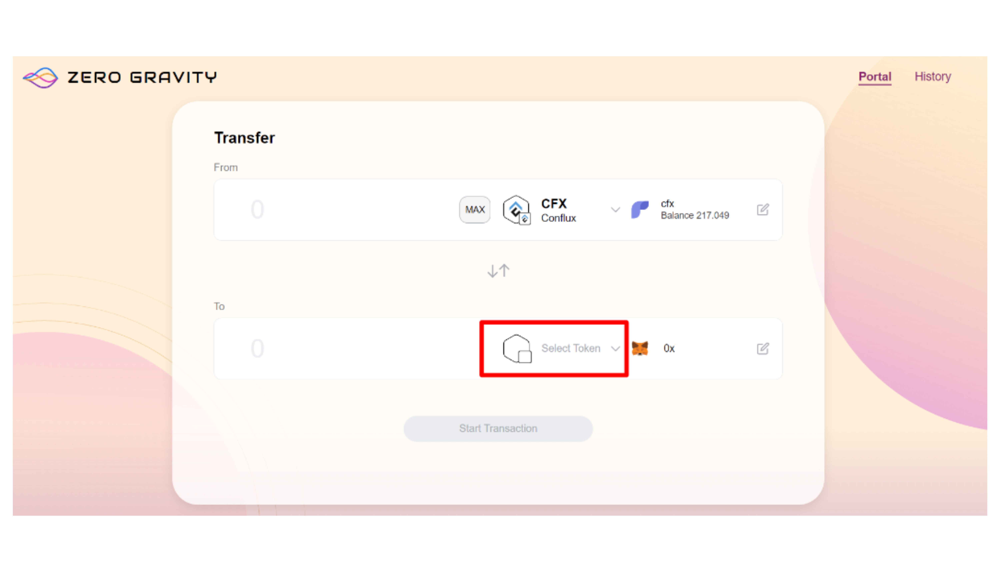
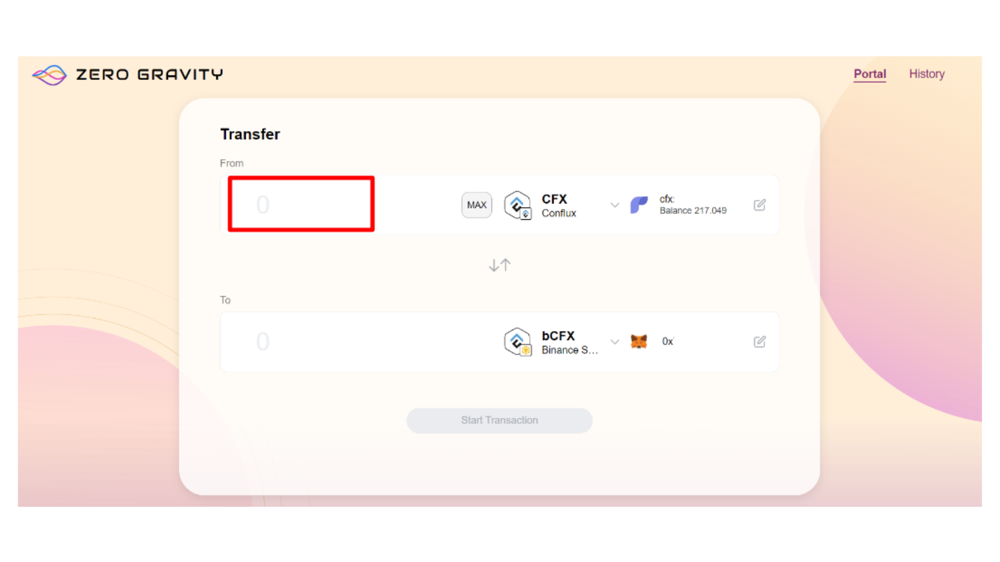

# Transfer Assets Across Chains Using Zero Gravity

One of the easiest ways to transfer assets between Core Space and other chains is through the use of [Zero Gravity](https://portal.zglabs.org/).
To get started, we recommend setting up two wallets: Fluent for Core Space and MetaMask for the other chain of your choice.
In this tutorial, we will explain the steps to transfer CFX from Conflux Core Space to BNB Smart Chain.

## Prerequisites for this tutorial

- A Fluent Wallet funded with at least 200 CFX.
- A MetaMask Wallet.

## Transferring CFX from Conflux Core to BNB Smart Chain

1. Go to the Zero Gravity web application: https://portal.zglabs.org/

2. Click Connect Wallet to connect your Fluent to Zero Gravity.

3. Click Connect Wallet to connect your MetaMask to Zero Gravity.

4. In the FROM drop-down list, select the network and token that you'll transfer your assets from.

5. In the TO drop-down list, select the network that you'll transfer your assets to.

6. Enter the amount that you want to transfer.

7. Click Start Transaction.

8. Confirm the transaction details.

9. After the cross-chain transfer is completed you can use the corresponding blockchain explorers to verify the assets transfer. The assets will be displayed in your destination wallet.

## FAQs

### Q: What should I do if my CFX transfer from another chain (like Binance Smart Chain) to Conflux Network gets stuck in a continuous loading loop during withdrawal?

**A:** If the cross-chain bridge interface continuously loads without completing the CFX withdrawal, this might be a front-end issue. Start by clearing your web browser's cache to eliminate any stored data that could be causing the problem. If the issue persists, try switching to a different web browser and attempt the withdrawal again. This step often helps to circumvent browser-specific glitches or compatibility issues with the cross-chain bridge interface.

### Q: Why did I receive _**PeggedCFX**_ instead of CFX?

**A:** Receiving _**PeggedCFX**_ indicates a shortage of CFX liquidity in the cross-chain bridge, often occurring in Conflux eSpace. You can visit [https://confluxhub.io/espace-bridge/espace-cross-chain](https://confluxhub.io/espace-bridge/espace-cross-chain) to claim your CFX once additional liquidity is provided. Alternatively, you have the option to send PeggedCFX back to the Binance Smart Chain (BSC).
