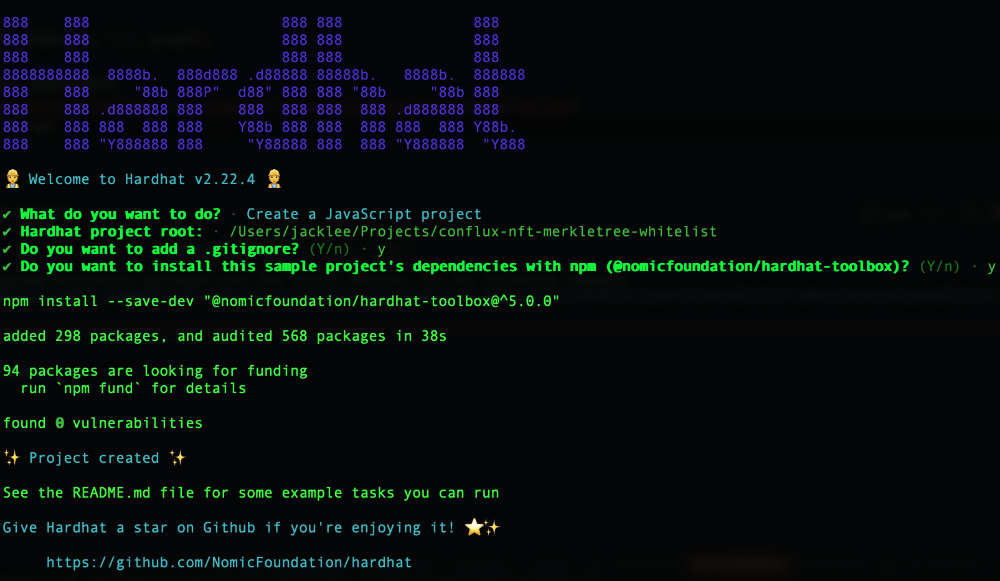
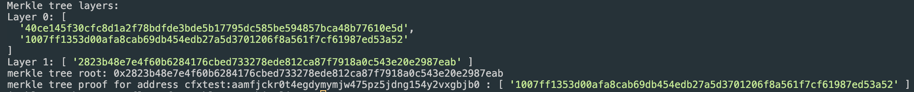
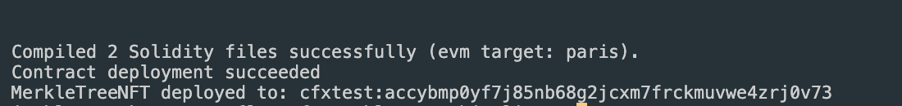
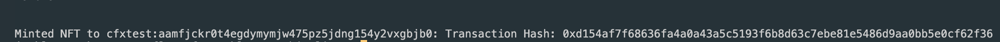

# Merkle Tree NFT Whitelist on CoreSpace using Hardhat

Using a Merkle Tree whitelist provides a cost-efficient way to distribute NFTs to a predefined list of addresses. It ensures that only whitelisted addresses can mint the NFTs, enhancing security and efficiency. Writing a whitelist of thousands of addresses directly within a smart contract would result in significant gas costs, and additionally, due to the maximum transaction gas limit restriction, it might be impractical to update such a large whitelist in a single transaction. However, since in the Merkle Tree verification process, leaf nodes and proofs can be stored off-chain while only the root value needs to be stored on-chain, this method significantly saves on gas costs and enables whitelist setup with only one transaction.

This tutorial will guide you through the steps to create, write, and deploy an ERC721 NFT smart contract with a Merkle Tree whitelist on Conflux CoreSpace using Hardhat. It will also show you how to use merkletreejs to create the Merkle Tree whitelist. For a practical example, please refer to the [Conflux-NFT-MerkleTree-Whitelist](https://github.com/ConfluxDAO/Conflux-NFT-MerkleTree-Whitelist) repository.

If you are not familiar with Hardhat, please refer to the [Hardhat documentation](https://hardhat.org/getting-started/).

### Prerequisites

Before you start, ensure you have the following:

- Node.js installed on your system & Hardhat setup on your machine.
- A Conflux CoreSpace wallet
- A basic understanding of smart contract development and the Solidity programming language.

## Step 1: Setting Up Your Environment

Open your terminal and run:

```bash
mkdir conflux-nft-merkletree-whitelist
cd conflux-nft-merkletree-whitelist
npm init -y
npm install --save-dev hardhat
npx hardhat
```

When prompted, choose the default project setup by pressing Enter for all questions. This will create a basic Hardhat project setup with all the necessary configurations.

[](../imgs/nft-tutorials/whitelist-hardhat-create-project.png)

## Step 2: Installing Dependencies

Install OpenZeppelin contracts for a secure, audited implementation of ERC721 tokens. Next, install the Hardhat-Conflux-Plugin, which is built on top of js-conflux-sdk, providing a similar interface for deployment and interaction. Finally, install merkletreejs and keccak256 to create a Merkle Tree from your whitelist addresses.

```bash
npm install @openzeppelin/contracts hardhat-conflux js-conflux-sdk keccak256 merkletreejs
```

## Step 3: Configuring Hardhat

Update `hardhat.config.js` to include the Conflux network configuration:

```javascript
require("@nomicfoundation/hardhat-toolbox");
require("hardhat-conflux");

const PRIVATE_KEY = "YOUR_PRIVATE_KEY_HERE";

/** @type import('hardhat/config').HardhatUserConfig */
module.exports = {
  solidity: "0.8.24",
  defaultNetwork: "cfxTestnet",
  networks: {
    cfx: {
      url: "https://main.confluxrpc.com",
      accounts: [PRIVATE_KEY],
      chainId: 1029,
    },
    cfxTestnet: {
      url: "https://test.confluxrpc.com",
      accounts: [PRIVATE_KEY],
      chainId: 1,
    },
  },
};
```

## Step 4: Writing the Smart Contract

Create a new file `MerkleTreeNFT.sol` in the `contracts` directory:

```solidity
// SPDX-License-Identifier: MIT
pragma solidity ^0.8.4;

import "@openzeppelin/contracts/token/ERC721/ERC721.sol";
import "./MerkleTreeProof.sol";

contract MerkleTreeNFT is ERC721 {
   bytes32 public immutable merkleRoot;
   mapping(address => bool) public hasMinted;

   constructor(string memory name, string memory symbol, bytes32 root)
   ERC721(name, symbol) {
       merkleRoot = root;
   }

   function mint(address account, uint256 tokenId, bytes32[] calldata proof) external {
       require(_verify(_leaf(account), proof), "Invalid merkle proof");
       require(!hasMinted[account], "Already minted!");
       _mint(account, tokenId);
       hasMinted[account] = true;
   }

   function _leaf(address account) internal pure returns (bytes32) {
       return keccak256(abi.encodePacked(account));
   }

   function _verify(bytes32 leaf, bytes32[] memory proof) internal view returns (bool) {
       return MerkleProof.verify(proof, merkleRoot, leaf);
   }
}
```

Create a new file `MerkleProof` library in the `contracts` directory:

```solidity
// SPDX-License-Identifier: MIT
pragma solidity ^0.8.4;

library MerkleProof {
    /**
     * @dev Returns `true` when a `root` reconstructed from a `proof` and `leaf` equals the given `root`, indicating valid data.
     * In the reconstruction, leaf pairs and element pairs are sorted.
     */
    function verify(
        bytes32[] memory proof,
        bytes32 root,
        bytes32 leaf
    ) internal pure returns (bool) {
        return processProof(proof, leaf) == root;
    }

    /**
     * @dev Returns the `root` computed from a Merkle tree using `leaf` and `proof`. The `proof` is only valid if the reconstructed `root` matches the given `root`.
     * In the reconstruction, leaf pairs and element pairs are sorted.
     */
    function processProof(bytes32[] memory proof, bytes32 leaf) internal pure returns (bytes32) {
        bytes32 computedHash = leaf;
        for (uint256 i = 0; i < proof.length; i++) {
            computedHash = _hashPair(computedHash, proof[i]);
        }
        return computedHash;
    }

    // Sorted Pair Hash
    function _hashPair(bytes32 a, bytes32 b) private pure returns (bytes32) {
        return a < b ? keccak256(abi.encodePacked(a, b)) : keccak256(abi.encodePacked(b, a));
    }
}

```

You will need to create or find an implementation for `MerkleProof` that suits your needs.

Run `npx hardhat compile` in your terminal.

## Step 5: Generating a Merkle Tree

Create a new script `generateTree.js` in the `scripts` directory to deploy your contract.

Use a JavaScript script to create a Merkle Tree from your whitelist addresses. You can use libraries like `merkletreejs` and `keccak256`.

```javascript
const { MerkleTree } = require("merkletreejs");
const keccak256 = require("keccak256");
const { format } = require("js-conflux-sdk");

// List of addresses
const whitelist = ["cfxtest:...", "cfxtest:..."];

// Helper function to encode the address as Solidity would
function solidityKeccak256(address) {
  // Convert Conflux address to hex format address (without "0x" prefix)
  const hexAddress = format.hexAddress(address).toLowerCase();
  // Encode the address and compute keccak256 hash
  return keccak256(Buffer.from(hexAddress.slice(2), "hex"));
}

// Convert addresses to hash (leaf nodes) using the helper function
const leaves = whitelist.map(solidityKeccak256);

// Create the Merkle tree
const tree = new MerkleTree(leaves, keccak256, {
  sortPairs: true,
});

// Get the Merkle tree root
const root = tree.getHexRoot();

// Get the proof for a specific address
const addressToProof = whitelist[0]; // Replace with the address you need the proof for
const leaf = solidityKeccak256(addressToProof);
const proof = tree.getProof(leaf).map((x) => x.data.toString("hex"));

// Display the complete Merkle tree
const layers = tree
  .getLayers()
  .map((layer) => layer.map((x) => x.toString("hex")));

console.log("Merkle tree layers:");
layers.forEach((layer, index) => {
  console.log(`Layer ${index}:`, layer);
});

console.log("merkle tree root:", root);
console.log("merkle tree proof for address", addressToProof, ":", proof);
```

You will see the following message after successful deployment
[](../imgs/nft-tutorials/generate-merkletree.png)
Save this root in your smart contract deployment script.

## Step 6: Deploying the Contract

Create a new script in the `scripts` directory to deploy your contract.

```javascript
const hre = require("hardhat");

async function main() {
  const signers = await hre.conflux.getSigners();
  const defaultAccount = signers[0];

  const MerkleTreeNFT = await hre.conflux.getContractFactory("MerkleTreeNFT");

  const root = "YOUR_MERKLE_TREE_ROOT";

  const receipt = await MerkleTreeNFT.constructor(
    "Confi MerkleTree",
    "Confi",
    root
  )
    .sendTransaction({
      from: defaultAccount.address,
    })
    .executed();

  console.log(
    `Contract deployment ${
      receipt.outcomeStatus === 0 ? "succeeded" : "failed"
    }`
  );

  console.log("MerkleTreeNFT deployed to:", receipt.contractCreated);
}

main()
  .then(() => process.exit(0))
  .catch((error) => {
    console.error(error);
    process.exit(1);
  });
```

Run your script with Hardhat to Deploy to Conflux CoreSpace Testnet

```bash
npx hardhat run scripts/deploy.js --network cfxTestnet
```

You will see the following message after successful deployment
[](../imgs/nft-tutorials/whitelist-deploy-success.png)

## Step 6: Minting an NFT with a Whitelist

To mint an NFT, you can use a script that interacts directly with the `mint` function in your smart contract. This script will mint an NFT to a specified address with proof.

Create another script in the `scripts` folder and name it `mintNFT.js`:

This script mints an NFT with the tokenId and a specific proof, where `YOUR_CONTRACT_ADDRESS` is the address of your deployed NFT contract, `NFT_RECEIVER_ADDRESS` is the address of the NFT you want mint to, and `YOUR_PROOF` is the merkle tree proof for your `NFT_RECEIVER_ADDRESS` address

```javascript
const hre = require("hardhat");

async function main() {
  const signers = await hre.conflux.getSigners();
  const defaultAccount = signers[0];

  const contractAddress = "YOUR_CONTRACT_ADDRESS";
  const recipientAddress = "NFT_RECEIVER_ADDRESS"; // Address to receive the NFT
  const tokenId = 1;

  const MerkleTreeNFT = await hre.conflux.getContractAt(
    "MerkleTreeNFT",
    contractAddress
  );

  const proof = "YOUR_PROOF_HERE";

  const receipt = await MerkleTreeNFT.mint(recipientAddress, tokenId, proof)
    .sendTransaction({
      from: defaultAccount.address,
    })
    .executed();

  console.log(
    `Minted NFT to ${recipientAddress}: Transaction Hash: ${receipt.transactionHash}`
  );
}

main().catch((error) => {
  console.error(error);
  process.exit(1);
});
```

Replace `YOUR_CONTRACT_ADDRESS` with your contract's address, `RECIPIENT_WALLET_ADDRESS` with the address of the wallet that should receive the NFT, and `YOUR_PROOF` is the merkle tree proof for your `NFT_RECEIVER_ADDRESS` address

```bash
npx hardhat run scripts/mintNFT.js --network cfxTestnet
```

You will see the following message after successful mint
[](../imgs/nft-tutorials/whitelist-mint-success.png)

## Conclusion

This setup provides a cost-efficient way to distribute NFTs to a whitelist of addresses using a Merkle Tree. Each step is essential for ensuring the security and efficiency of your NFT distribution. Be sure to test thoroughly in a test environment before deploying to the main network.
