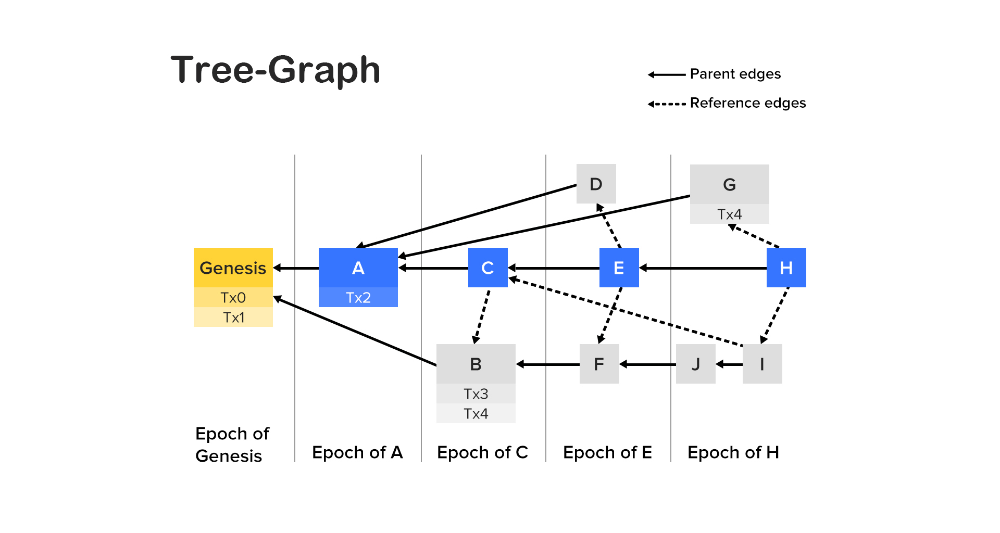

# The Tree-Graph

At the heart of Conflux is the [Tree-Graph](https://arxiv.org/pdf/1805.03870.pdf) ledger structure and the [GHAST](https://confluxnetwork.medium.com/conflux-research-group-ghast-mechanism-adaptive-weight-ghast-explained-part-1-ffe8224a7282) chain selection rule.

Distributed ledgers need to deal with concurrent blocks, aka forks. Blockchains like Bitcoin and Ethereum use the [longest chain rule](https://confluxnetwork.medium.com/advantages-and-disadvantages-of-the-longest-chain-rule-bc27225a2728) to select one fork and discard all the rest. The discarded blocks contribute neither to the system’s security, nor to its throughput. As a result, there is an [inherent conflict](https://eprint.iacr.org/2013/881.pdf) between scalability and security in these blockchains. Conflux, on the other hand, incorporates all concurrent blocks into its ledger, achieving very high levels of security and performance.

First, Conflux replaces the longest chain rule with the GHAST chain selection rule. With this rule, a fork is selected based on the mining power working on its subtree, not just on a chain, which in turn makes this selection much more robust. This allows Conflux to use a block creation rate as high as 2 blocks per second. GHAST can also withstand liveness attacks.

Second, Conflux uses the Tree-Graph as its ledger structure. Each block, apart from having a single parent edge, also contains a list of reference edges to previous blocks. This introduces new information about the before-after relationship between blocks. This structure is essentially a [directed tree](https://en.wikipedia.org/wiki/Polytree) (parent edges only) embedded inside a [DAG](https://en.wikipedia.org/wiki/Directed_acyclic_graph) (all edges), hence the name Tree-Graph.

When processing transactions, Conflux first selects a pivot chain in the Tree-Graph using GHAST. Then, using the pivot chain and the reference edges, it orders the ledger into a linear sequence of blocks. Finally, it executes transactions following this linear order.

