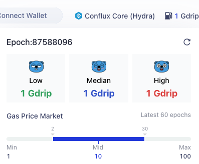

In the Conflux Core Space, transactions are processed by miners who charge a fee for their service. This fee incentivises miners to participate in the network and keep it running smoothly. The fees are paid in CFX and are specified by the transaction initiator through the `gas`, `gasPrice` and `storageLimit` fields in the transaction.

## Gas Fee in Transactions

The gas fee for a transaction in Conflux is determined by two key fields: `gas` and `gasPrice`.

- **`gas`**: This field specifies the maximum amount of computing power that a transaction can consume.
- **`gasPrice`**: Indicates your willingness to pay per unit of computing power.

The actual gas cost is calculated as `gasCharged` multiplied by `gasPrice`. It's important to note that `gasCharged` will not exceed the limit set by the `gas` field.

For more detailed information about gas and its calculation in Conflux, please visit our [detailed documentation on gas](/docs/general/conflux-basics/gas.md).

### How to Set `gasPrice` field

The Conflux consensus doesn't set a limit for transaction gas price and the minimum gas price depends on the miners' setting. Here are the minimum gas price settings of Confura, the public RPC endpoints supported by Conflux foundation:

- Core space: 1 GDrip
- eSpace: 20 GDrip

Besides, it is recommended to set gas price based on Core space / eSpace RPC return value:

- core space: [`cfx_gasPrice`](/docs/core/build/json-rpc/cfx-namespace#cfx_gasprice)
- eSpace: `eth_gasPrice`

#### Speeding up a transaction

`gasPrice` affects the speed at which a transaction is included in a block. Generally, the higher the `gasPrice`, the faster the transaction is likely to be mined. However, a higher `gasPrice` also means higher transaction fees.

In situations of network congestion, a transaction may experience delays in being mined and added to the blockchain. In such cases, it is advisable to increase the `gasPrice` to expedite the transaction. The gas station in the upper right corner of Scan can be used to check the current gas price situation on the network.

Using the **High** value for `gasPrice` corresponds to obtaining the fastest transaction processing speed. For transactions that have already been sent, it is possible to increase the `gasPrice` and resend the transaction to replace the previous one.

### How to Set `gas` field

For regular CFX transfers, setting the gas to 21,000 is sufficient.

For contract interactions, it is recommended to set gas based on the return value of core space / espace RPC:

- Core space: `gasLimit` field of [`cfx_estimateGasAndCollateral`](/docs/core/build/json-rpc/cfx-namespace/#cfx_estimategasandcollateral)
- eSpace: `eth_estimateGas`

These methods simulate the execution of the transaction and return the estimated amount of gas used for the transaction. Actually, in most cases, the value `gasUsed` returned by [`cfx_estimateGasAndCollateral`](/docs/core/build/json-rpc/cfx-namespace/#cfx_estimategasandcollateral) is accurate, but it is not recommended to use `gasUsed` due to two main reasons:

1. Due to [EIP-150](https://eips.ethereum.org/EIPS/eip-150), setting the gas to the actual gas consumption may often lead to transaction failure.
2. The result is based on the current blockchain state during the simulation, but the actual execution states may be different.

The `gasLimit` field typically equals `1.3 * gasUsed`. This ensures that the gas limit is sufficient for the transaction, and any excessive gas fee will be refunded.

## Storage Collateral

In addition to transaction fees, the Conflux network requires the pledging of CFX for occupying new storage space or modifying existed storage during a transaction. The pledged CFX generates a 4% annual interest, which is paid to miners to subsidise their storage costs. When the occupied space is released or modified by others, the pledged CFX is returned.

The `storageLimit` field specifies the upper limit of the storage space that can be occupied by a transaction. And it is recommended to use the `storageCollaterized` field of returned value from [`cfx_estimateGasAndCollateral`](../../build/json-rpc/cfx-namespace.md#cfx_estimategasandcollateral) as the `storageLimit` field.

:::info

Refer to [storage](../storage.md) for more information.

:::

When sending a transaction, the sender must ensure that there is sufficient balance to cover the `value + storageLimit * (10^18/1024) + gas * gasPrice`. If the balance is insufficient, the transaction will be rejected by nodes.

If the specified `storageLimit` exceeds the actual storage occupied by the transaction, **no additional fees will be incurred**, and the excess will be refunded.

If the transaction is [sponsored](../internal-contracts/sponsor-whitelist-control.md), the sender only needs to ensure sufficient funds for the value cost.

The current SDK provides methods to automatically set reasonable values for `gas`, `storageLimit`, and `gasPrice`, but users can also specify these values manually.

## FAQs

### What Happens if the Set `gas` Value is Too Low?

If the set gas value is too low, the transaction may fail to execute.

### If the Set `gas` Value is Too High, Will Extra Gas Be Charged?

If the set gas value is too high, the excess gas will be refunded, but only up to a maximum of one-fourth of the gas limit. For example, if the transaction's gas limit is 100000, but only 50000 is actually consumed during execution, only 25000 gas fees will be refunded.

### What Occurs if the `storageLimit` is Set Too Low?

It will result in transaction execution failure.

### If the storageLimit is Set Too High, Will Extra Charges be Incurred?

No, the excess will be refunded.

### What is the Relationship Between `gas` and `storageLimit`?

There is no relationship between the two.

### Reasons for Transaction Failure Despite Using `gas` Returned from `cfx_estimateGasAndCollateral`

When setting the `gas` amount for a transaction based on the estimate from `cfx_estimateGasAndCollateral`, there are key considerations to prevent failure:

1. **Correct Field Usage**: Ensure that the `gasLimit` provided by `cfx_estimateGasAndCollateral` is utilized, not the `gasUsed` field.

2. **Dynamic Execution Environments**: The estimation method simulates execution based on the current state of the blockchain at the time of the call. However, the actual execution environment may change, potentially requiring more gas than estimated. To mitigate the risk of failure due to these variations, you can set `gas` that is higher than the estimated amount.

### What are the Costs for Gas and Storage in Transactions?

When sending a transaction, you incur a gas fee and a storage fee. The gas fee, necessary for transaction processing, is calculated using the formula: `gasFee` = `gasPrice` \* `gasCharged`. This fee compensates miners for transaction validation and execution.

In addition to the gas fee, transactions may utilize new storage space. While there's no direct charge for this storage use, it necessitates staking a certain amount of CFX. This staked CFX, proportional to the storage used, is refunded once the storage is no longer needed. The rate is 1 CFX per 1024 bytes of storage.

### How to calculate the gas fee actually used in the transaction?

On ConfluxScan, users can view gas usage, gas price, gas fee, and other relevant information of a transaction, which is obtained through `cfx_getTransactionReceipt`: `gasFee = gasCharged * gasPrice`, but the gasCharged is not necessarily equal to gasUsed.
There is a rule in Conflux: `gas` is used to set the upper limit of gas that can be used in a transaction. It must be greater than the actual gas used value (gasUsed).
For the excessive part, at most, only 1/4 will be refunded: if the excessive part is less than 1/4 of the gasLimit, all will be refunded, but if it is greater than 1/4, only 1/4 will be returned. Hence, try to give an accurate gas value when sending a transaction.

### How to know the amount of gas and storage used by a transaction?

The [`cfx_estimateGasAndCollateral`](/docs/core/build/json-rpc/cfx-namespace/#cfx_estimategasandcollateral) RPC can be used to estimate the amount of gas and storage that a transaction needs to use, but the estimation is not 100% accurate.
Hence, the returned gas can be adjusted manually, such as multiplying by `1.3`.

### Why has the balance not changed after interacting with a contract and the gas fee is paid for this transaction?

The Conflux network has a sponsor mechanism. If a contract has a sponsor, the gas and storage fees for this contract’s interactions will be paid by the sponsor.
