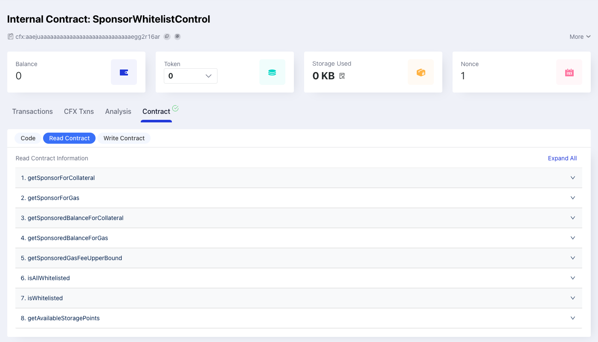
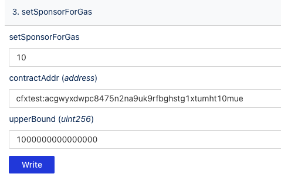
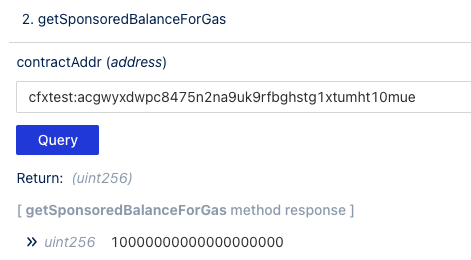
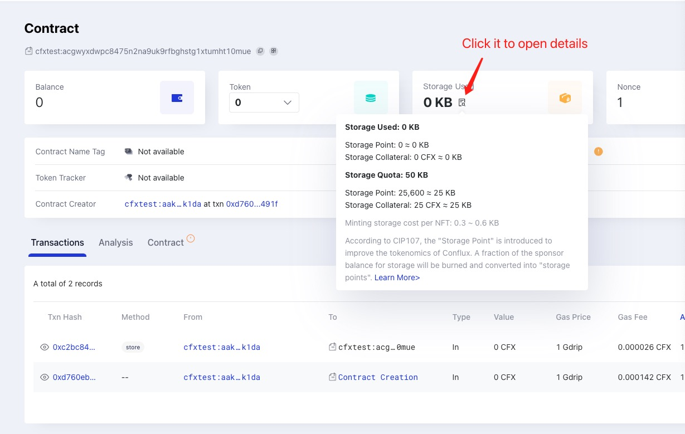

Conflux Core [Sponsorship](../core-space-basics/sponsor-mechanism.md) offers a user-friendly feature for new blockchain users. This tutorial will guide you on how to use the [ConfluxScan Read&Write Tool](https://www.confluxscan.io/address/cfx:aaejuaaaaaaaaaaaaaaaaaaaaaaaaaaaaegg2r16ar?tab=contract-viewer) to sponsor a contract.

The Contract Read&Write Tool allows users to interact with smart contracts. Any verified contract on ConfluxScan can utilize this tool to read or write data.

- [Mainnet SponsorWhitelistControl Read&Write Tool](https://www.confluxscan.io/address/cfx:aaejuaaaaaaaaaaaaaaaaaaaaaaaaaaaaegg2r16ar?tab=contract-viewer)
- [Testnet SponsorWhitelistControl Read&Write Tool](https://testnet.confluxscan.io/address/cfxtest:aaejuaaaaaaaaaaaaaaaaaaaaaaaaaaaaeprn7v0eh?tab=contract-viewer)

## Preparation

1. Install the [Fluent](https://fluentwallet.com/) wallet and switch to the Conflux Testnet network.
2. Acquire some test tokens from the [Conflux Testnet Faucet](https://faucet.confluxnetwork.org/).
3. Have a contract address ready, for example: `cfxtest:acgwyxdwpc8475n2na9uk9rfbghstg1xtumht10mue`.

## Query Sponsor Info

In the **Read Contract** tab, all the contract's view methods are listed. Open any of them, input the parameter (if any), and click the **Query** button to obtain the result.

For instance, using `getSponsorForGas`:

If a **Zero Address** is returned, it signifies that the contract is not sponsored.

## Sponsor Storage

In the **Write Contract** tab, all the contract's write methods are listed. Before using it, connect your wallet.

If a write method includes a **payable modifier**, the first input box can be used to set the amount of CFX to be transferred to the contract when calling the method.

For example, inputting 50 means transferring 50 CFX to the contract.

Then click the **Write** button. A popup will appear; click **Confirm** to approve the transaction.

After transaction execution, you can query the contract's sponsor info again.

Half of the CFX will be converted into storage points.

## Sponsor Gas

We will set 10 CFX for the gas sponsor balance, with an upper bound of **1000000000000000** Drip (`10**15` Drip).

After the transaction execution, you can query the contract's sponsor info again.

## Whitelist

Finally, add the zero address to the whitelist to use the contract without paying a gas fee.

For the second parameter, which is an array, pass ["0x0000000000000000000000000000000000000000"].

## Check Contract Storage Usage Info on ConfluxScan

You can check the contract's storage usage and sponsor balance info on the ConfluxScan contract detail page.

## Check Transactions Sponsored on ConfluxScan

After setting up the sponsor, you can interact with the contract without paying gas fee. The transaction will be marked as **Sponsored** on ConfluxScan in the detail page.

## Other Sponsor Methods

Developers can use SDKs to call the `SponsorWhitelistControl` methods to sponsor a contract. For an example, see [here](../core-space-basics/internal-contracts/sponsor-whitelist-control.md#how-to-sponsor-a-contract).

## FAQs

### I sponsored a contract, but the transaction still failed. Why?

Several reasons might cause the transaction to fail:

1. The upper bound is too small.
2. The sponsor balance is insufficient.
3. The whitelist is not set correctly.
